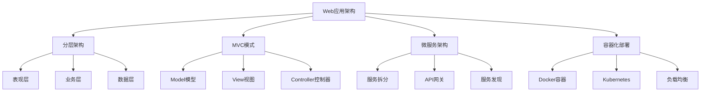
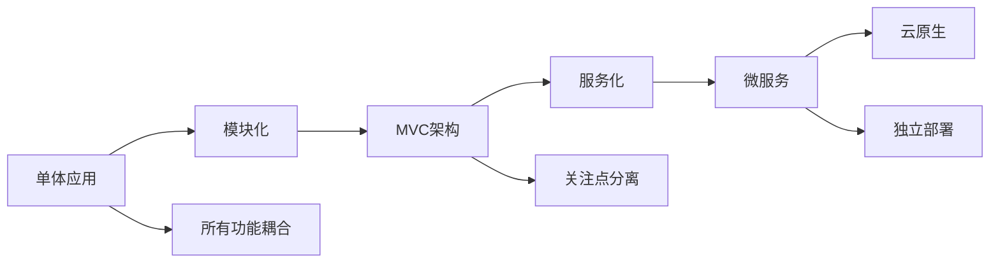
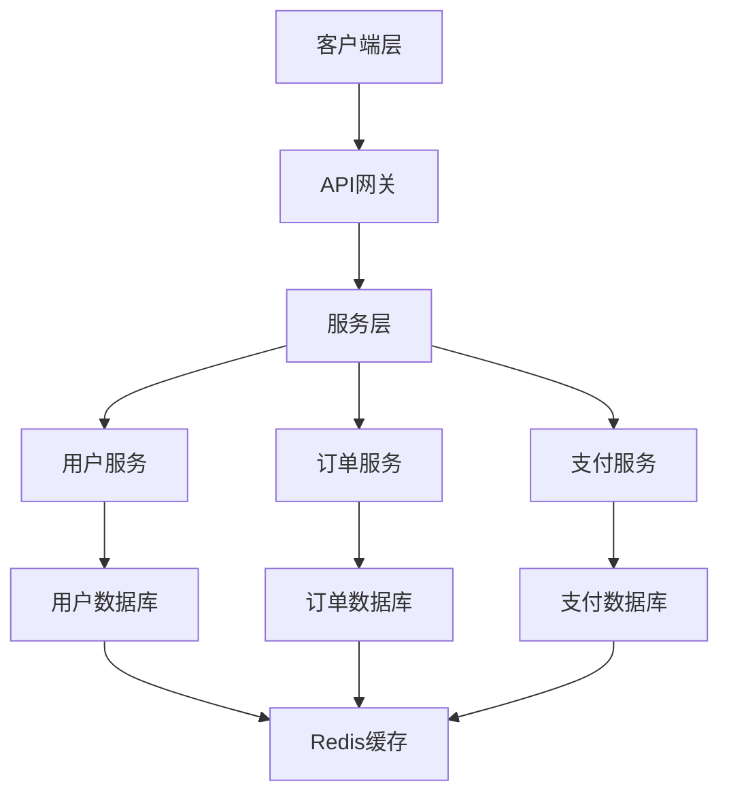

# Web应用架构设计



## 📋 知识结构（金字塔模型）

### 🏗️ 基础层：认知（What）
**架构设计的基本原则**

| 原则 | 描述 | 重要性 | 应用场景 |
|------|------|--------|----------|
| **单一职责** | 每个模块只管一件事 | ★★★★★ | 所有架构 |
| **开闭原则** | 对扩展开放，对修改关闭 | ★★★★☆ | 框架设计 |
| **依赖倒置** | 依赖抽象而非具体实现 | ★★★★☆ | 接口设计 |
| **DRY原则** | 避免重复代码 | ★★★★☆ | 代码组织 |

### 🔍 理解层：机制（Why&How）

**架构演进路径：**



**架构模式对比：**

| 架构模式 | 复杂度 | 可扩展性 | 开发效率 | 运维成本 | 适用规模 |
|----------|--------|----------|----------|----------|----------|
| **单体架构** | 低 | 差 | 高 | 低 | 小型 |
| **分层架构** | 中 | 中 | 高 | 中 | 中小型 |
| **微服务架构** | 高 | 优秀 | 中 | 高 | 大型 |
| **Serverless** | 中 | 极高 | 极高 | 低 | 任意 |

**Node.js应用典型架构：**



### 🚀 应用层：实践（Apply）

**项目结构最佳实践：**

```javascript
// ✅ 标准项目目录结构
const projectStructure = {
  'src/': {
    'controllers/': '控制器层 - 处理HTTP请求',
    'services/': '业务逻辑层 - 核心业务处理',
    'repositories/': '数据访问层 - 数据库操作',
    'models/': '数据模型 - 数据结构定义',
    'middlewares/': '中间件 - 通用功能',
    'routes/': '路由定义 - API端点',
    'utils/': '工具函数 - 通用工具',
    'config/': '配置文件 - 应用配置',
    'types/': '类型定义 - TypeScript类型',
    'tests/': '测试文件 - 单元测试和集成测试',
    'migrations/': '数据库迁移 - 数据库结构变更'
  },
  
  'docs/': '文档目录',
  'scripts/': '构建和部署脚本',
  'docker/': 'Docker配置文件',
  'k8s/': 'Kubernetes配置'
};

// ✅ 分层架构实现
class LayeredArchitecture {
  constructor() {
    this.layers = {
      controller: new ControllerLayer(),
      service: new ServiceLayer(),
      repository: new RepositoryLayer(),
      model: new ModelLayer()
    };
  }
  
  // 控制器层：处理HTTP请求
  getControllerLayer() {
    return {
      async handleRequest(req, res) {
        try {
          // 请求验证
          this.validateRequest(req);
          
          // 调用服务层
          const response = await this.layers.service.execute(
            req.method,
            req.params,
            req.body
          );
          
          // 格式化响应
          this.sendResponse(res, response);
        } catch (error) {
          this.handleError(res, error);
        }
      }
    };
  }
  
  // 服务层：业务逻辑处理
  getServiceLayer() {
    return {
      async execute(method, params, data) {
        // 业务规则验证
        this.validateBusinessRules(data);
        
        // 调用数据层
        const result = await this.layers.repository[method.toLowerCase()](params, data);
        
        // 业务逻辑处理
        return this.processBusinessLogic(result);
      }
    };
  }
  
  // 数据访问层：数据库操作
  getRepositoryLayer() {
    return {
      async create(params, data) {
        return await this.layers.model.create(data);
      },
      
      async read(params) {
        return await this.layers.model.findById(params.id);
      },
      
      async update(params, data) {
        return await this.layers.model.findByIdAndUpdate(params.id, data);
      },
      
      async delete(params) {
        return await this.layers.model.findByIdAndDelete(params.id);
      }
    };
  }
}
```

**MVC模式实现：**

```javascript
// ✅ Model层 - 数据模型定义
class UserModel {
  constructor(mongoose) {
    this.schema = new mongoose.Schema({
      username: {
        type: String,
        required: true,
        unique: true,
        trim: true,
        minlength: 3,
        maxlength: 30
      },
      email: {
        type: String,
        required: true,
        unique: true,
        lowercase: true,
        match: [/^\w+([.-]?\w+)*@\w+([.-]?\w+)*(\.\w{2,3})+$/, 'Invalid email format']
      },
      password: {
        type: String,
        required: true,
        select: false
      },
      profile: {
        firstName: String,
        lastName: String,
        avatar: String,
        bio: String
      },
      preferences: {
        theme: { type: String, default: 'light' },
        language: { type: String, default: 'en' },
        notifications: {
          email: { type: Boolean, default: true },
          push: { type: Boolean, default: false }
        }
      },
      status: {
        type: String,
        enum: ['active', 'inactive', 'banned'],
        default: 'active'
      },
      lastLoginAt: Date,
      createdAt: { type: Date, default: Date.now },
      updatedAt: { type: Date, default: Date.now }
    });
    
    // 中间件
    this.schema.pre('save', function(next) {
      this.updatedAt = new Date();
      next();
    });
    
    // 虚拟字段
    this.schema.virtual('fullName').get(function() {
      return `${this.profile?.firstName || ''} ${this.profile?.lastName || ''}`.trim();
    });
    
    // 索引
    this.schema.index({ email: 1 });
    this.schema.index({ username: 1 });
    this.schema.index({ createdAt: -1 });
    
    this.model = mongoose.model('User', this.schema);
  }
  
  // 查询方法
  async findByEmail(email) {
    return this.model.findOne({ email }).select('+password');
  }
  
  async findByUsername(username) {
    return this.model.findOne({ username });
  }
  
  async findActive() {
    return this.model.find({ status: 'active' });
  }
  
  // 统计方法
  async getUserStats() {
    const stats = await this.model.aggregate([
      {
        $group: {
          _id: '$status',
          count: { $sum: 1 },
          lastMonth: {
            $sum: {
              $cond: [
                { $gte: ['$createdAt', new Date(Date.now() - 30 * 24 * 60 * 60 * 1000)] },
                1, 0
              ]
            }
          }
        }
      }
    ]);
    
    return stats.reduce((acc, stat) => {
      acc[stat._id] = stat.count;
      return acc;
    }, {});
  }
}

// ✅ View层 - 响应格式化
class ResponseView {
  static success(data, message = 'Success', meta = {}) {
    return {
      success: true,
      message,
      data,
      meta: {
        timestamp: new Date().toISOString(),
        ...meta
      }
    };
  }
  
  static error(message, details = {}, meta = {}) {
    return {
      success: false,
      message,
      details,
      meta: {
        timestamp: new Date().toISOString(),
        ...meta
      }
    };
  }
  
  static paginated(data, pagination, message = 'Success') {
    return {
      success: true,
      message,
      data,
      pagination: {
        page: pagination.page,
        limit: pagination.limit,
        total: pagination.total,
        pages: Math.ceil(pagination.total / pagination.limit),
        hasNext: pagination.page * pagination.limit < pagination.total,
        hasPrev: pagination.page > 1
      }
    };
  }
  
  static formatUser(user) {
    return {
      id: user._id,
      username: user.username,
      email: user.email,
      fullName: user.fullName,
      profile: user.profile,
      preferences: user.preferences,
      status: user.status,
      lastLoginAt: user.lastLoginAt,
      createdAt: user.createdAt
    };
  }
}

// ✅ Controller层 - 请求处理
class UserController {
  constructor(userService, authService) {
    this.userService = userService;
    this.authService = authService;
  }
  
  async register(req, res, next) {
    try {
      const userData = req.body;
      
      // 验证输入
      await this.validateRegistration(userData);
      
      // 创建用户
      const user = await this.userService.create(userData);
      
      // 生成认证令牌
      const token = await this.authService.generateToken(user);
      
      res.status(201).json(ResponseView.success({
        user: ResponseView.formatUser(user),
        token
      }, 'User registered successfully'));
      
    } catch (error) {
      next(error);
    }
  }
  
  async login(req, res, next) {
    try {
      const { email, password } = req.body;
      
      // 认证用户
      const user = await this.authService.authenticate(email, password);
      
      // 生成令牌
      const token = await this.authService.generateToken(user);
      
      // 更新最后登录时间
      await this.userService.updateLastLogin(user._id);
      
      res.json(ResponseView.success({
        user: ResponseView.formatUser(user),
        token
      }, 'Login successful'));
      
    } catch (error) {
      next(error);
    }
  }
  
  async getProfile(req, res, next) {
    try {
      const userId = req.user._id;
      const user = await this.userService.findById(userId);
      
      res.json(ResponseView.success(
        ResponseView.formatUser(user),
        'Profile retrieved successfully'
      ));
      
    } catch (error) {
      next(error);
    }
  }
  
  async updateProfile(req, res, next) {
    try {
      const userId = req.user._id;
      const updateData = req.body;
      
      // 验证更新数据
      await this.validateProfileUpdate(updateData);
      
      const user = await this.userService.updateProfile(userId, updateData);
      
      res.json(ResponseView.success(
        ResponseView.formatUser(user),
        'Profile updated successfully'
      ));
      
    } catch (error) {
      next(error);
    }
  }
  
  async validateRegistration(userData) {
    const required = ['username', 'email', 'password'];
    
    for (const field of required) {
      if (!userData[field]) {
        throw new Error(`${field} is required`);
      }
    }
    
    if (userData.password.length < 8) {
      throw new Error('Password must be at least 8 characters long');
    }
  }
  
  async validateProfileUpdate(updateData) {
    const allowedFields = ['profile', 'preferences'];
    const updateFields = Object.keys(updateData);
    
    const invalidFields = updateFields.filter(field => 
      !allowedFields.includes(field)
    );
    
    if (invalidFields.length > 0) {
      throw new Error(`Cannot update fields: ${invalidFields.join(', ')}`);
    }
  }
}
```

**微服务架构设计：**

```javascript
// ✅ 服务注册和发现
class ServiceRegistry {
  constructor(redis) {
    this.redis = redis;
    this.services = new Map();
    this.defaultTTL = 30000; // 30秒
  }
  
  async register(serviceInfo) {
    const {
      name,
      version,
      host,
      port,
      healthEndpoint = '/health',
      metadata = {}
    } = serviceInfo;
    
    const serviceId = `${name}:${version}:${host}:${port}`;
    const serviceData = {
      id: serviceId,
      name,
      version,
      host,
      port,
      healthEndpoint,
      metadata,
      registeredAt: new Date().toISOString(),
      lastHeartbeat: new Date().toISOString()
    };
    
    // 注册到Redis
    await this.redis.hset(
      `services:${name}`,
      serviceId,
      JSON.stringify(serviceData)
    );
    
    // 设置过期时间
    await this.redis.expire(`services:${name}`, this.defaultTTL);
    
    this.services.set(serviceId, serviceData);
    
    console.log(`Service registered: ${serviceId}`);
    return serviceData;
  }
  
  async discovery(serviceName) {
    const services = await this.redis.hgetall(`services:${serviceName}`);
    
    const availableServices = Object.values(services)
      .map(serviceData => {
        try {
          return JSON.parse(serviceData);
        } catch (error) {
          console.error('Failed to parse service data:', error);
          return null;
        }
      })
      .filter(service => service && this.isServiceHealthy(service));
    
    // 负载均衡选择服务
    return this.selectService(availableServices);
  }
  
  async deregister(serviceId) {
    const service = this.services.get(serviceId);
    if (service) {
      await this.redis.hdel(`services:${service.name}`, serviceId);
      this.services.delete(serviceId);
      console.log(`Service deregistered: ${serviceId}`);
    }
  }
  
  selectService(services) {
    if (services.length === 0) {
      throw new Error('No available services');
    }
    
    // 简单的轮询负载均衡
    const index = Math.floor(Math.random() * services.length);
    return services[index];
  }
  
  isServiceHealthy(service) {
    const heartbeatTime = new Date(service.lastHeartbeat);
    const now = new Date();
    
    return (now - heartbeatTime) < this.defaultTTL;
  }
}

// ✅ API网关实现
class APIGateway {
  constructor(options = {}) {
    this.routes = new Map();
    this.middlewares = [];
    this.serviceRegistry = options.serviceRegistry;
  }
  
  // 注册路由
  route(method, path, targetService, options = {}) {
    const routeKey = `${method.toUpperCase()} ${path}`;
    const routeConfig = {
      service: targetService,
      timeout: options.timeout || 5000,
      retries: options.retries || 3,
      middleware: options.middleware || []
    };
    
    this.routes.set(routeKey, routeConfig);
    console.log(`Route registered: ${routeKey} -> ${targetService}`);
  }
  
  // 处理请求
  async handleRequest(req, res) {
    const routeKey = `${req.method.toUpperCase()} ${req.path}`;
    const route = this.routes.get(routeKey);
    
    if (!route) {
      return res.status(404).json({
        error: 'Route not found',
        message: `${req.method} ${req.path} is not available`
      });
    }
    
    try {
      // 执行中间件
      await this.executeMiddlewares(req, res, route.middleware);
      
      // 服务发现
      const service = await this.serviceRegistry.discovery(route.service);
      
      // 代理请求
      await this.proxyRequest(req, res, service, route);
      
    } catch (error) {
      console.error('Gateway error:', error);
      res.status(500).json({
        error: 'Internal Gateway Error',
        message: error.message
      });
    }
  }
  
  async proxyRequest(req, res, service, routeConfig) {
    const { host, port, healthEndpoint } = service;
    const targetUrl = `http://${host}:${port}`;
    
    // 构建代理URL
    let proxyPath = req.path;
    if (routeConfig.pathPrefix) {
      proxyPath = req.path.replace(routeConfig.pathPrefix, '');
    }
    
    const fullUrl = `${targetUrl}${proxyPath}${req.url.split('?')[1] ? '?' + req.url.split('?')[1] : ''}`;
    
    // 发送代理请求
    const requestOptions = {
      method: req.method,
      headers: {
        ...req.headers,
        'x-forwarded-for': req.ip,
        'x-original-url': req.originalUrl
      },
      timeout: routeConfig.timeout
    };
    
    if (req.method !== 'GET' && req.method !== 'HEAD') {
      requestOptions.body = req.body;
    }
    
    try {
      const response = await fetch(fullUrl, requestOptions);
      const responseData = await response.json();
      
      res.status(response.status).json(responseData);
    } catch (error) {
      throw new Error(`Service communication failed: ${error.message}`);
    }
  }
  
  async executeMiddlewares(req, res, middlewares) {
    for (const middleware of middlewares) {
      await new Promise((resolve, reject) => {
        middleware(req, res, (err) => {
          if (err) reject(err);
          else resolve();
        });
      });
    }
  }
}
```

## 🧠 费曼学习法：能用简单的话解释

**架构设计核心思想：**
1. **分层架构** = 建房子的楼层，每层有不同功能
2. **MVC模式** = 餐厅模式：Model是后厨、View是服务员、Controller是经理
3. **微服务** = 公司部门制，各部门独立运作但相互配合

**设计原则：**
```javascript
const architecturePrinciples = {
  '单一职责': '一个模块只做一件事',
  '松耦合': '模块间依赖最小化',
  '高内聚': '相关功能组织在一起',
  '可测试性': '每个组件都能独立测试'
};
```

## 🎯 刻意练习要点

**必须掌握的技能：**
- [ ] 设计合理的项目目录结构
- [ ] 实现清晰的分层架构
- [ ] 理解并应用设计模式
- [ ] 能够进行架构评估和重构

**编程练习：**

**1. 设计一个电商系统架构**
```javascript
// 练习：电商系统微服务架构设计
class EcommerceArchitecture {
  constructor() {
    this.services = {
      'user-service': {
        port: 3001,
        dependencies: ['mysql'],
        endpoints: ['/users', '/auth', '/profiles']
      },
      'product-service': {
        port: 3002,
        dependencies: ['mongodb', 'elasticsearch'],
        endpoints: ['/products', '/categories', '/inventory']
      },
      'order-service': {
        port: 3003,
        dependencies: ['mysql', 'redis'],
        endpoints: ['/orders', '/cart', '/payments']
      },
      'notification-service': {
        port: 3004,
        dependencies: ['redis', 'rabbitmq'],
        endpoints: ['/notifications', '/emails', '/sms']
      }
    };
  }
  
  generateArchitectureDiagram() {
    return `
      ┌─────────────────┐
      │   API Gateway   │
      └─────────┬───────┘
                │
      ┌─────────┴───────┐
      │                 │
   ┌──┴───┐         ┌───┴───┐
   │ User │         │Product│
   │Service│         │Service│
   └──┬───┘         └───┬───┘
      │                 │
   ┌──┴───┐         ┌───┴───┐
   │ MySQL │         │MongoDB│
   └───────┘         └───────┘
    `;
  }
  
  designDataModels() {
    return {
      User: {
        id: 'UUID',
        email: 'String',
        profile: 'Object',
        preferences: 'Object'
      },
      Product: {
        id: 'ObjectId',
        name: 'String',
        description: 'String',
        price: 'Number',
        inventory: 'Number',
        categories: 'Array'
      },
      Order: {
        id: 'UUID',
        userId: 'UUID',
        items: 'Array',
        status: 'String',
        totalAmount: 'Number'
      }
    };
  }
}
```

**2. 实现服务间通信**
```javascript
// 练习：服务间事件通信
class ServiceEventBus {
  constructor(redis, serviceName) {
    this.redis = redis;
    this.serviceName = serviceName;
    this.subscriptions = new Map();
  }
  
  // 发布事件
  async publish(event, data, options = {}) {
    const eventData = {
      event,
      data,
      source: this.serviceName,
      timestamp: new Date().toISOString(),
      id: require('crypto').randomUUID(),
      ...options
    };
    
    const channel = `events:${event}`;
    
    await this.redis.publish(channel, JSON.stringify(eventData));
    console.log(`Published event: ${event} from ${this.serviceName}`);
  }
  
  // 订阅事件
  async subscribe(event, handler) {
    const channel = `events:${event}`;
    
    if (!this.subscriptions.has(channel)) {
      const subscriber = this.redis.duplicate();
      await subscriber.subscribe(channel);
      
      subscriber.on('message', (ch, message) => {
        try {
          const eventData = JSON.parse(message);
          
          // 忽略自己发布的事件
          if (eventData.source !== this.serviceName) {
            handler(eventData);
          }
        } catch (error) {
          console.error('Failed to process event:', error);
        }
      });
      
      this.subscriptions.set(channel, subscriber);
    }
    
    console.log(`Subscribed to event: ${event}`);
  }
  
  // 请求-响应模式
  async request(serviceName, method, data, timeout = 5000) {
    const requestId = require('crypto').randomUUID();
    const responseChannel = `response:${requestId}`;
    
    const subscriber = this.redis.duplicate();
    await subscriber.subscribe(responseChannel);
    
    return new Promise((resolve, reject) => {
      const timer = setTimeout(() => {
        subscriber.unsubscribe();
        reject(new Error('Request timeout'));
      }, timeout);
      
      subscriber.once('message', (channel, message) => {
        clearTimeout(timer);
        subscriber.unsubscribe();
        
        try {
          const response = JSON.parse(message);
          resolve(response);
        } catch (error) {
          reject(error);
        }
      });
      
      // 发送请求
      this.publish(`request:${serviceName}:${method}`, {
        requestId,
        serviceName: this.serviceName,
        ...data
      });
    });
  }
}
```

**性能监控和优化：**
```javascript
// ✅ 架构性能监控
class ArchitectureMetrics {
  constructor() {
    this.metrics = {
      requestCounts: new Map(),
      responseTimes: new Map(),
      errorRates: new Map(),
      serviceHealth: new Map()
    };
  }
  
  trackRequest(serviceName, endpoint, startTime) {
    const key = `${serviceName}:${endpoint}`;
    
    return {
      end: (statusCode) => {
        const duration = Date.now() - startTime;
        
        // 计数
        const count = this.metrics.requestCounts.get(key) || 0;
        this.metrics.requestCounts.set(key, count + 1);
        
        // 响应时间
        const times = this.metrics.responseTimes.get(key) || [];
        times.push(duration);
        if (times.length > 1000) times.shift(); // 保持最近1000次
        this.metrics.responseTimes.set(key, times);
        
        // 错误率
        if (statusCode >= 400) {
          const errorCount = this.metrics.errorRates.get(key) || 0;
          this.metrics.errorRates.set(key, errorCount + 1);
        }
      }
    };
  }
  
  generateReport() {
    const report = {
      timestamp: new Date().toISOString(),
      services: {}
    };
    
    for (const [service, endpoint] of this.extractServiceEndpoints()) {
      const key = `${service}:${endpoint}`;
      
      const count = this.metrics.requestCounts.get(key) || 0;
      const times = this.metrics.responseTimes.get(key) || [];
      const errorCount = this.metrics.errorRates.get(key) || 0;
      
      const avgResponseTime = times.length > 0 
        ? times.reduce((a, b) => a + b, 0) / times.length 
        : 0;
      
      report.services[key] = {
        requestCount: count,
        averageResponseTime: avgResponseTime,
        errorRate: count > 0 ? (errorCount / count * 100).toFixed(2) + '%' : '0%'
      };
    }
    
    return report;
  }
  
  extractServiceEndpoints() {
    const services = new Set();
    
    for (const key of this.metrics.requestCounts.keys()) {
      const [service, endpoint] = key.split(':');
      services.add([service, endpoint]);
    }
    
    return Array.from(services);
  }
}
```

**关联学习：**
- → [[019-API设计与文档]] RESTful API设计
- → [[024-微服务架构模式]] 微服务深入实践
- → [[032-全栈博客系统]] 项目架构实战

## 💡 知识点跳转

**前置知识：** [[015-Express核心机制]] - Web框架基础
**后续深入：** [[017-数据库集成方案]] - 数据层架构

---

*🔗 相关链接：[[015-Express核心机制]] | [[017-数据库集成方案]] | [[019-API设计与文档]]*
