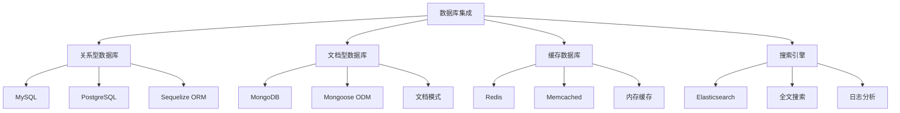
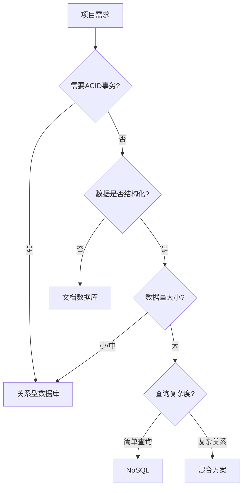

# 数据库集成方案



## 📋 知识结构（金字塔模型）

### 🏗️ 基础层：认知（What）
**数据库类型和特点对比**

| 数据库类型 | 特点 | 优势 | 劣势 | 适用场景 |
|------------|------|------|------|----------|
| **关系型** | ACID事务 | 数据一致性 | 扩展性差 | 财务系统 |
| **文档型** | 灵活模式 | 开发快速 | CPU密集型 | 内容管理 |
| **键值存储** | 高性能 | 读写速度极快 | 功能简单 | 缓存 |
| **图数据库** | 关系查询 | 复杂关系分析 | 小生态 | 社交网络 |

### 🔍 理解层：机制（Why&How）

**数据库选择决策树：**



**ORM/ODM对比：**

| 工具 | 数据库 | 特点 | 学习曲线 | 性能 |
|------|--------|------|----------|------|
| **Sequelize** | MySQL/PostgreSQL | 功能完整 | 中等 | 中等 |
| **TypeORM** | 多数据库 | TypeScript友好 | 陡峭 | 较高 |
| **Prisma** | 多数据库 | 现代设计 | 平缓 | 高 |
| **Mongoose** | MongoDB | 丰富功能 | 中等 | 中等 |

### 🚀 应用层：实践（Apply）

**MongoDB集成实现：**

```javascript
const mongoose = require('mongoose');

// ✅ MongoDB连接管理类
class MongoDBManager {
  constructor(config) {
    this.config = {
      uri: config.uri || 'mongodb://localhost:27017/myapp',
      options: {
        maxPoolSize: 10,
        serverSelectionTimeoutMS: 5000,
        socketTimeoutMS: 45000,
        family: 4,
        ...config.options
      }
    };
    this.isConnected = false;
  }
  
  async connect() {
    try {
      await mongoose.connect(this.config.uri, this.config.options);
      this.isConnected = true;
      
      // 连接事件监听
      mongoose.connection.on('connected', () => {
        console.log('MongoDB connected');
      });
      
      mongoose.connection.on('error', (err) => {
        console.error('MongoDB connection error:', err);
        this.isConnected = false;
      });
      
      mongoose.connection.on('disconnected', () => {
        console.log('MongoDB disconnected');
        this.isConnected = false;
      });
      
      console.log('MongoDB connected successfully');
    } catch (error) {
      console.error('MongoDB connection failed:', error);
      throw error;
    }
  }
  
  async disconnect() {
    try {
      await mongoose.disconnect();
      this.isConnected = false;
      console.log('MongoDB disconnected successfully');
    } catch (error) {
      console.error('MongoDB disconnect error:', error);
      throw error;
    }
  }
  
  async healthCheck() {
    if (!this.isConnected) {
      return { status: 'disconnected', healthy: false };
    }
    
    try {
      await mongoose.connection.db.admin().ping();
      return {
        status: 'connected',
        healthy: true,
        database: mongoose.connection.db.databaseName,
        collections: await mongoose.connection.db.listCollections().toArray()
      };
    } catch (error) {
      return {
        status: 'error',
        healthy: false,
        error: error.message
      };
    }
  }
}

// ✅ Mongoose模型工厂
class ModelFactory {
  static createUserModel() {
    const userSchema = new mongoose.Schema({
      username: {
        type: String,
        required: true,
        unique: true,
        trim: true,
        minlength: 3,
        maxlength: 30
      },
      email: {
        type: String,
        required: true,
        unique: true,
        lowercase: true,
        match: [/^\w+([.-]?\w+)*@\w+([.-]?\w+)*(\.\w{2,3})+$/, 'Invalid email format']
      },
      password: {
        type: String,
        required: true,
        select: false
      },
      profile: {
        firstName: String,
        lastName: String,
        avatar: String,
        bio: String,
        birthDate: Date,
        location: {
          city: String,
          country: String
        }
      },
      preferences: {
        theme: { type: String, default: 'light' },
        language: { type: String, default: 'en' },
        notifications: {
          email: { type: Boolean, default: true },
          push: { type: Boolean, default: false }
        }
      },
      status: {
        type: String,
        enum: ['active', 'inactive', 'banned'],
        default: 'active'
      },
      lastLoginAt: Date,
      createdAt: { type: Date, default: Date.now },
      updatedAt: { type: Date, default: Date.now }
    });
    
    // 虚拟字段
    userSchema.virtual('fullName').get(function() {
      return `${this.profile?.firstName || ''} ${this.profile?.lastName || ''}`.trim();
    });
    
    // 中间件
    userSchema.pre('save', function(next) {
      this.updatedAt = new Date();
      next();
    });
    
    // 索引
    userSchema.index({ email: 1 });
    userSchema.index({ username: 1 });
    userSchema.index({ 'profile.location.city': 1, 'profile.location.country': 1 });
    userSchema.index({ createdAt: -1 });
    
    // 静态方法
    userSchema.statics.findByEmail = function(email) {
      return this.findOne({ email }).select('+password');
    };
    
    userSchema.statics.findActiveUsers = function() {
      return this.find({ status: 'active' });
    };
    
    // 实例方法
    userSchema.methods.comparePassword = async function(candidatePassword) {
      const bcrypt = require('bcrypt');
      return bcrypt.compare(candidatePassword, this.password);
    };
    
    userSchema.methods.updateLastLogin = function() {
      this.lastLoginAt = new Date();
      return this.save();
    };
    
    return mongoose.model('User', userSchema);
  }
  
  static createProductModel() {
    const productSchema = new mongoose.Schema({
      name: {
        type: String,
        required: true,
        trim: true,
        maxlength: 200
      },
      description: {
        type: String,
        required: true,
        maxlength: 2000
      },
      price: {
        type: Number,
        required: true,
        min: 0
      },
      category: {
        type: mongoose.Schema.Types.ObjectId,
        ref: 'Category',
        required: true
      },
      tags: [String],
      images: [String],
      inventory: {
        quantity: { type: Number, default: 0 },
        reserved: { type: Number, default: 0 }
      },
      specifications: mongoose.Schema.Types.Mixed,
      status: {
        type: String,
        enum: ['active', 'inactive', 'discontinued'],
        default: 'active'
      },
      createdAt: { type: Date, default: Date.now },
      updatedAt: { type: Date, default: Date.now }
    });
    
    // 虚拟字段
    productSchema.virtual('availableQuantity').get(function() {
      return Math.max(0, this.inventory.quantity - this.inventory.reserved);
    });
    
    productSchema.virtual('isInStock').get(function() {
      return this.availableQuantity > 0;
    });
    
    // 索引
    productSchema.index({ name: 'text', description: 'text' });
    productSchema.index({ category: 1 });
    productSchema.index({ price: 1 });
    productSchema.index({ tags: 1 });
    productSchema.index({ status: 1, createdAt: -1 });
    
    // 静态方法
    productSchema.statics.searchProducts = function(searchTerm, options = {}) {
      const query = {
        $text: { $search: searchTerm }
      };
      
      if (options.category) {
        query.category = options.category;
      }
      
      if (options.minPrice !== undefined || options.maxPrice !== undefined) {
        query.price = {};
        if (options.minPrice !== undefined) query.price.$gte = options.minPrice;
        if (options.maxPrice !== undefined) query.price.$lte = options.maxPrice;
      }
      
      return this.find(query, { score: { $meta: 'textScore' } })
        .sort({ score: { $meta: 'textScore' } })
        .populate('category', 'name');
    };
    
    return mongoose.model('Product', productSchema);
  }
}

// ✅ 数据库仓储模式
class Repository {
  constructor(model) {
    this.model = model;
  }
  
  async create(data) {
    try {
      const document = new this.model(data);
      await document.save();
      return document;
    } catch (error) {
      throw this.handleError(error);
    }
  }
  
  async findById(id, select = null, populate = null) {
    try {
      let query = this.model.findById(id);
      
      if (select) {
        query = query.select(select);
      }
      
      if (populate) {
        query = query.populate(populate);
      }
      
      const document = await query;
      
      if (!document) {
        throw new Error('Document not found');
      }
      
      return document;
    } catch (error) {
      throw this.handleError(error);
    }
  }
  
  async findOne(conditions = {}, select = null, populate = null) {
    try {
      let query = this.model.findOne(conditions);
      
      if (select) {
        query = query.select(select);
      }
      
      if (populate) {
        query = query.populate(populate);
      }
      
      return await query;
    } catch (error) {
      throw this.handleError(error);
    }
  }
  
  async findMany(conditions = {}, options = {}) {
    try {
      const {
        select = null,
        populate = null,
        sort = { createdAt: -1 },
        limit = 10,
        skip = 0
      } = options;
      
      let query = this.model.find(conditions);
      
      if (select) {
        query = query.select(select);
      }
      
      if (populate) {
        query = query.populate(populate);
      }
      
      return await query
        .sort(sort)
        .limit(limit)
        .skip(skip);
    } catch (error) {
      throw this.handleError(error);
    }
  }
  
  async updateById(id, updateData, options = {}) {
    try {
      const { runValidators = true, new: returnNew = true } = options;
      
      const document = await this.model.findByIdAndUpdate(
        id,
        updateData,
        {
          runValidators,
          new: returnNew
        }
      );
      
      if (!document) {
        throw new Error('Document not found');
      }
      
      return document;
    } catch (error) {
      throw this.handleError(error);
    }
  }
  
  async deleteById(id) {
    try {
      const document = await this.model.findByIdAndDelete(id);
      
      if (!document) {
        throw new Error('Document not found');
      }
      
      return document;
    } catch (error) {
      throw this.handleError(error);
    }
  }
  
  async count(conditions = {}) {
    try {
      return await this.model.countDocuments(conditions);
    } catch (error) {
      throw this.handleError(error);
    }
  }
  
  async aggregate(pipeline) {
    try {
      return await this.model.aggregate(pipeline);
    } catch (error) {
      throw this.handleError(error);
    }
  }
  
  handleError(error) {
    if (error.name === 'ValidationError') {
      const validationErrors = Object.values(error.errors).map(err => ({
        field: err.path,
        message: err.message,
        value: err.value
      }));
      
      const validationError = new Error('Validation failed');
      validationError.statusCode = 400;
      validationError.details = validationErrors;
      return validationError;
    }
    
    if (error.code === 11000) {
      const duplicateError = new Error('Duplicate entry');
      duplicateError.statusCode = 409;
      duplicateError.field = Object.keys(error.keyPattern)[0];
      return duplicateError;
    }
    
    return error;
  }
}
```

**Redis缓存集成：**

```javascript
const redis = require('redis');

// ✅ Redis缓存管理类
class RedisManager {
  constructor(config) {
    this.config = {
      host: config.host || 'localhost',
      port: config.port || 6379,
      password: config.password || null,
      db: config.db || 0,
      retryDelayOnFailover: 100,
      maxRetriesPerRequest: 3,
      lazyConnect: true,
      ...config
    };
    
    this.client = null;
    this.publisher = null;
    this.subscriber = null;
    this.isConnected = false;
  }
  
  async connect() {
    try {
      this.client = redis.createClient(this.config);
      this.publisher = redis.createClient(this.config);
      this.subscriber = redis.createClient(this.config);
      
      await Promise.all([
        this.client.connect(),
        this.publisher.connect(),
        this.subscriber.connect()
      ]);
      
      this.isConnected = true;
      
      // 事件监听
      this.client.on('error', (err) => {
        console.error('Redis client error:', err);
        this.isConnected = false;
      });
      
      this.client.on('connect', () => {
        console.log('Redis connected');
        this.isConnected = true;
      });
      
      this.client.on('close', () => {
        console.log('Redis disconnected');
        this.isConnected = false;
      });
      
      console.log('Redis connected successfully');
    } catch (error) {
      console.error('Redis connection failed:', error);
      throw error;
    }
  }
  
  async disconnect() {
    try {
      await Promise.all([
        this.client?.quit(),
        this.publisher?.quit(),
        this.subscriber?.quit()
      ]);
      
      this.isConnected = false;
      console.log('Redis disconnected successfully');
    } catch (error) {
      console.error('Redis disconnect error:', error);
      throw error;
    }
  }
  
  // 缓存操作方法
  async set(key, value, ttl = 3600) {
    try {
      const serialized = JSON.stringify(value);
      await this.client.setEx(key, ttl, serialized);
      return true;
    } catch (error) {
      console.error('Redis set error:', error);
      return false;
    }
  }
  
  async get(key, parser = true) {
    try {
      const value = await this.client.get(key);
      
      if (!value) return null;
      
      return parser ? JSON.parse(value) : value;
    } catch (error) {
      console.error('Redis get error:', error);
      return null;
    }
  }
  
  async del(key) {
    try {
      const result = await this.client.del(key);
      return result > 0;
    } catch (error) {
      console.error('Redis delete error:', error);
      return false;
    }
  }
  
  async exists(key) {
    try {
      const result = await this.client.exists(key);
      return result === 1;
    } catch (error) {
      console.error('Redis exists error:', error);
      return false;
    }
  }
  
  async setMultiple(keyValuePairs, ttl = 3600) {
    try {
      const pipeline = this.client.multi();
      
      for (const [key, value] of Object.entries(keyValuePairs)) {
        pipeline.setEx(key, ttl, JSON.stringify(value));
      }
      
      await pipeline.exec();
      return true;
    } catch (error) {
      console.error('Redis setMultiple error:', error);
      return false;
    }
  }
  
  async getMultiple(keys) {
    try {
      const values = await this.client.mGet(keys);
      
      return keys.reduce((result, key, index) => {
        const value = values[index];
        result[key] = value ? JSON.parse(value) : null;
        return result;
      }, {});
    } catch (error) {
      console.error('Redis getMultiple error:', error);
      return {};
    }
  }
  
  // 高级缓存方法
  async setWithFallback(key, fallbackFunction, ttl = 3600) {
    try {
      const cached = await this.get(key);
      
      if (cached) {
        return cached;
      }
      
      const freshData = await fallbackFunction();
      await this.set(key, freshData, ttl);
      
      return freshData;
    } catch (error) {
      console.error('Redis setWithFallback error:', error);
      return await fallbackFunction();
    }
  }
  
  async invalidatePattern(pattern) {
    try {
      const keys = await this.client.keys(pattern);
      
      if (keys.length > 0) {
        await this.client.del(keys);
      }
      
      return keys.length;
    } catch (error) {
      console.error('Redis invalidatePattern error:', error);
      return 0;
    }
  }
  
  // 发布订阅
  async publish(channel, message) {
    try {
      const result = await this.publisher.publish(channel, JSON.stringify(message));
      return result;
    } catch (error) {
      console.error(':_Redis publish error:', error);
      return false;
    }
  }
  
  async subscribe(channel, callback) {
    try {
      await this.subscriber.subscribe(channel);
      
      this.subscriber.on('message', (receivedChannel, message) => {
        if (receivedChannel === channel) {
          try {
            const parsedMessage = JSON.parse(message);
            callback(parsedMessage);
          } catch (error) {
            console.error('Message parsing error:', error);
          }
        }
      });
      
      return true;
    } catch (error) {
      console.error('Redis subscribe error:', error);
      return false;
    }
  }
}

// ✅ 缓存服务抽象
class CacheService {
  constructor(redisManager) {
    this.redis = redisManager;
    this.defaultTTL = 3600; // 1小时
  }
  
  async getUserCache(userId) {
    const key = `user:${userId}`;
    return await this.redis.get(key);
  }
  
  async setUserCache(userId, userData, ttl = this.defaultTTL) {
    const key = `user:${userId}`;
    return await this.redis.set(key, userData, ttl);
  }
  
  async invalidateUserCache(userId) {
    const patterns = [`user:${userId}`, `user:${userId}:*`];
    
    for (const pattern of patterns) {
      await this.redis.invalidatePattern(pattern);
    }
  }
  
  async getProductCache(productId) {
    const key = `product:${productId}`;
    return await this.redis.get(key);
  }
  
  async setProductCache(productId, productData, ttl = this.defaultTTL) {
    const key = `product:${productId}`;
    return await this.redis.set(key, productData, ttl);
  }
  
  async invalidateProductCache(productId) {
    const patterns = [`product:${productId}`, `product:${productId}:*`];
    
    for (const pattern of patterns) {
      await this.redis.invalidatePattern(pattern);
    }
  }
  
  async getSessionCache(sessionId) {
    const key = `session:${sessionId}`;
    return await this.redis.get(key);
  }
  
  async setSessionCache(sessionId, sessionData, ttl = 86400) { // 24小时
    const key = `session:${sessionId}`;
    return await this.redis.set(key, sessionData, ttl);
  }
  
  async deleteSessionCache(sessionId) {
    const key = `session:${sessionId}`;
    return await this.redis.del(key);
  }
}
```

**数据库事务管理：**

```javascript
// ✅ 事务管理类
class TransactionManager {
  constructor(mongoManager) {
    this.mongo = mongoManager;
    this.session = null;
  }
  
  async beginTransaction() {
    try {
      this.session = await mongoose.startSession();
      this.session.startTransaction();
      return this.session;
    } catch (error) {
      console.error('Failed to begin transaction:', error);
      throw error;
    }
  }
  
  async commitTransaction() {
    try {
      if (this.session) {
        await this.session.commitTransaction();
        await this.session.endSession();
        this.session = null;
        console.log('Transaction committed successfully');
      }
    } catch (error) {
      console.error('Failed to commit transaction:', error);
      throw error;
    }
  }
  
  async rollbackTransaction() {
    try {
      if (this.session) {
        await this.session.abortTransaction();
        await this.session.endSession();
        this.session = null;
        console.log('Transaction rolled back successfully');
      }
    } catch (error) {
      console.error('Failed to rollback transaction:', error);
      throw error;
    }
  }
  
  async executeInTransaction(operations) {
    let session = null;
    
    try {
      session = await mongoose.startSession();
      session.startTransaction();
      
      const results = [];
      
      for (const operation of operations) {
        const result = await operation(session);
        results.push(result);
      }
      
      await session.commitTransaction();
      await session.endSession();
      
      return results;
    } catch (error) {
      if (session) {
        await session.abortTransaction();
        await session.endSession();
      }
      
      console.error('Transaction execution failed:', error);
      throw error;
    }
  }
  
  // 示例：转账事务
  async transferMoney(fromUserId, toUserId, amount) {
    return await this.executeInTransaction([
      async (session) => {
        const Account = mongoose.model('Account');
        return await Account.findOneAndUpdate(
          { userId: fromUserId },
          { $inc: { balance: -amount } },
          { session, new: true }
        );
      },
      async (session) => {
        const Account = mongoose.model('Account');
        return await Account.findOneAndUpdate(
          { userId: toUserId },
          { $inc: { balance: amount } },
          { session, new: true }
        );
      },
      async (session) => {
        const Transaction = mongoose.model('Transaction');
        return await Transaction.create([{
          fromUser: fromUserId,
          toUser: toUserId,
          amount,
          type: 'transfer',
          status: 'completed'
        }], { session });
      }
    ]);
  }
}
```

## 🧠 费曼学习法：能用简单的话解释

**数据库集成核心思想：**
1. **数据库** = 不同的房间，放不同类型的家具（数据）
2. **ORM/ODM** = 自动服务员，帮我们管理房间
3. **缓存** = 桌上放常用东西，不用每次都去柜子里拿

**选择原则：**
```javascript
const selectionPrinciples = {
  '关系型数据库': '需要严格事务和一致性',
  '文档数据库': '数据变化频繁，结构灵活',
  'Redis缓存': '频繁访问的热点数据',
  '搜索引擎': '需要复杂搜索功能'
};
```

## 🎯 刻意练习要点

**必须掌握的技能：**
- [ ] 选择合适的数据库技术
- [ ] 实现ORM/ODM模型设计
- [ ] 配置和管理数据库连接
- [ ] 实现高效缓存策略

**编程练习：**

**1. 实现数据仓库模式**
```javascript
// 练习：创建通用数据仓库
class GenericRepository {
  constructor(model, cacheService = null) {
    this.model = model;
    this.cache = cacheService;
    this.cachePrefix = this.model.collection.name.toLowerCase();
  }
  
  async findWithCache(filter, options = {}) {
    const cacheKey = this.generateCacheKey(filter, options);
    
    if (this.cache) {
      const cached = await this.cache.get(cacheKey);
      if (cached) return cached;
    }
    
    const result = await this.model.find(filter, options);
    
    if (this.cache) {
      await this.cache.set(cacheKey, result, options.ttl || 600);
    }
    
    return result;
  }
  
  generateCacheKey(filter, options) {
    const filterStr = JSON.stringify(filter);
    const optionsStr = JSON.stringify(options);
    const hash = require('crypto')
      .createHash('md5')
      .update(filterStr + optionsStr)
      .digest('hex');
    
    return `${this.cachePrefix}:query:${hash}`;
  }
  
  async bulkUpsert(upserts) {
    const bulkOps = upserts.map(upsert => ({
      updateOne: {
        filter: upsert.filter,
        update: { $set: upsert.data },
        upsert: true
      }
    }));
    
    return await this.model.bulkWrite(bulkOps);
  }
}
```

**2. 实现数据库迁移系统**
```javascript
// 练习：创建数据库迁移管理
class MigrationManager {
  constructor(db, migrationCollection = 'migrations') {
    this.db = db;
    this.collection = this.db.collection(migrationCollection);
  }
  
  async createMigration(name, up, down) {
    const migration = {
      name,
      up: up.toString(),
      down: down.toString(),
      createdAt: new Date(),
      ranAt: null
    };
    
    await this.collection.insertOne(migration);
    return migration;
  }
  
  async runMigrations() {
    const pending = await this.getPendingMigrations();
    
    for (const migration of pending) {
      console.log(`Running migration: ${migration.name}`);
      
      try {
        await this.executeScript(migration.up);
        await this.markMigrationAsRun(migration.name);
        console.log(`✓ Migration completed: ${migration.name}`);
      } catch (error) {
        console.error(`✗ Migration failed: ${migration.name}`, error);
        throw error;
      }
    }
  }
  
  async rollbackMigration(name) {
    const migration = await this.collection.findOne({ name });
    
    if (!migration) {
      throw new Error(`Migration not found: ${name}`);
    }
    
    console.log(`Rolling back migration: ${name}`);
    
    try {
      await this.executeScript(migration.down);
      await this.collection.updateOne(
        { name },
        { $set: { ranAt: null } }
      );
      console.log(`✓ Rollback completed: ${name}`);
    } catch (error) {
      console.error(`✗ Rollback failed: ${name}`, error);
      throw error;
    }
  }
  
  async executeScript(functionCode) {
    const func = new Function('db', 'collection', functionCode);
    return func(this.db, this.db.collection);
  }
  
  async getPendingMigrations() {
    return await this.collection.find({ ranAt: null }).toArray();
  }
  
  async markMigrationAsRun(name) {
    await this.collection.updateOne(
      { name },
      { $set: { ranAt: new Date() } }
    );
  }
}
```

**数据库性能监控：**
```javascript
// ✅ 数据库性能监控
class DatabasePerformanceMonitor {
  constructor(databaseManager) {
    this.db = databaseManager;
    this.metrics = {
      queryCount: 0,
      queryTimes: [],
      errorCount: 0,
      lastHealthCheck: null
    };
  }
  
  async trackQuery(queryFunction) {
    const startTime = Date.now();
    this.metrics.queryCount++;
    
    try {
      const result = await queryFunction();
      
      const duration = Date.now() - startTime;
      this.metrics.queryTimes.push(duration);
      
      if (this.metrics.queryTimes.length > 1000) {
        this.metrics.queryTimes.shift(); // 保持最近1000次记录
      }
      
      return result;
    } catch (error) {
      this.metrics.errorCount++;
      throw error;
    }
  }
  
  generatePerformanceReport() {
    const times = this.metrics.queryTimes;
    const averageTime = times.length > 0 
      ? times.reduce((a, b) => a + b, 0) / times.length 
      : 0;
    
    const maxTime = Math.max(...times, 0);
    const minTime = Math.min(...times, Infinity);
    
    return {
      queriesExecuted: this.metrics.queryCount,
      averageQueryTime: Math.round(averageTime * 100) / 100,
      maxQueryTime: maxTime,
      minQueryTime: minTime === Infinity ? 0 : minTime,
      errorRate: this.metrics.queryCount > 0 
        ? (this.metrics.errorCount / this.metrics.queryCount * 100).toFixed(2) + '%'
        : '0%',
      timestamp: new Date().toISOString()
    };
  }
  
  async checkDatabaseHealth() {
    this.metrics.lastHealthCheck = new Date();
    
    try {
      const healthCheck = await this.db.healthCheck();
      
      return {
        ...healthCheck,
        performanceMetrics: this.generatePerformanceReport()
      };
    } catch (error) {
      return {
        status: 'error',
        healthy: false,
        error: error.message,
        performanceMetrics: this.generatePerformanceReport()
      };
    }
  }
}
```

**关联学习：**
- → [[018-身份验证与授权]] 安全数据库设计
- → [[019-API设计与文档]] 数据API设计
- → [[032-全栈博客系统]] 实际数据库应用

## 💡 知识点跳转

**前置知识：** [[016-Web应用架构设计]] - 应用架构基础
**后续深入：** [[018-身份验证与授权]] - 安全数据管理

---

*🔗 相关链接：[[016-Web应用架构设计]] | [[018-身份验证与授权]] | [[032-全栈博客系统]]*
