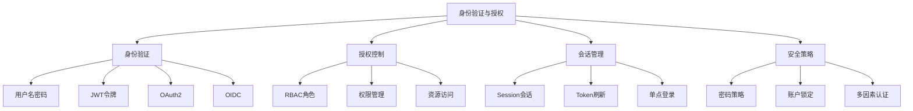
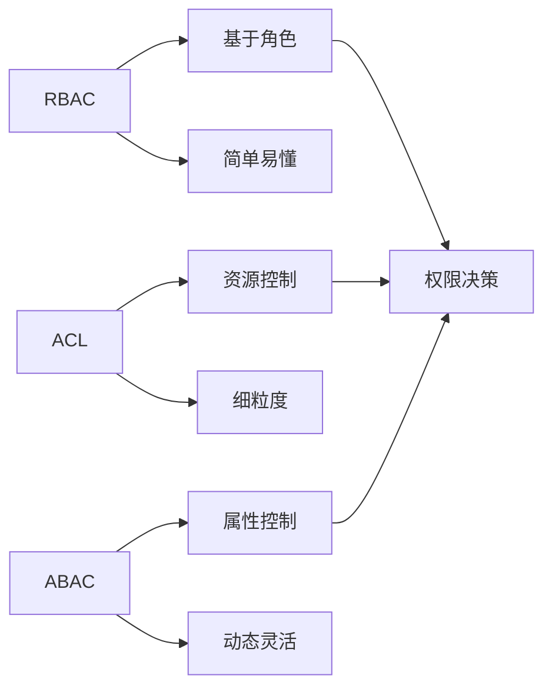

# 身份验证与授权



## 📋 知识结构（金字塔模型）

### 🏗️ 基础层：认知（What）
**认证与授权的核心概念**

| 概念 | 含义 | 职责 | 实现方式 |
|------|------|------|----------|
| **身份验证(Auth)** | 验证用户身份 | "你是谁?" | 用户名/密码、生物识别 |
| **授权(Authorization)** | 控制访问权限 | "你能做什么?" | RBAC、ACL、ABAC |
| **会话管理** | 维持用户状态 | "保持登录状态" | Session、Token |
| **安全策略** | 安全规则定义 | "如何保护?" | 密码策略、MFA |

### 🔍 理解层：机制（Why&How）

**认证流程对比：**

| 认证方式 | 特点 | 安全级别 | 用户体验 | 适用场景 |
|----------|------|----------|----------|----------|
| **Session + Cookie** | 服务器端状态 | 高 | 好 | 传统Web应用 |
| **JWT Token** | 无状态、可扩展 | 中 | 好 | SPA、API |
| **OAuth2** | 第三方集成 | 高 | 优异 | 第三方登录 |
| **OpenID Connect** | 身份联邦 | 极高 | 优异 | 企业SSO |

**权限模型对比：**



### 🚀 应用层：实践（Apply）

**JWT认证系统：**

```javascript
const jwt = require('jsonwebtoken');
const bcrypt = require('bcrypt');
const crypto = require('crypto');

// ✅ JWT认证服务
class JWTAuthService {
  constructor(options = {}) {
    this.secret = options.secret || process.env.JWT_SECRET;
    this.refreshSecret = options.refreshSecret || process.env.JWT_REFRESH_SECRET;
    this.expiresIn = options.expiresIn || '24h';
    this.refreshExpiresIn = options.refreshExpiresIn || '7d';
    this.algorithm = options.algorithm || 'HS256';
    
    if (!this.secret || !this.refreshSecret) {
      throw new Error('JWT secrets must be configured');
    }
  }
  
  // 生成访问令牌
  generateAccessToken(payload) {
    const tokenPayload = {
      userId: payload.userId,
      email: payload.email,
      role: payload.role,
      permissions: payload.permissions || [],
      type: 'access'
    };
    
    return jwt.sign(tokenPayload, this.secret, {
      expiresIn: this.expiresIn,
      algorithm: this.algorithm,
      issuer: 'myapp.com',
      audience: 'myapp-users'
    });
  }
  
  // 生成刷新令牌
  generateRefreshToken(payload) {
    const tokenPayload = {
      userId: payload.userId,
      tokenVersion: payload.tokenVersion || 0,
      type: 'refresh'
    };
    
    return jwt.sign(tokenPayload, this.refreshSecret, {
      expiresIn: this.refreshExpiresIn,
      algorithm: this.algorithm,
      issuer: 'myapp.com',
      audience: 'myapp-users'
    });
  }
  
  // 生成令牌对
  generateTokenPair(user) {
    return {
      accessToken: this.generateAccessToken(user),
      refreshToken: this.generateRefreshToken(user),
      expiresIn: this.parseExpiration(this.expiresIn)
    };
  }
  
  // 验证访问令牌
  verifyAccessToken(token) {
    try {
      return jwt.verify(token, this.secret, {
        issuer: 'myapp.com',
        audience: 'myapp-users'
      });
    } catch (error) {
      throw new Error(`Invalid access token: ${error.message}`);
    }
  }
  
  // 验证刷新令牌
  verifyRefreshToken(token) {
    try {
      return jwt.verify(token, this.refreshSecret, {
        issuer: 'myapp.com',
        audience: 'myapp-users'
      });
    } catch (error) {
      throw new Error(`Invalid refresh token: ${error.message}`);
    }
  }
  
  // 刷新令牌
  async refreshTokens(refreshToken, userRepository) {
    const decoded = this.verifyRefreshToken(refreshToken);
    
    if (decoded.type !== 'refresh') {
      throw new Error('Invalid token type for refresh');
    }
    
    // 查找用户并验证令牌版本
    const user = await userRepository.findById(decoded.userId);
    if (!user || user.tokenVersion !== decoded.tokenVersion) {
      throw new Error('Invalid refresh token');
    }
    
    // 生成新的令牌对
    return this.generateTokenPair(user);
  }
  
  parseExpiration(expiresIn) {
    const units = {
      s: 1000,
      m: 60 * 1000,
      h: 60 * 60 * 1000,
      d: 24 * 60 * 60 * 1000
    };
    
    const match = expiresIn.match(/^(\d+)([smhd])$/);
    if (match) {
      return parseInt(match[1]) * units[match[2]];
    }
    
    return 24 * 60 * 60 * 1000; // 默认24小时
  }
}

// ✅ 密码加密服务
class PasswordService {
  constructor(options = {}) {
    this.saltRounds = options.saltRounds || 12;
    this.minLength = options.minLength || 8;
    this.requireSpecialChar = options.requireSpecialChar !== false;
    this.requireNumber = options.requireNumber !== false;
    this.requireUppercase = options.requireUppercase !== false;
    this.requireLowercase = options.requireLowercase !== false;
  }
  
  // 验证密码强度
  validatePasswordStrength(password) {
    const errors = [];
    
    if (password.length < this.minLength) {
      errors.push(`Password must be at least ${this.minLength} characters long`);
    }
    
    if (this.requireSpecialChar && !/[!@#$%^&*(),.?":{}|<>]/.test(password)) {
      errors.push('Password must contain at least one special character');
    }
    
    if (this.requireNumber && !/\d/.test(password)) {
      errors.push('Password must contain at least one number');
    }
    
    if (this.requireUppercase && !/[A-Z]/.test(password)) {
      errors.push('Password must contain at least one uppercase letter');
    }
    
    if (this.requireLowercase && !/[a-z]/.test(password)) {
      errors.push('Password must contain at least one lowercase letter');
    }
    
    if (/(.)\1{2,}/.test(password)) {
      errors.push('Password cannot contain more than 2 consecutive identical characters');
    }
    
    // 检查常见密码
    const commonPasswords = ['123456', 'password', '123456789', 'password123'];
    if (commonPasswords.includes(password.toLowerCase())) {
      errors.push('Password is too common. Please choose a different password');
    }
    
    return {
      isValid: errors.length === 0,
      errors,
      score: this.calculatePasswordScore(password)
    };
  }
  
  // 计算密码强度分数
  calculatePasswordScore(password) {
    let score = 0;
    
    // 长度分数
    if (password.length >= 8) score += 2;
    if (password.length >= 12) score += 3;
    if (password.length >= 16) score += 2;
    
    // 字符多样性分数
    if (/[a-z]/.test(password)) score += 1;
    if (/[A-Z]/.test(password)) score += 1;
    if (/\d/.test(password)) score += 1;
    if (/[!@#$%^&*(),.?":{}|<>]/.test(password)) score += 2;
    
    return Math.min(score, 10); // 最高10分
  }
  
  // 加密密码
  async hashPassword(password) {
    const validation = this.validatePasswordStrength(password);
    
    if (!validation.isValid) {
      const error = new Error('Invalid password');
      error.details = validation.errors;
      throw error;
    }
    
    return await bcrypt.hash(password, this.saltRounds);
  }
  
  // 验证密码
  async comparePassword(password, hashedPassword) {
    return await bcrypt.compare(password, hashedPassword);
  }
  
  // 生成安全的随机密码
  generateSecurePassword(length = 16) {
    const lowercase = 'abcdefghijklmnopqrstuvwxyz';
    const uppercase = 'ABCDEFGHIJKLMNOPQRSTUVWXYZ';
    const numbers = '0123456789';
    const special = '!@#$%^&*';
    
    const allChars = lowercase + uppercase + numbers + special;
    
    let password = '';
    
    // 确保至少包含每种字符
    password += lowercase[Math.floor(Math.random() * lowercase.length)];
    password += uppercase[Math.floor(Math.random() * uppercase.length)];
    password += numbers[Math.floor(Math.random() * numbers.length)];
    password += special[Math.floor(Math.random() * special.length)];
    
    // 填充剩余长度
    for (let i = password.length; i < length; i++) {
      password += allChars[Math.floor(Math.random() * allChars.length)];
    }
    
    // 打乱字符顺序
    return password.split('').sort(() => Math.random() - 0.5).join('');
  }
}

// ✅ RBAC权限管理系统
class RBACPermissionService {
  constructor(options = {}) {
    this.permissions = new Map();
    this.roles = new Map();
    this.resources = new Map();
    this.defaultRole = options.defaultRole || 'user';
    this.superAdminRole = options.superAdminRole || 'super_admin';
  }
  
  // 定义权限
  definePermission(name, resource, action, conditions = {}) {
    const permission = {
      name,
      resource,
      action,
      conditions,
      createdAt: new Date()
    };
    
    this.permissions.set(name, permission);
    
    if (!this.resources.has(resource)) {
      this.resources.set(resource, new Set());
    }
    this.resources.get(resource).add(name);
    
    return permission;
  }
  
  // 定义角色
  defineRole(name, permissions = [], metadata = {}) {
    const role = {
      name,
      permissions: [...permissions],
      metadata: {
        isSystem: false,
        canDelete: true,
        canModifyPermissions: false,
        ...metadata
      },
      createdAt: new Date()
    };
    
    this.roles.set(name, role);
    return role;
  }
  
  // 为用户分配角色
  async assignRoleToUser(userId, roleName, assignedBy = null) {
    const role = this.roles.get(roleName);
    
    if (!role) {
      throw new Error(`Role ${roleName} does not exist`);
    }
    
    // 这里应该保存到数据库
    // await this.userRoleRepository.create({ userId, roleName, assignedBy });
    
    return {
      userId,
      roleName,
      assignedBy,
      assignedAt: new Date()
    };
  }
  
  // 检查用户权限
  async checkUserPermission(userId, permissionName, context = {}) {
    try {
      // 获取用户角色
      const userRoles = await this.getUserRoles(userId);
      
      // 超级管理员拥有所有权限
      if (userRoles.includes(this.superAdminRole)) {
        return { allowed: true, reason: 'super_admin_access' };
      }
      
      // 检查每个角色的权限
      for (const roleName of userRoles) {
        const role = this.roles.get(roleName);
        
        if (!role) continue;
        
        if (role.permissions.includes(permissionName)) {
          const permission = this.permissions.get(permissionName);
          
          // 检查权限条件
          if (this.evaluateConditions(permission.conditions, context)) {
            return { allowed: true, reason: 'role_permission', role: roleName };
          }
        }
      }
      
      return { allowed: false, reason: 'insufficient_permissions' };
    } catch (error) {
      console.error('Permission check error:', error);
      return { allowed: false, reason: 'check_failed', error: error.message };
    }
  }
  
  // 获取用户所有权限
  async getUserPermissions(userId) {
    const userRoles = await this.getUserRoles(userId);
    const userPermissions = new Set();
    
    for (const roleName of userRoles) {
      const role = this.roles.get(roleName);
      
      if (role) {
        role.permissions.forEach(perm => userPermissions.add(perm));
      }
    }
    
    return Array.from(userPermissions);
  }
  
  // 评估权限条件
  evaluateConditions(conditions, context) {
    for (const [key, expectedValue] of Object.entries(conditions)) {
      const actualValue = this.getNestedValue(context, key);
      
      if (actualValue !== expectedValue) {
        return false;
      }
    }
    
    return true;
  }
  
  // 获取嵌套对象值
  getNestedValue(obj, path) {
    return path.split('.').reduce((current, prop) => current && current[prop], obj);
  }
  
  // 获取用户角色（这里应该从数据库查询）
  async getUserRoles(userId) {
    // 模拟数据，实际应该查询数据库
    return ['user', 'content_creator']; // userId相关逻辑
  }
  
  // 初始化默认权限和角色
  initializeDefaultPermissions() {
    // 定义基础权限
    this.definePermission('users.create', 'users', 'create');
    this.definePermission('users.read', 'users', 'read');
    this.definePermission('users.update', 'users', 'update');
    this.definePermission('users.delete', 'users', 'delete');
    
    this.definePermission('posts.create', 'posts', 'create');
    this.definePermission('posts.read', 'posts', 'read');
    this.definePermission('posts.update', 'posts', 'update');
    this.definePermission('posts.delete', 'posts', 'delete');
    
    // 定义角色
    this.defineRole('guest', ['posts.read'], {
      isSystem: true,
      canDelete: false
    });
    
    this.defineRole('user', [
      'posts.create', 'posts.read', 'posts.update'
    ], {
      isSystem: true,
      canDelete: false
    });
    
    this.defineRole('moderator', [
      'posts.create', 'posts.read', 'posts.update', 'posts.delete',
      'users.read'
    ], {
      metadata: { level: 2 }
    });
    
    this.defineRole('admin', [
      'posts.create', 'posts.read', 'posts.update', 'posts.delete',
      'users.create', 'users.read', 'users.update'
    ], {
      metadata: { level: 3 },
      canModifyPermissions: true
    });
    
    this.defineRole('super_admin', [
      'posts.create', 'posts.read', 'posts.update', 'posts.delete',
      'users.create', 'users.read', 'users.update', 'users.delete'
    ], {
      metadata: { level: 4 },
      isSystem: true,
      canDelete: false,
      canModifyPermissions: true
    });
  }
}
```

**中间件实现：**

```javascript
// ✅ 认证中间件
class AuthMiddleware {
  constructor(authService, userRepository) {
    this.authService = authService;
    this.userRepository = userRepository;
    this.authenticatedUsers = new Map(); // 内存缓存
  }
  
  // JWT认证中间件
  jwtAuth() {
    return async (req, res, next) => {
      try {
        const token = this.extractToken(req);
        
        if (!token) {
          return res.status(401).json({
            error: 'Authentication required',
            message: 'Token is missing'
          });
        }
        
        const decoded = this.authService.verifyAccessToken(token);
        
        // 检查令牌黑名单（可选）
        if (await this.isTokenBlacklisted(token)) {
          return res.status(401).json({
            error: 'Token revoked',
            message: 'Token has been invalidated'
          });
        }
        
        // 获取用户信息
        const user = await this.getUserFromToken(decoded);
        
        if (!user || user.status !== 'active') {
          return res.status(401).json({
            error: 'User not found or inactive',
            message: 'User account is not accessible'
          });
        }
        
        req.user = user;
        req.userId = user._id;
        req.token = token;
        req.tokenClaims = decoded;
        
        next();
      } catch (error) {
        console.error('Authentication error:', error.message);
        
        if (error.message.includes('expired')) {
          return res.status(401).json({
            error: 'Token expired',
            message: 'Please login again'
          });
        }
        
        return res.status(401).json({
          error: 'Authentication failed',
          message: error.message
        });
      }
    };
  }
  
  // 权限检查中间件
  requirePermission(permissionName, options = {}) {
    return async (req, res, next) => {
      try {
        if (!req.user) {
          return res.status(401).json({
            error: 'Authentication required',
            message: 'User must be authenticated'
          });
        }
        
        const context = {
          userId: req.user._id,
          userRole: req.user.role,
          resource: options.resource,
          ownerId: options.ownerIdExtractor ? options.ownerIdExtractor(req) : null
        };
        
        // 合并额外的上下文
        if (options.contextExtractor) {
          Object.assign(context, options.contextExtractor(req));
        }
        
        const permissionCheck = await this.authService.permissionService.checkUserPermission(
          req.user._id,
          permissionName,
          context
        );
        
        if (!permissionCheck.allowed) {
          return res.status(403).json({
            error: 'Insufficient permissions',
            message: `Requires permission: ${permissionName}`,
            reason: permissionCheck.reason
          });
        }
        
        req.permissionContext = permissionCheck;
        next();
      } catch (error) {
        console.error('Permission check error:', error);
        res.status(500).json({
          error: 'Permission check failed',
          message: 'Internal server error during permission verification'
        });
      }
    };
  }
  
  // 角色检查中间件
  requireRole(allowedRoles) {
    const roles = Array.isArray(allowedRoles) ? allowedRoles : [allowedRoles];
    
    return async (req, res, next) => {
      try {
        if (!req.user) {
          return res.status(401).json({
            error: 'Authentication required'
          });
        }
        
        if (!roles.includes(req.user.role)) {
          return res.status(403).json({
            error: 'Insufficient role',
            message: `Required roles: ${roles.join(', ')}`,
            userRole: req.user.role
          });
        }
        
        next();
      } catch (error) {
        res.status(500).json({
          error: 'Role check failed'
        });
      }
    };
  }
  
  // 所有权检查中间件
  requireOwnership(userIdField = 'user_id', options = {}) {
    return async (req, res, next) => {
      try {
        if (!req.user) {
          return res.status(401).json({
            error: 'Authentication required'
          });
        }
        
        let resourceUserId;
        
        if (typeof userIdField === 'function') {
          resourceUserId = userIdField(req);
        } else {
          resourceUserId = req.params[userIdField] || req.body[userIdField];
        }
        
        // 检查是否是资源所有者
        if (req.user._id.toString() !== resourceUserId) {
          return res.status(403).json({
            error: 'Access denied',
            message: 'You can only access your own resources'
          });
        }
        
        next();
      } catch (error) {
        res.status(500).json({
          error: 'Ownership check failed'
        });
      }
    };
  }
  
  // 提取令牌
  extractToken(req) {
    const authHeader = req.headers.authorization;
    
    if (authHeader && authHeader.startsWith('Bearer ')) {
      return authHeader.substring(7);
    }
    
    // 检查URL参数中的令牌（用于WebSocket等场景）
    if (req.query.token) {
      return req.query.token;
    }
    
    return null;
  }
  
  // 检查令牌黑名单
  async isTokenBlacklisted(token) {
    // 实现令牌黑名单检查逻辑
    return false;
  }
  
  // 从令牌获取用户信息
  async getUserFromToken(decoded) {
    const cacheKey = `user:${decoded.userId}`;
    
    // 检查缓存
    if (this.authenticatedUsers.has(cacheKey)) {
      return this.authenticatedUsers.get(cacheKey);
    }
    
    // 从数据库获取用户
    const user = await this.userRepository.findById(decoded.userId);
    
    if (user) {
      // 缓存用户信息（短期缓存）
      this.authenticatedUsers.set(cacheKey, user);
      
      // 设置缓存过期
      setTimeout(() => {
        this.authenticatedUsers.delete(cacheKey);
      }, 5 * 60 * 1000); // 5分钟
    }
    
    return user;
  }
}

// ✅ OAuth2客户端集成
class OAuth2Service {
  constructor(configs) {
    this.providers = new Map();
    
    for (const [providerName, config] of Object.entries(configs)) {
      this.providers.set(providerName, {
        authUrl: config.authUrl,
        tokenUrl: config.tokenUrl,
        clientId: config.clientId,
        clientSecret: config.clientSecret,
        redirectUri: config.redirectUri,
        scope: config.scope || 'read',
        ...config
      });
    }
  }
  
  // 生成认证URL
  generateAuthUrl(providerName, state = null) {
    const provider = this.providers.get(providerName);
    
    if (!provider) {
      throw new Error(`OAuth provider ${providerName} not configured`);
    }
    
    const params = new URLSearchParams({
      response_type: 'code',
      client_id: provider.clientId,
      redirect_uri: provider.redirectUri,
      scope: provider.scope
    });
    
    if (state) {
      params.append('state', state);
    }
    
    return `${provider.authUrl}?${params.toString()}`;
  }
  
  // 交换访问令牌
  async exchangeCodeForToken(providerName, code) {
    const provider = this.providers.get(providerName);
    
    if (!provider) {
      throw new Error(`OAuth provider ${providerName} not configured`);
    }
    
    const response = await fetch(provider.tokenUrl, {
      method: 'POST',
      headers: {
        'Accept': 'application/json',
        'Content-Type': 'application/x-www-form-urlencoded'
      },
      body: new URLSearchParams({
        grant_type: 'authorization_code',
        client_id: provider.clientId,
        client_secret: provider.clientSecret,
        code,
        redirect_uri: provider.redirectUri
      })
    });
    
    if (!response.ok) {
      throw new Error(`OAuth token exchange failed: ${response.statusText}`);
    }
    
    return await response.json();
  }
  
  // 获取用户信息
  async getUserInfo(providerName, accessToken) {
    const provider = this.providers.get(providerName);
    
    if (!provider) {
      throw new Error(`OAuth provider ${providerName} not configured`);
    }
    
    const response = await fetch(provider.userInfoUrl, {
      headers: {
        'Authorization': `Bearer ${accessToken}`,
        'Accept': 'application/json'
      }
    });
    
    if (!response.ok) {
      throw new Error(`Failed to get user info: ${response.statusText}`);
    }
    
    return await response.json();
  }
  
  // 刷新令牌
  async refreshToken(providerName, refreshToken) {
    const provider = this.providers.get(providerName);
    
    if (!provider) {
      throw new Error(`OAuth provider ${providerName} not configured`);
    }
    
    const response = await fetch(provider.tokenUrl, {
      method: 'POST',
      headers: {
        'Accept': 'application/json',
        'Content-Type': 'application/x-www-form-urlencoded'
      },
      body: new URLSearchParams({
        grant_type: 'refresh_token',
        refresh_token: refreshToken,
        client_id: provider.clientId,
        client_secret: provider.clientSecret
      })
    });
    
    if (!response.ok) {
      throw new Error(`Token refresh failed: ${response.statusText}`);
    }
    
    return await response.json();
  }
}
```

## 🧠 费曼学习法：能用简单的话解释

**认证授权核心思想：**
1. **认证** = 身份验证："你是张三吗？"
2. **授权** = 权限控制："张三可以进办公室吗？"
3. **令牌** = 身份证明：出示身份证件
4. **角色** = 职务等级：普通员工、经理、CEO

**安全原则：**
```javascript
const securityPrinciples = {
  '零信任': '永远不要相信，总是验证',
  '最小权限': '只给必需的权限',
  '纵深防御': '多层安全保护',
  '失效即终止': '权限过期立即撤销'
};
```

## 🎯 刻意练习要点

**必须掌握的技能：**
- [ ] 实现JWT认证和授权
- [ ] 设计RBAC权限系统
- [ ] 集成OAuth2第三方登录
- [ ] 实现安全中间件

**编程练习：**

**1. 实现多因素认证**
```javascript
// 练习：实现TOTP多因素认证
class MultiFactorAuthService {
  constructor(qrCodeProvider) {
    this.qrCodeProvider = qrCodeProvider;
    this.backupCodesLength = 10;
  }
  
  // 生成TOTP密钥
  generateTOTPSecret(userEmail) {
    const secret = speakeasy.generateSecret({
      name: userEmail,
      issuer: 'MyApp',
      length: 32
    });
    
    return {
      secret: secret.base32,
      qrCodeUrl: this.qrCodeProvider.generate(secret.otpauth_url)
    };
  }
  
  // 验证TOTP代码
  verifyTOTP(token, secret) {
    return speakeasy.totp.verify({
      secret,
      encoding: 'base32',
      token,
      window: 2 // 允许前后2个时间窗口的代码
    });
  }
  
  // 生成备份代码
  generateBackupCodes() {
    const codes = [];
    for (let i = 0; i < this.backupCodesLength; i++) {
      codes.push(crypto.randomBytes(4).toString('hex').toUpperCase());
    }
    return codes;
  }
  
  // 验证备份代码
  verifyBackupCode(inputCode, backupCodes) {
    const validCodes = backupCodes.filter(code => code !== null);
    const index = validCodes.findIndex(code => code === inputCode);
    
    if (index !== -1) {
      // 使用后删除备份代码
      backupCodes[index] = null;
      return true;
    }
    
    return false;
  }
}
```

**2. 实现会话管理**
```javascript
// 练习：实现安全的会话管理
class SessionManager {
  constructor(redisManager, options = {}) {
    this.redis = redisManager;
    this.sessionTTL = options.sessionTTL || 3600; // 1小时
    this.refreshTTL = options.refreshTTL || 604800; // 7天
    this.maxConcurrentSessions = options.maxConcurrentSessions || 5;
  }
  
  async createSession(userId, sessionData = {}) {
    const sessionId = crypto.randomUUID();
    const sessionToken = crypto.randomBytes(32).toString('hex');
    
    const session = {
      sessionId,
      userId,
      sessionToken,
      createdAt: new Date(),
      lastActivity: new Date(),
      ipAddress: sessionData.ipAddress,
      userAgent: sessionData.userAgent,
      isActive: true,
      ...sessionData.metadata
    };
    
    // 存储会话
    await this.redis.setEx(
      `session:${sessionId}`,
      this.sessionTTL,
      JSON.stringify(session)
    );
    
    // 更新用户会话列表
    await this.addToUserSessionList(userId, sessionId);
    
    // 限制同时在线会话数
    await this.enforceSessionLimit(userId);
    
    return {
      sessionId,
      sessionToken,
      expiresAt: new Date(Date.now() + this.sessionTTL * 1000)
    };
  }
  
  async validateSession(sessionToken) {
    try {
      const sessionData = await this.redis.get(`session:${sessionToken}`);
      
      if (!sessionData) {
        return { valid: false, reason: 'session_not_found' };
      }
      
      const session = JSON.parse(sessionData);
      
      if (!session.isActive) {
        return { valid: false, reason: 'session_inactive' };
      }
      
      // 检查是否过期
      const now = new Date();
      const lastActivity = new Date(session.lastActivity);
      
      if (now - lastActivity > this.sessionTTL * 1000) {
        await this.invalidateSession(session.sessionId);
        return { valid: false, reason: 'session_expired' };
      }
      
      // 更新最后活动时间
      session.lastActivity = now;
      await this.redis.setEx(
        `session:${session.sessionId}`,
        this.sessionTTL,
        JSON.stringify(session)
      );
      
      return {
        valid: true,
        session,
        userId: session.userId
      };
    } catch (error) {
      return { valid: false, reason: 'validation_error', error: error.message };
    }
  }
  
  async invalidateSession(sessionId) {
    try {
      // 获取会话信息
      const sessionData = await this.redis.get(`session:${sessionId}`);
      
      if (sessionData) {
        const session = JSON.parse(sessionData);
        
        // 从用户会话列表中移除
        await this.removeFromUserSessionList(session.userId, sessionId);
        
        // 删除会话
        await this.redis.del(`session:${sessionId}`);
        
        return true;
      }
      
      return false;
    } catch (error) {
      console.error('Session invalidation error:', error);
      return false;
    }
  }
  
  async invalidateAllUserSessions(userId) {
    try {
      const sessionList = await this.getUserSessionList(userId);
      
      for (const sessionId of sessionList) {
        await this.invalidateSession(sessionId);
      }
      
      return sessionList.length;
    } catch (error) {
      console.error('Invalidate all sessions error:', error);
      return 0;
    }
  }
  
  async addToUserSessionList(userId, sessionId) {
    const key = `user_sessions:${userId}`;
    await this.redis.lPush(key, sessionId);
    await this.redis.expire(key, this.sessionTTL * 2);
  }
  
  async removeFromUserSessionList(userId, sessionId) {
    const key = `user_sessions:${userId}`;
    await this.redis.lRem(key, 0, sessionId);
  }
  
  async getUserSessionList(userId) {
    const key = `user_sessions:${userId}`;
    return await this.redis.lRange(key, 0, -1);
  }
  
  async enforceSessionLimit(userId) {
    const sessions = await this.getUserSessionList(userId);
    
    if (sessions.length > this.maxConcurrentSessions) {
      // 删除最旧的会话
      const sessionsToRemove = sessions.slice(0, sessions.length - this.maxConcurrentSessions);
      
      for (const sessionId of sessionsToRemove) {
        await this.invalidateSession(sessionId);
      }
    }
  }
}
```

**安全监控和审计：**
```javascript
// ✅ 安全事件监控
class SecurityAuditService {
  constructor(logger) {
    this.logger = logger;
    this.suspiciousActivities = new Set();
    this.failedAttempts = new Map();
    this.maxFailedAttempts = 5;
    this.lockoutDuration = 30 * 60 * 1000; // 30分钟
  }
  
  async logAuthenticationAttempt(userId, email, success, details = {}) {
    const event = {
      timestamp: new Date(),
      eventType: success ? 'auth_success' : 'auth_failure',
      userId,
      email,
      ipAddress: details.ipAddress,
      userAgent: details.userAgent,
      details
    };
    
    await this.logger.info('Authentication attempt', event);
    
    if (!success) {
      await this.handleFailedAttempt(email, details.ipAddress);
    } else {
      await this.clearFailedAttempts(email, details.ipAddress);
    }
  }
  
  async logPermissionCheck(userId, permission, resource, success, context = {}) {
    const event = {
      timestamp: new Date(),
      eventType: success ? 'permission_granted' : 'permission_denied',
      userId,
      permission,
      resource,
      context
    };
    
    await this.logger.info('Permission check', event);
    
    if (!success) {
      await this.analyzeSuspiciousActivity(userId, permission, resource);
    }
  }
  
  async logSensitiveOperation(userId, operation, details = {}) {
    const event = {
      timestamp: new Date(),
      eventType: 'sensitive_operation',
      userId,
      operation,
      details
    };
    
    await this.logger.warn('Sensitive operation', event);
  }
  
  async handleFailedAttempt(email, ipAddress) {
    const key = `${email}:${ipAddress}`;
    const current = this.failedAttempts.get(key) || 0;
    const newCount = current + 1;
    
    this.failedAttempts.set(key, newCount);
    
    if (newCount >= this.maxFailedAttempts) {
      await this.lockoutAccount(email, ipAddress);
    }
  }
  
  async clearFailedAttempts(email, ipAddress) {
    const key = `${email}:${ipAddress}`;
    this.failedAttempts.delete(key);
  }
  
  async lockoutAccount(email, ipAddress) {
    const lockoutKey = `lockout:${email}:${ipAddress}`;
    
    // 这里应该通知管理员或设置账户锁定状态
    console.warn(`Account locked: ${email} from ${ipAddress}`);
    
    // 设置自动解锁时间
    setTimeout(() => {
      this.failedAttempts.delete(`${email}:${ipAddress}`);
    }, this.lockoutDuration);
  }
  
  async analyzeSuspiciousActivity(userId, permission, resource) {
    // 分析可疑活动模式
    this.suspiciousActivities.add(`${userId}:${permission}`);
    
    if (this.suspiciousActivities.size > 10) {
      await this.logger.error('Possible security threat detected', {
        userId,
        suspiciousActivities: Array.from(this.suspiciousActivities)
      });
    }
  }
}
```

**关联学习：**
- → [[019-API设计与文档]] 安全API设计
- → [[024-微服务架构模式]] 分布式认证
- → [[033-电商后端API]] 实际安全应用

## 💡 知识点跳转

**前置知识：** [[017-数据库集成方案]] - 安全数据存储
**后续深入：** [[019-API设计与文档]] - 安全API设计

---

*🔗 相关链接：[[017-数据库集成方案]] | [[019-API设计与文档]] | [[033-电商后端API]]*
