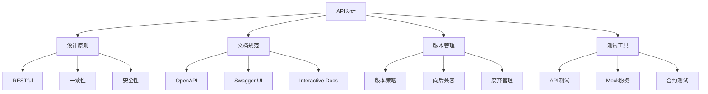
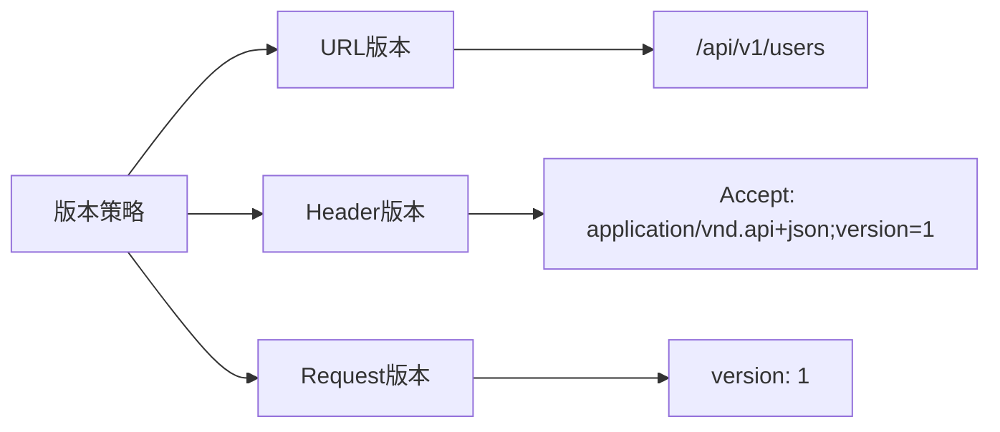

# API设计与文档



## 📋 知识结构（金字塔模型）

### 🏗️ 基础层：认知（What）
**API设计的核心要素**

| 要素 | 重要性 | 内容 | 最佳实践 |
|------|--------|------|----------|
| **RESTful设计** | ★★★★★ | 资源导向 | 使用HTTP动词和状态码 |
| **API文档** | ★★★★★ | 清晰描述 | OpenAPI/Swagger |
| **版本管理** | ★★★★☆ | 演进策略 | URL版本、Header版本 |
| **错误处理** | ★★★★☆ | 统一格式 | HTTP状态码+错误详情 |

### 🔍 理解层：机制（Why&How）

**REST设计约束：**

| 约束 | 要求 | 收益 | 示例 |
|------|------|------|------|
| **客户端-服务器** | 分离关注点 | 可移植性 | Web浏览器+服务器 |
| **无状态** | 每个请求独立 | 可扩展性 | JWT令牌 |
| **可缓存** | 响应可缓存 | 性能 | Cache-Control头 |
| **统一接口** | 标准化操作 | 通用性 | GET/POST/PUT/DELETE |
| **分层系统** | 网络层次 | 简化 | 代理、网关 |

**API版本策略对比：**



### 🚀 应用层：实践（Apply）

**RESTful API设计实现：**

```javascript
// ✅ RESTful API控制器
class RESTController {
  constructor(modelService) {
    this.service = modelService;
  }
  
  // GET /users - 获取用户列表
  async index(req, res, next) {
    try {
      const { page = 1, limit = 10, search, sort } = req.query;
      
      const options = {
        page: parseInt(page),
        limit: Math.min(100, parseInt(limit)),
        search,
        sort: this.parseSortQuery(sort)
      };
      
      const result = await this.service.findMany(options);
      
      res.json({
        data: result.data,
        meta: {
          pagination: {
            page: result.page,
            limit: result.limit,
            total: result.total,
            pages: Math.ceil(result.total / result.limit)
          },
          links: this.generatePaginationLinks(req, result)
        }
      });
    } catch (error) {
      next(error);
    }
  }
  
  // GET /users/:id - 获取单个用户
  async show(req, res, next) {
    try {
      const { id } = req.params;
      
      const user = await this.service.findById(id);
      
      res.json({
        data: user,
        links: {
          self: `${req.protocol}://${req.get('host')}/api/v1/users/${id}`
        }
      });
    } catch (error) {
      next(error);
    }
  }
  
  // POST /users - 创建用户
  async create(req, res, next) {
    try {
      const validationResult = this.validateCreateData(req.body);
      if (!validationResult.isValid) {
        return res.status(400).json({
          error: 'Validation failed',
          details: validationResult.errors
        });
      }
      
      const user = await this.service.create(req.body);
      
      res.status(201).json({
        data: user,
        links: {
          self: `${req.protocol}://${req.get('host')}/api/v1/users/${user._id}`
        }
      });
    } catch (error) {
      next(error);
    }
  }
  
  // PUT /users/:id - 更新用户
  async update(req, res, next) {
    try {
      const { id } = req.params;
      
      const validationResult = this.validateUpdateData(req.body);
      if (!validationResult.isValid) {
        return res.status(400).json({
          error: 'Validation failed',
          details: validationResult.errors
        });
      }
      
      const user = await this.service.updateById(id, req.body);
      
      res.json({
        data: user,
        links: {
          self: `${req.protocol}://${req.get('host')}/api/v1/users/${id}`
        }
      });
    } catch (error) {
      next(error);
    }
  }
  
  // DELETE /users/:id - 删除用户
  async destroy(req, res, next) {
    try {
      const { id } = req.params;
      
      await this.service.deleteById(id);
      
      res.status(204).end();
    } catch (error) {
      next(error);
    }
  }
  
  // PATCH /users/:id - 部分更新
  async partialUpdate(req, res, next) {
    try {
      const { id } = req.params;
      
      const user = await this.service.partialUpdate(id, req.body);
      
      res.json({
        data: user,
        links: {
          self: `${req.protocol}://${req.get('host')}/api/v1/users/${id}`
        }
      });
    } catch (error) {
      next(error);
    }
  }
  
  // 帮助方法
  parseSortQuery(sortString) {
    if (!sortString) return { createdAt: -1 };
    
    return sortString.split(',').reduce((sort, field) => {
      if (field.startsWith('-')) {
        sort[field.substring(1)] = -1;
      } else {
        sort[field] = 1;
      }
      return sort;
    }, {});
  }
  
  generatePaginationLinks(req, result) {
    const { page, limit, total } = result;
    const baseUrl = `${req.protocol}://${req.get('host')}${req.path}`;
    const queryString = req.url.split('?')[1] ? `?${req.url.split('?')[1]}` : '';
    
    const links = {
      first: `${baseUrl}?page=1&limit=${limit}${queryString}`,
      last: `${baseUrl}?page=${Math.ceil(total / limit)}&limit=${limit}${queryString}`,
      prev: page > 1 ? `${baseUrl}?page=${page - 1}&limit=${limit}${queryString}` : null,
      next: page * limit < total ? `${baseUrl}?page=${page + 1}&limit=${limit}${queryString}` : null
    };
    
    return links;
  }
  
  validateCreateData(data) {
    const required = ['email', 'username'];
    const errors = [];
    
    for (const field of required) {
      if (!data[field]) {
        errors.push(`${field} is required`);
      }
    }
    
    if (data.email && !this.isValidEmail(data.email)) {
      errors.push('Invalid email format');
    }
    
    return {
      isValid: errors.length === 0,
      errors
    };
  }
  
  validateUpdateData(data) {
    const errors = [];
    
    if (data.email && !this.isValidEmail(data.email)) {
      errors.push('Invalid email format');
    }
    
    return {
      isValid: errors.length === 0,
      errors
    };
  }
  
  isValidEmail(email) {
    return /^[^\s@]+@[^\s@]+\.[^\s@]+$/.test(email);
  }
}
```

**OpenAPI文档生成：**

```javascript
const swaggerJsdoc = require('swagger-jsdoc');

// ✅ OpenAPI配置
const swaggerDefinition = {
  openapi: '3.0.0',
  info: {
    title: 'MyApp API',
    version: '1.0.0',
    description: 'A comprehensive RESTful API for MyApp',
    termsOfService: 'https://myapp.com/terms',
    contact: {
      name: 'API Support',
      email: 'api@myapp.com',
      url: 'https://myapp.com/support'
    },
    license: {
      name: 'MIT',
      url: 'https://opensource.org/licenses/MIT'
    }
  },
  servers: [
    {
      url: 'https://api.myapp.com/v1',
      description: 'Production server'
    },
    {
      url: 'https://staging-api.myapp.com/v1',
      description: 'Staging server'
    },
    {
      url: 'http://localhost:3000/v1',
      description: 'Local development server'
    }
  ],
  components: {
    securitySchemes: {
      BearerAuth: {
        type: 'http',
        scheme: 'bearer',
        bearerFormat: 'JWT',
        description: 'Enter JWT token'
      },
      ApiKeyAuth: {
        type: 'apiKey',
        in: 'header',
        name: 'X-API-Key',
        description: 'API Key for authentication'
      }
    },
    schemas: {
      User: {
        type: 'object',
        required: ['username', 'email'],
        properties: {
          id: {
            type: 'string',
            format: 'uuid',
            description: 'Unique identifier for the user'
          },
          username: {
            type: 'string',
            minLength: 3,
            maxLength: 30,
            pattern: '^[a-zA-Z0-9_]+$',
            description: 'Unique username'
          },
          email: {
            type: 'string',
            format: 'email',
            description: 'User email address'
          },
          createdAt: {
            type: 'string',
            format: 'date-time',
            description: 'User creation timestamp'
          },
          updatedAt: {
            type: 'string',
            format: 'date-time',
            description: 'Last update timestamp'
          }
        }
      },
      Error: {
        type: 'object',
        properties: {
          error: {
            type: 'string',
            description: 'Error identifier'
          },
          message: {
            type: 'string',
            description: 'Human-readable error message'
          },
          details: {
            type: 'array',
            items: {
              type: 'string'
            },
            description: 'Detailed error information'
          },
          requestId: {
            type: 'string',
            description: 'Unique request identifier for debugging'
          }
        }
      },
      Pagination: {
        type: 'object',
        properties: {
          page: {
            type: 'integer',
            minimum: 1,
            description: 'Current page number'
          },
          limit: {
            type: 'integer',
            minimum: 1,
            maximum: 100,
            description: 'Number of items per page'
          },
          total: {
            type: 'integer',
            minimum: 0,
            description: 'Total number of items'
          },
          pages: {
            type: 'integer',
            minimum: 0,
            description: 'Total number of pages'
          }
        }
      }
    },
    parameters: {
      UserId: {
        name: 'id',
        in: 'path',
        required: true,
        schema: {
          type: 'string',
          format: 'uuid'
        },
        description: 'User unique identifier'
      },
      PageParam: {
        name: 'page',
        in: 'query',
        schema: {
          type: 'integer',
          minimum: 1,
          default: 1
        },
        description: 'Page number for pagination'
      },
      LimitParam: {
        name: 'limit',
        in: 'query',
        schema: {
          type: 'integer',
          minimum: 1,
          maximum: 100,
          default: 10
        },
        description: 'Number of items per page'
      },
      SearchParam: {
        name: 'search',
        in: 'query',
        schema: {
          type: 'string'
        },
        description: 'Search term for filtering results'
      }
    },
    responses: {
      NotFound: {
        description: 'Resource not found',
        content: {
          'application/json': {
            schema: {
              $ref: '#/components/schemas/Error'
            }
          }
        }
      },
      ValidationError: {
        description: 'Validation failed',
        content: {
          'application/json': {
            schema: {
              $ref: '#/components/schemas/Error'
            }
          }
        }
      },
      Unauthorized: {
        description: 'Authentication required',
        content: {
          'application/json': {
            schema: {
              $ref: '#/components/schemas/Error'
            }
          }
        }
      },
      Forbidden: {
        description: 'Insufficient permissions',
        content: {
          'application/json': {
            schema: {
              $ref: '#/components/schemas/Error'
            }
          }
        }
      }
    }
  },
  security: [
    { BearerAuth: [] },
    { ApiKeyAuth: [] }
  ]
};

// ✅ Swagger注释示例
/**
 * @swagger
 * /users:
 *   get:
 *     summary: Get list of users
 *     description: Retrieve a paginated list of all users
 *     tags: [Users]
 *     parameters:
 *       - $ref: '#/components/parameters/PageParam'
 *       - $ref: '#/components/parameters/LimitParam'
 *       - $ref: '#/components/parameters/SearchParam'
 *       - name: sort
 *         in: query
 *         schema:
 *           type: string
 *           enum: [username, email, createdAt]
 *         description: Sort field
 *     responses:
 *       200:
 *         description: Successful response with user list
 *         content:
 *           application/json:
 *             schema:
 *               type: object
 *               properties:
 *                 data:
 *                   type: array
 *                   items:
 *                     $ref: '#/components/schemas/User'
 *                 meta:
 *                   type: object
 *                   properties:
 *                     pagination:
 *                       $ref: '#/components/schemas/Pagination'
 *       400:
 *         $ref: '#/components/responses/ValidationError'
 *       401:
 *         $ref: '#/components/responses/Unauthorized'
 *   post:
 *     summary: Create a new user
 *     description: Create a new user account
 *     tags: [Users]
 *     requestBody:
 *       required: true
 *       content:
 *         application/json:
 *           schema:
 *             type: object
 *             required: [username, email]
 *             properties:
 *               username:
 *                 type: string
 *                 minLength: 3
 *                 maxLength: 30
 *                 example: johndoe
 *               email:
 *                 type: string
 *                 format: email
 *                 example: john@example.com
 *     responses:
 *       201:
 *         description: User created successfully
 *         content:
 *           application/json:
 *             schema:
 *               type: object
 *               properties:
 *                 data:
 *                   $ref: '#/components/schemas/User'
 *       400:
 *         $ref: '#/components/responses/ValidationError'
 *       409:
 *         description: Username or email already exists
 * /users/{id}:
 *   get:
 *     summary: Get user by ID
 *     description: Retrieve a specific user by their unique identifier
 *     tags: [Users]
 *     parameters:
 *       - $ref: '#/components/parameters/UserId'
 *     responses:
 *       200:
 *         description: Successful response with user data
 *         content:
 *           application/json:
 *             schema:
 *               type: object
 *               properties:
 *                 data:
 *                   $ref: '#/components/schemas/User'
 *       404:
 *         $ref: '#/components/responses/NotFound'
 *   put:
 *     summary: Update user
 *     description: Update all fields of a specific user
 *     tags: [Users]
 *     parameters:
 *       - $ref: '#/components/parameters/UserId'
 *     requestBody:
 *       required: true
 *       content:
 *         application/json:
 *           schema:
 *             $ref: '#/components/schemas/User'
 *     responses:
 *       200:
 *         description: User updated successfully
 *       400:
 *         $ref: '#/components/responses/ValidationError'
 *       404:
 *         $ref: '#/components/responses/NotFound'
 *   delete:
 *     summary: Delete user
 *     description: Delete a specific user
 *     tags: [Users]
 *     parameters:
 *       - $ref: '#/components/parameters/UserId'
 *     responses:
 *       204:
 *         description: User deleted successfully
 *       404:
 *         $ref: '#/components/responses/NotFound'
 */

const options = {
  definition: swaggerDefinition,
  apis: ['./routes/*.js', './controllers/*.js'] // 扫描文件路径
};

const swaggerSpec = swaggerJsdoc(options);
```

**版本管理策略：**

```javascript
// ✅ API版本管理器
class APIVersionManager {
  constructor(options = {}) {
    this.currentVersion = options.currentVersion || '1';
    this.supportedVersions = options.supportedVersions || ['1'];
    this.defaultVersion = options.defaultVersion || '1';
    this.strategy = options.strategy || 'url'; // url, header, accept
    this.deprecatedVersions = options.deprecatedVersions || {};
  }
  
  // 版本检测中间件
  versionDetection() {
    return (req, res, next) => {
      let version = null;
      
      switch (this.strategy) {
        case 'url':
          version = this.detectVersionFromUrl(req.path);
          break;
        case 'header':
          version = req.headers['api-version'];
          break;
        case 'accept':
          version = this.detectVersionFromAccept(req.headers.accept);
          break;
        default:
          version = this.defaultVersion;
      }
      
      if (version && !this.supportedVersions.includes(version)) {
        return res.status(400).json({
          error: 'Unsupported API version',
          message: `API version ${version} is not supported`,
          supportedVersions: this.supportedVersions,
          defaultVersion: this.defaultVersion
        });
      }
      
      req.apiVersion = version || this.defaultVersion;
      
      // 检查是否为新版弃用版本
      const deprecationInfo = this.deprecatedVersions[req.apiVersion];
      if (deprecationInfo) {
        res.set({
          'API-Version': req.apiVersion,
          'Sunset': deprecationInfo.sunsetDate,
          'Deprecation': deprecationInfo.deprecationDate || 'true'
        });
      }
      
      next();
    };
  }
  
  // URL版本检测
  detectVersionFromUrl(path) {
    const versionMatch = path.match(/\/v(\d+(?:\.\d+)?)/);
    return versionMatch ? versionMatch[1] : null;
  }
  
  // Accept头版本检测
  detectVersionFromAccept(acceptHeader) {
    if (!acceptHeader) return null;
    
    const versionMatch = acceptHeader.match(/version[=\s]+(\d+(?:\.\d+)?)/i);
    return versionMatch ? versionMatch[1] : null;
  }
  
  // 版本迁移助手
  migrateData(oldData, fromVersion, toVersion) {
    const migrationPath = this.getMigrationPath(fromVersion, toVersion);
    
    let migratedData = { ...oldData };
    
    for (const migrationStep of migrationPath) {
      migratedData = migrationStep(migratedData);
    }
    
    return migratedData;
  }
  
  // 获取迁移路径
  getMigrationPath(fromVersion, toVersion) {
    // 实现版本迁移逻辑
    const migrations = {
      '1': null, // 无需迁移
      '2': [
        (data) => ({
          ...data,
          additionalField: 'defaultValue'
        })
      ],
      '3': [
        // 从v1到v3的迁移
        (data) => ({
          ...data,
          newStructure: {
            data: data.someField,
            metadata: {
              version: '3'
            }
          }
        })
      ]
    };
    
    return migrations[toVersion] || [];
  }
  
  // 设置弃用版本
  deprecateVersion(version, deprecationInfo) {
    this.deprecatedVersions[version] = {
      deprecationDate: new Date(),
      sunsetDate: deprecationInfo.sunsetDate,
      noticeDays: deprecationInfo.noticeDays || 365,
      replacementVersion: deprecationInfo.replacementVersion
    };
  }
}
```

## 🧠 费曼学习法：能用简单的话解释

**API设计核心思想：**
1. **RESTful** = 像图书馆一样组织资源
2. **API文档** = 使用说明书，让开发者知道怎么用
3. **版本管理** = 书的版本，新版本保持兼容性

**设计原则：**
```javascript
const apiPrinciples = {
  '一致性': '所有接口保持相同的风格',
  '可预测性': '能猜到接口的行为',
  '简洁性': '简单易懂，避免复杂嵌套',
  '错误友好': '提供清晰的错误信息'
};
```

## 🎯 刻意练习要点

**必须掌握的技能：**
- [ ] 设计RESTful API接口
- [ ] 生成和维护API文档
- [ ] 实施版本管理策略
- [ ] 创建API测试客户端

**编程练习：**

**1. 实现API客户端库**
```javascript
// 练习：创建Javaript API客户端
class APIClient {
  constructor(baseURL, options = {}) {
    this.baseURL = baseURL;
    this.timeout = options.timeout || 10000;
    this.headers = {
      'Content-Type': 'application/json',
      ...options.headers
    };
    this.authToken = options.authToken;
  }
  
  setAuthToken(token) {
    this.authToken = token;
    this.headers.Authorization = `Bearer ${token}`;
  }
  
  async request(endpoint, options = {}) {
    const url = new URL(endpoint, this.baseURL);
    
    const requestOptions = {
      method: options.method || 'GET',
      headers: { ...this.headers, ...options.headers },
      timeout: this.timeout
    };
    
    if (options.data) {
      requestOptions.body = JSON.stringify(options.data);
    }
    
    try {
      const response = await fetch(url.toString(), requestOptions);
      
      if (!response.ok) {
        await this.handleError(response);
      }
      
      const data = await response.json();
      return {
        data,
        status: response.status,
        headers: response.headers
      };
    } catch (error) {
      throw new Error(`API request failed: ${error.message}`);
    }
  }
  
  async handleError(response) {
    const errorData = await response.json().catch(() => ({ error: 'Unknown error' }));
    
    throw new APIError(response.status, errorData.error, errorData.message);
  }
}

class APIError extends Error {
  constructor(status, error, message) {
    super(message);
    this.status = status;
    this.error = error;
  }
}
```

**2. 实现API Mock服务**
```javascript
// 练习：创建API Mock工具
class APIMockServer {
  constructor() {
    this.routes = new Map();
    this.responses = new Map();
  }
  
  mockGET(path, response) {
    this.routes.set(`GET:${path}`, response);
  }
  
  mockPOST(path, response) {
    this.routes.set(`POST:${path}`, response);
  }
  
  async handleRequest(method, path) {
    const key = `${method}:${path}`;
    const mockResponse = this.routes.get(key);
    
    if (!mockResponse) {
      return {
        status: 404,
        body: { error: 'Not found' }
      };
    }
    
    if (typeof mockResponse === 'function') {
      return await mockResponse();
    }
    
    return mockResponse;
  }
}
```

**关联学习：**
- → [[015-Express核心机制]] Express API实现
- → [[032-全栈博客系统]] API实际应用
- → [[034-实时聊天应用]] WebSocket API

## 💡 知识点跳转

**前置知识：** [[015-Express核心机制]] - Web框架基础
**后续深入：** [[032-全栈博客系统]] - 项目实战应用

---

*🔗 相关链接：[[015-Express核心机制]] | [[032-全栈博客系统]] | [[034-实时聊天应用]]*
