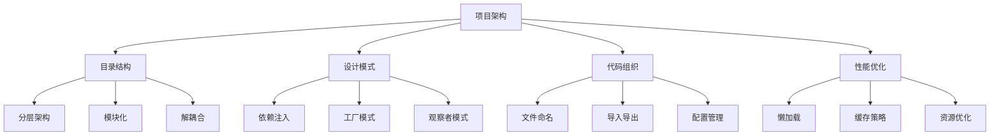

# 项目架构最佳实践



## 📋 知识结构（金字塔模型）

### 🏗️ 基础层：认知（What）
**项目架构的核心要素**

| 要素 | 重要性 | 描述 | 最佳实践 |
|------|--------|------|----------|
| **目录结构** | ★★★★★ | 代码组织方式 | 清晰分层、按功能分组 |
| **设计模式** | ★★★★☆ | 解决常见问题 | 依赖注入、工厂模式 |
| **配置管理** | ★★★★☆ | 环境配置 | 配置分离、环境变量 |
| **错误处理** | ★★★★★ | 异常管理 | 统一处理、日志记录 |

### 🔍 理解层：机制（Why&How）

**架构模式对比：**

| 模式 | 特点 | 优势 | 劣势 | 适用场景 |
|------|------|------|------|----------|
| **MVC** | 视图分离 | 清晰职责 | 耦合度中等 | Web应用 |
| **微服务** | 服务独立 | 可扩展 | 复杂度高 | 大型系统 |
| **洋葱架构** | 依赖反转 | 易测试 | 学习曲线 | 企业应用 |
| **插件架构** | 功能模块化 | 可插拔 | 管理复杂 | 工具软件 |

### 🚀 应用层：实践（Apply）

**标准项目结构：**

```javascript
// ✅ 项目目录结构设计
const projectStructure = {
  src: {
    'controllers/': '控制器 - 处理HTTP请求',
    'services/': '服务层 - 业务逻辑',
    'repositories/': '仓储层 - 数据访问',
    'models/': '数据模型 - 数据结构',
    'middlewares/': '中间件 - 通用功能',
    'routes/': '路由 - API端点定义',
    'utils/': '工具函数 - 通用工具',
    'config/': '配置 - 应用配置',
    'types/': '类型定义 - TypeScript类型',
    'tests/': '测试文件',
    'migrations/': '数据库迁移'
  },
  
  docs: '项目文档',
  scripts: '构建脚本',
  docker: 'Docker配置',
  k8s: 'Kubernetes配置'
};

// ✅ 依赖注入容器
class DIContainer {
  constructor() {
    this.services = new Map();
    this.singletons = new Map();
    this.factories = new Map();
  }
  
  // 注册服务
  register(name, factory, options = {}) {
    const serviceInfo = {
      factory,
      singleton: options.singleton || false,
      dependencies: options.dependencies || []
    };
    
    this.services.set(name, serviceInfo);
    return this;
  }
  
  // 注册单例
  singleton(name, instance) {
    this.singletons.set(name, instance);
    return this;
  }
  
  // 解析依赖
  resolve(name) {
    // 检查单例
    if (this.singletons.has(name)) {
      return this.singletons.get(name);
    }
    
    const service = this.services.get(name);
    if (!service) {
      throw new Error(`Service ${name} not found`);
    }
    
    // 解析依赖
    const dependencies = service.dependencies.map(dep => this.resolve(dep));
    
    // 创建实例
    const instance = service.factory(...dependencies);
    
    // 缓存单例
    if (service.singleton) {
      this.singletons.set(name, instance);
    }
    
    return instance;
  }
}

// ✅ 服务工厂模式
class ServiceFactory {
  constructor(container) {
    this.container = container;
  }
  
  createUserService() {
    return new UserService(
      this.container.resolve('userRepository'),
      this.container.resolve('emailService'),
      this.container.resolve('logger')
    );
  }
  
  createOrderService() {
    return new OrderService(
      this.container.resolve('orderRepository'),
      this.container.resolve('paymentService'),
      this.container.resolve('notificationService')
    );
  }
  
  createEmailService() {
    return new EmailService(
      this.container.resolve('emailConfig')
    );
  }
}

// ✅ 配置管理最佳实践
class ConfigManager {
  constructor() {
    this.configs = new Map();
    this.loaders = new Map();
    this.resolvers = new Map();
  }
  
  // 注册配置加载器
  registerLoader(name, loader) {
    this.loaders.set(name, loader);
    return this;
  }
  
  // 加载配置
  async load() {
    for (const [name, loader] of this.loaders) {
      const config = await loader.load();
      this.configs.set(name, config);
    }
    
    // 解析配置引用
    this.resolveReferences();
    
    return this;
  }
  
  // 获取配置
  get(path, defaultValue = null) {
    return this.getNestedValue(this.configs.get('default'), path, defaultValue);
  }
  
  getNestedValue(obj, path, defaultValue) {
    return path.split('.').reduce((current, key) => {
      return current && current[key] !== undefined ? current[key] : defaultValue;
    }, obj);
  }
  
  // 解析配置引用
  resolveReferences() {
    for (const [name, config] of this.configs) {
      this.resolveConfigReferences(config);
    }
  }
  
  resolveConfigReferences(obj) {
    for (const key in obj) {
      if (typeof obj[key] === 'object' && obj[key] !== null) {
        this.resolveConfigReferences(obj[key]);
      } else if (typeof obj[key] === 'string' && obj[key].startsWith('${')) {
        obj[key] = this.resolveReference(obj[key]);
      }
    }
  }
  
  resolveReference(reference) {
    const match = reference.match(/\${([^:}]+)(?::([^}]+))?}/);
    if (!match) return reference;
    
    const [, configPath, defaultValue] = match;
    return this.get(configPath, defaultValue || '');
  }
}

// ✅ 应用工厂
class ApplicationFactory {
  constructor() {
    this.container = new DIContainer();
    this.services = new ServiceFactory(this.container);
    this.configManager = new ConfigManager();
  }
  
  async create() {
    // 配置注册
    this.registerLoaders();
    
    // 加载配置
    await this.configManager.load();
    
    // 注册基础服务
    await this.registerServices();
    
    // 创建应用
    return this.buildApplication();
  }
  
  registerLoaders() {
    this.configManager
      .registerLoader('default', {
        load: () => ({
          database: {
            host: process.env.DB_HOST || 'localhost',
            port: process.env.DB_PORT || 27017,
            name: process.env.DB_NAME || 'myapp'
          },
          server: {
            port: process.env.PORT || 3000,
            host: process.env.HOST || 'localhost'
          },
          jwt: {
            secret: process.env.JWT_SECRET || 'change-me',
            expiresIn: process.env.JWT_EXPIRES || '24h'
          }
        })
      });
  }
  
  async registerServices() {
    this.container
      .singleton('config', this.configManager.configs.get('default'))
      .singleton('logger', new Logger())
      .register('userRepository', () => new UserRepository())
      .register('emailService', () => this.services.createEmailService())
      .register('userService', () => this.services.createUserService())
      .register('orderService', () => this.services.createOrderService());
  }
  
  buildApplication() {
    return {
      container: this.container,
      userService: this.container.resolve('userService'),
      orderService: this.container.resolve('orderService'),
      emailService: this.container.resolve('emailService'),
      logger: this.container.resolve('logger')
    };
  }
}

// ✅ 模块注册器
class ModuleRegistry {
  constructor() {
    this.modules = new Map();
  }
  
  // 注册模块
  register(name, module) {
    const moduleInfo = {
      name,
      instance: module,
      dependencies: module.dependencies || [],
      initialized: false
    };
    
    this.modules.set(name, moduleInfo);
    return this;
  }
  
  // 初始化模块
  async initialize(name, dependencies = {}) {
    const module = this.modules.get(name);
    if (!module) {
      throw new Error(`Module ${name} not found`);
    }
    
    try {
      await module.instance.initialize(dependencies);
      module.initialized = true;
      console.log(`Module ${name} initialized`);
    } catch (error) {
      console.error(`Failed to initialize module ${name}:`, error);
      throw error;
    }
  }
  
  // 获取模块实例
  get(name) {
    const module = this.modules.get(name);
    return module ? module.instance : null;
  }
  
  // 获取所有模块
  getAll() {
    return Array.from(this.modules.values()).map(m => m.instance);
  }
}
```

## 🧠 费曼学习法：能用简单的话解释

**架构设计核心思想：**
1. **分层架构** = 建房子的楼层，每层有不同功能
2. **依赖注入** = 外带食材，厨房不用自己种菜
3. **配置管理** = 开关面板，不同房间用不同开关

## 🎯 刻意练习要点

**必须掌握的技能：**
- [ ] 设计清晰的项目结构
- [ ] 实现依赖注入模式
- [ ] 管理配置和环境
- [ ] 应用设计模式

---

*🔗 相关链接：[[016-Web应用架构设计]] | [[022-部署与运维策略]] | [[023-性能优化深入]]*
