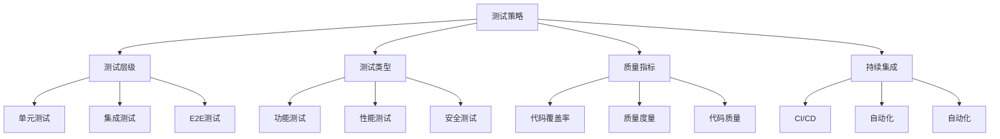

# 测试与质量保证



## 📋 知识结构（金字塔模型）

### 🏗️ 基础层：认知（What）
**测试金字塔结构**

| 层级 | 测试类型 | 数量 | 速度 | 稳定性 | 成本 |
|------|----------|------|------|--------|------|
| **单元测试** | 功能测试 | 多 | 快 | 高 | 低 |
| **集成测试** | 接口测试 | 中 | 中 | 中 | 中 |
| **端到端测试** | 场景测试 | 少 | 慢 | 低 | 高 |

### 🔍 理解层：机制（Why&How）

**测试框架对比：**

| 框架 | 特点 | 优势 | 适用场景 |
|------|------|------|----------|
| **Jest** | 零配置 | 开箱即用 | 单元测试 |
| **Mocha** | 灵活 | 可定制 | 多种测试 |
| **AVA** | 并发执行 | 速度快 | 大型项目 |
| **Cypress** | GUI测试 | 易调试 | E2E测试 |

### 🚀 应用层：实践（Apply）

**Jest测试配置：**

```javascript
// jest.config.js
module.exports = {
  testEnvironment: 'node',
  coverageDirectory: 'coverage',
  collectCoverageFrom: [
    'src/**/*.{js,ts}',
    '!src/**/*.d.ts',
    '!src/tests/**/*'
  ],
  testMatch: [
    '<rootDir>/src/**/__tests__/**/*.{js,ts}',
    '<rootDir>/src/**/*.{test,spec}.{js,ts}'
  ],
  setupFilesAfterEnv: ['<rootDir>/src/setupTests.js']
};

// ✅ 单元测试示例
describe('UserService', () => {
  let userService;
  let mockRepository;
  
  beforeEach(() => {
    mockRepository = {
      findById: jest.fn(),
      create: jest.fn(),
      update: jest.fn(),
      delete: jest.fn()
    };
    
    userService = new UserService(mockRepository);
  });
  
  describe('createUser', () => {
    it('should create a user successfully', async () => {
      const userData = {
        email: 'test@example.com',
        username: 'testuser'
      };
      
      mockRepository.create.mockResolvedValue({
        id: '123',
        ...userData
      });
      
      const result = await userService.createUser(userData);
      
      expect(result).toEqual({
        id: '123',
        ...userData
      });
      expect(mockRepository.create).toHaveBeenCalledWith(userData);
    });
    
    it('should throw error for invalid email', async () => {
      const userData = {
        email: 'invalid-email',
        username: 'testuser'
      };
      
      await expect(userService.createUser(userData))
        .rejects
        .toThrow('Invalid email format');
    });
  });
});

// ✅ 超级测试集成测试
const request = require('supertest');
const app = require('../src/app');

describe('API Integration Tests', () => {
  let authToken;
  
  beforeAll(async () => {
    const response = await request(app)
      .post('/api/auth/login')
      .send({ email: 'admin@test.com', password: 'password' });
    
    authToken = response.body.token;
  });
  
  describe('User API', () => {
    it('GET /api/users should return user list', async () => {
      const response = await request(app)
        .get('/api/users')
        .set('Authorization', `Bearer ${authToken}`)
        .expect(200);
      
      expect(response.body.data).toBeInstanceOf(Array);
      expect(response.body.meta.pagination).toBeDefined();
    });
    
    it('POST /api/users should create new user', async () => {
      const userData = {
        email: 'newuser@test.com',
        username: 'newuser',
        password: 'password123'
      };
      
      const response = await request(app)
        .post('/api/users')
        .set('Authorization', `Bearer ${authToken}`)
        .send(userData)
        .expect(201);
      
      expect(response.body.data.email).toBe(userData.email);
    });
  });
});
```

## 🧠 费曼学习法：能用简单的话解释

**测试核心思想：**
1. **单元测试** = 检查每个零件的质量
2. **集成测试** = 检查零件组装后的功能
3. **E2E测试** = 检查整个产品的用户体验

## 🎯 刻意练习要点

**必须掌握的技能：**
- [ ] 编写单元测试
- [ ] 进行集成测试
- [ ] 设置测试环境
- [ ] 衡量代码质量

---

*🔗 相关链接：[[010-错误处理机制]] | [[022-部署与运维策略]] | [[025-实时通信技术]]*
