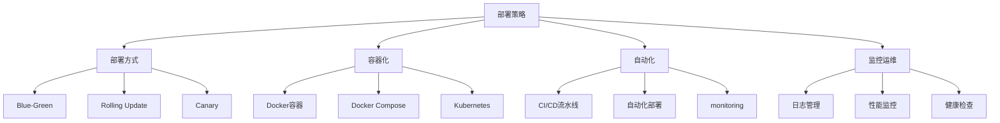

# 部署与运维策略



## 📋 知识结构（金字塔模型）

### 🏗️ 基础层：认知（What）
**部署策略对比**

| 策略 | 特点 | 优势 | 风险 | 适用场景 |
|------|------|------|------|----------|
| **蓝绿部署** | 新旧版本并存 | 零停机时间 | 双倍资源 | 关键业务 |
| **滚动更新** | 逐步替换 | 资源节约 | 兼容性问题 | 微服务 |
| **金丝雀部署** | 小流量验证 | 风险可控 | 复杂配置 | 新功能发布 |

### 🔍 理解层：机制（Why&How）

**容器编排对比：**

| 工具 | 特点 | 复杂度 | 功能 | 生态 |
|------|------|--------|------|------|
| **Docker** | 容器运行时 | 低 | 基础 | 成熟 |
| **Docker Compose** | 单机编排 | 中 | 开发环境 | 简单项目 |
| **Kubernetes** | 集群编排 | 高 | 生产级 | 企业 |

### 🚀 应用层：实践（Apply）

**Docker最佳实践：**

```dockerfile
# ✅ 多阶段构建优化
FROM node:18-alpine AS builder

WORKDIR /app
COPY package*.json ./
RUN npm ci --only=production

COPY . .
RUN npm run build

FROM node:18-alpine AS production
WORKDIR /app

RUN addgroup -g 1001 -S nodejs
RUN adduser -S nodejs -u 1001

COPY --from=builder --chown=nodejs:nodejs /app/dist ./dist
COPY --from=builder --chown=nodejs:nodejs /app/node_modules ./node_modules
COPY --chown=nodejs:nodejs package*.json ./

USER nodejs

EXPOSE 3000
CMD ["npm", "start"]
```

**Kubernetes部署配置：**

```yaml
# deployment.yaml
apiVersion: apps/v1
kind: Deployment
metadata:
  name: myapp-api
spec:
  replicas: 3
  selector:
    matchLabels:
      app: myapp-api
  template:
    metadata:
      labels:
        app: myapp-api
    spec:
      containers:
      - name: api
        image: myapp/api:v1.0.0
        ports:
        - containerPort: 3000
        env:
        - name: NODE_ENV
          value: "production"
        - name: DATABASE_URL
          valueFrom:
            secretKeyRef:
              name: database-secret
              key: url
        resources:
          requests:
            memory: "256Mi"
            cpu: "250m"
          limits:
            memory: "512Mi"
            cpu: "500m"
        livenessProbe:
          httpGet:
            path: /health
            port: 3000
          initialDelaySeconds: 30
          periodSeconds: 10
        readinessProbe:
          httpGet:
            path: /ready
            port: 3000
          initialDelaySeconds: 5
          periodSeconds: 5

---
apiVersion: v1
kind: Service
metadata:
  name: myapp-api-service
spec:
  selector:
    app: myapp-api
  ports:
  - port: 80
    targetPort: 3000
  type: LoadBalancer
```

## 🧠 费曼学习法：能用简单的话解释

**部署运维核心思想：**
1. **容器化** = 打包快递，一件快递就是一个容器
2. **编排** = 快递公司的调度系统
3. **监控** = 快递跟踪，知道包裹在哪里

## 🎯 刻意练习要点

**必须掌握的技能：**
- [ ] 容器化应用部署
- [ ] 配置自动化流水线
- [ ] 设置监控和告警
- [ ] 管理生产环境

---

*🔗 相关链接：[[020-项目架构最佳实践]] | [[023-性能优化深入]] | [[025-实时通信技术]]*
