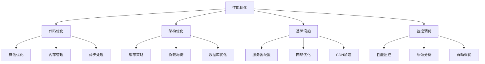

# 性能优化深入



## 📋 知识结构（金字塔模型）

### 🏗️ 基础层：认知（What）
**性能优化分类**

| 类别 | 层级 | 优化目标 | 预期收益 |
|------|------|----------|----------|
| **代码级** | 应用层 | CPU效率 | 10-30% |
| **架构级** | 系统层 | 吞吐量 | 100-500% |
| **基础设施** | 平台层 | 响应时间 | 50-200% |

### 🔍 理解层：机制（Why&How）

**Node.js性能瓶颈：**

| 瓶颈类型 | 表现 | 检测方法 | 解决方案 |
|----------|------|----------|----------|
| **CPU密集型** | 事件循环阻塞 | CPU使用率 | Worker Threads |
| **内存泄漏** | 内存持续增长 | 内存监控 | GC优化 |
| **I/O阻塞** | 响应延迟 | 延迟监控 | 异步优化 |

### 🚀 应用层：实践（Apply）

**性能监控工具：**

```javascript
// ✅ 性能监控服务
class PerformanceMonitor {
  constructor() {
    this.metrics = new Map();
    this.startTime = Date.now();
  }
  
  // 监控HTTP请求
  monitorRequest(req, res, next) {
    const startTime = Date.now();
    const requestId = req.headers['x-request-id'] || crypto.randomUUID();
    
    req.startTime = startTime;
    req.requestId = requestId;
    
    res.on('finish', () => {
      const duration = Date.now() - startTime;
      
      this.recordMetric('response_time', {
        method: req.method,
        path: req.path,
        statusCode: res.statusCode,
        duration,
        requestId
      });
      
      // 慢请求告警
      if (duration > 1000) {
        console.warn(`Slow request detected: ${duration}ms ${req.method} ${req.path}`);
      }
    });
    
    next();
  }
  
  // 记录性能指标
  recordMetric(type, data) {
    if (!this.metrics.has(type)) {
      this.metrics.set(type, []);
    }
    
    const metrics = this.metrics.get(type);
    metrics.push(data);
    
    // 保留最近1000条记录
    if (metrics.length > 1000) {
      metrics.shift();
    }
  }
  
  // 获取性能报告
  getPerformanceReport() {
    const report = {
      uptime: Date.now() - this.startTime,
      memory: process.memoryUsage(),
      cpu: process.cpuUsage(),
      metrics: {}
    };
    
    for (const [type, data] of this.metrics) {
      report.metrics[type] = this.calculateMetrics(data);
    }
    
    return report;
  }
  
  calculateMetrics(data) {
    const durations = data.map(d => d.duration || 0);
    
    return {
      count: data.length,
      avg: durations.reduce((a, b) => a + b, 0) / durations.length,
      min: Math.min(...durations),
      max: Math.max(...durations),
      p95: this.calculatePercentile(durations, 95),
      p99: this.calculatePercentile(durations, 99)
    };
  }
  
  calculatePercentile(values, percentile) {
    const sorted = values.sort((a, b) => a - b);
    const index = Math.ceil((percentile / 100) * sorted.length) - 1;
    return sorted[index];
  }
}

// ✅ 缓存优化策略
class CacheOptimizer {
  constructor(redisManager) {
    this.redis = redisManager;
    this.localCache = new Map();
    this.cacheStats = {
      hits: 0,
      misses: 0,
      sets: 0
    };
  }
  
  // 多级缓存
  async get(path, fetcher, options = {}) {
    const { ttl = 3600, localTTL = 300 } = options;
    
    // 1. 检查本地缓存
    const localKey = `local:${path}`;
    if (this.localCache.has(localKey)) {
      const cached = this.localCache.get(localKey);
      if (Date.now() - cached.timestamp < localTTL * 1000) {
        this.cacheStats.hits++;
        return cached.data;
      }
    }
    
    // 2. 检查Redis缓存
    const redisKey = `redis:${path}`;
    let data = await this.redis.get(redisKey);
    
    if (data) {
      this.cacheStats.hits++;
      // 更新本地缓存
      this.localCache.set(localKey, {
        data,
        timestamp: Date.now()
      });
      return data;
    }
    
    // 3. 获取新数据
    this.cacheStats.misses++;
    data = await fetcher();
    
    // 4. 缓存数据
    await this.redis.set(redisKey, data, ttl);
    this.localCache.set(localKey, {
      data,
      timestamp: Date.now()
    });
    this.cacheStats.sets++;
    
    return data;
  }
  
  // 缓存预热
  async prewarmCache(paths) {
    const promises = paths.map(path => {
      const [key, fetcher, options] = path;
      return this.get(key, fetcher, options);
    });
    
    await Promise.all(promises);
    console.log(`Cache prewarmed for ${paths.length} items`);
  }
  
  // 缓存失效
  async invalidate(pattern) {
    const keys = await this.redis.invalidatePattern(pattern);
    
    // 清理本地缓存
    for (const key of this.localCache.keys()) {
      if (key.includes(pattern)) {
        this.localCache.delete(key);
      }
    }
    
    return keys;
  }
  
  getCacheStats() {
    const total = this.cacheStats.hits + this.cacheStats.misses;
    const hitRate = total > 0 ? (this.cacheStats.hits / total) * 100 : 0;
    
    return {
      ...this.cacheStats,
      hitRate: hitRate.toFixed(2) + '%',
      localCacheSize: this.localCache.size
    };
  }
}

// ✅ 连接池优化
class ConnectionPoolOptimizer {
  constructor(dbConfig) {
    this.pools = new Map();
    this.config = dbConfig;
  }
  
  createOptimizedPool(poolName, config) {
    const poolOpts = {
      min: config.min || 5,
      max: config.max || 20,
      acquireTimeoutMillis: config.acquireTimeout || 60000,
      idleTimeoutMillis: config.idleTimeout || 30000,
      reapIntervalMillis: config.reapInterval || 1000,
      createRetryIntervalMillis: config.createRetry || 200,
      
      // 高性能配置
      killOnError: false,
      handleDisconnects: true,
      preloadModules: false,
      removeOnError: true
    };
    
    const pool = this.createPool(poolOpts);
    this.pools.set(poolName, pool);
    
    return pool;
  }
  
  // 健康检查
  async healthCheck(poolName) {
    const pool = this.pools.get(poolName);
    
    try {
      const connection = await pool.getConnection();
      await connection.ping();
      connection.release();
      
      return {
        status: 'healthy',
        active: pool.activeConnections(),
        idle: pool.idleConnections(),
        total: pool.totalConnections()
      };
    } catch (error) {
      return {
        status: 'unhealthy',
        error: error.message
      };
    }
  }
  
  // 性能监控
  getPoolMetrics(poolName) {
    const pool = this.pools.get(poolName);
    
    return {
      name: poolName,
      active: pool.activeConnections(),
      idle: pool.idleConnections(),
      total: pool.totalConnections(),
      pendingAcquires: pool.pendingAcquirers(),
      config: pool.opts
    };
  }
}
```

## 🧠 费曼学习法：能用简单的话解释

**性能优化核心思想：**
1. **缓存** = 买东西先看仓库，有就不用去工厂
2. **连接池** = 出租车公司，不用每次都等车
3. **监控** = 体检报告，了解系统健康状况

## 🎯 刻意练习要点

**必须掌握的技能：**
- [ ] 识别性能瓶颈
- [ ] 实施缓存策略
- [ ] 优化数据库查询
- [ ] 监控系统性能

---

*🔗 相关链接：[[020-项目架构最佳实践]] | [[022-部署与运维策略]] | [[024-微服务架构模式]]*
