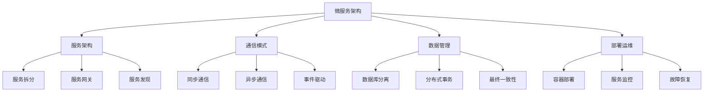

# 微服务架构模式



## 📋 知识结构（金字塔模型）

### 🏗️ 基础层：认知（What）
**微服务架构特征**

| 特征 | 描述 | 要求 | 收益 |
|------|------|------|------|
| **服务自治** | 独立开发部署 | 团队独立 | 开发效率 |
| **业务边界** | 清晰的服务边界 | 领域驱动 | 维护性 |
| **数据隔离** | 独立数据存储 | 数据库分离 | 安全性 |

### 🔍 理解层：机制（Why&How）

**微服务 vs 单体架构：**

| 对比项 | 单体架构 | 微服务架构 | 选择建议 |
|--------|----------|------------|----------|
| **复杂度** | 低 | 高 | 小型团队选单体 |
| **可扩展性** | 紧耦合 | 独立扩展 | 大型系统选微服务 |
| **部署** | 简单 | 复杂 | 评估运维能力 |

### 🚀 应用层：实践（Apply）

**微服务通信实现：**

```javascript
// ✅ 服务间通信客户端
class ServiceClient {
  constructor(discovery, circuitBreaker) {
    this.discovery = discovery;
    this.circuitBreaker = circuitBreaker;
  }
  
  async call(serviceName, endpoint, data, options = {}) {
    const service = await this.discovery.find(serviceName);
    
    return await this.circuitBreaker.execute(async () => {
      const url = `http://${service.host}:${service.port}${endpoint}`;
      
      const response = await fetch(url, {
        method: options.method || 'POST',
        headers: {
          'Content-Type': 'application/json',
          ...options.headers
        },
        body: JSON.stringify(data),
        timeout: options.timeout || 5000
      });
      
      if (!response.ok) {
        throw new Error(`Service call failed: ${response.status}`);
      }
      
      return await response.json();
    });
  }
}

// ✅ 事件驱动架构
class EventBus {
  constructor() {
    this.subscribers = new Map();
    this.eventStore = [];
  }
  
  subscribe(eventType, handler) {
    if (!this.subscribers.has(eventType)) {
      this.subscribers.set(eventType, []);
    }
    
    this.subscribers.get(eventType).push(handler);
  }
  
  async publish(eventType, data) {
    const event = {
      id: crypto.randomUUID(),
      type: eventType,
      data,
      timestamp: new Date(),
      version: '1.0'
    };
    
    // 存储事件
    this.eventStore.push(event);
    
    // 通知订阅者
    const handlers = this.subscribers.get(eventType) || [];
    
    await Promise.all(
      handlers.map(handler => 
        handler(event).catch(err => 
          console.error(`Event handler failed for ${eventType}:`, err)
        )
      )
    );
  }
}
```

## 🧠 费曼学习法：能用简单的话解释

**微服务核心思想：**
1. **服务拆分** = 把大公司分成多个独立部门
2. **服务通信** = 部门间打电话协作
3. **事件驱动** = 部门广播通知其他部门

## 🎯 刻意练习要点

**必须掌握的技能：**
- [ ] 设计服务边界
- [ ] 实现服务间通信
- [ ] 处理分布式事务
- [ ] 管理服务生命周期

---

*🔗 相关链接：[[016-Web应用架构设计]] | [[022-部署与运维策略]] | [[032-全栈博客系统]]*
