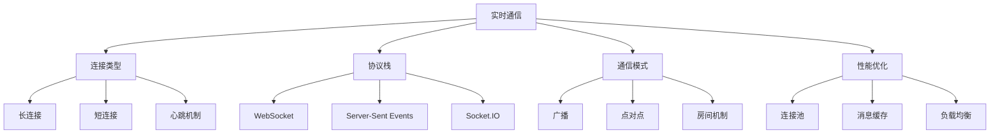

# 实时通信技术



## 📋 知识结构（金字塔模型）

### 🏗️ 基础层：认知（What）
**实时通信技术对比**

| 技术 | 特点 | 优势 | 劣势 | 适用场景 |
|------|------|------|------|----------|
| **WebSocket** | 全双工 | 低延迟 | 连接管理复杂 | 游戏、聊天 |
| **SSE** | 服务端推送 | 简单实现 | 只能上行 | 通知推送 |
| **Socket.IO** | 功能丰富 | 自动降级 | 体积较大 | 复杂应用 |

### 🔍 理解层：机制（Why&How）

**WebSocket握手机制：**

1. HTTP升级请求
2. 服务端回应升级
3. 建立WebSocket连接
4. 双向数据传输

### 🚀 应用层：实践（Apply）

**Socket.IO实现：**

```javascript
const io = require('socket.io')(server);

class RealtimeServer {
  constructor() {
    this.io = io;
    this.users = new Map();
    this.rooms = new Map();
  }
  
  initialize() {
    this.io.on('connection', (socket) => {
      console.log('User connected:', socket.id);
      
      // 用户加入
      socket.on('join', (userInfo) => {
        this.handleUserJoin(socket, userInfo);
      });
      
      // 消息发送
      socket.on('message', (message) => {
        this.handleMessage(socket, message);
      });
      
      // 用户断开
      socket.on('disconnect', () => {
        this.handleUserDisconnect(socket);
      });
    });
  }
  
  handleUserJoin(socket, userInfo) {
    const userId = userInfo.id;
    const roomId = userInfo.room;
    
    // 存储用户信息
    this.users.set(socket.id, { userId, roomId, socket });
    
    // 加入房间
    socket.join(roomId);
    
    // 通知房间成员
    socket.to(roomId).emit('userJoined', {
      userId,
      timestamp: new Date()
    });
  }
  
  handleMessage(socket, message) {
    const user = this.users.get(socket.id);
    
    if (!user) return;
    
    const messageData = {
      id: crypto.randomUUID(),
      userId: user.userId,
      roomId: user.roomId,
      content: message.content,
      timestamp: new Date(),
      type: message.type || 'text'
    };
    
    // 广播到房间
    this.io.to(user.roomId).emit('newMessage', messageData);
    
    // 保存消息(如需要)
    this.saveMessage(messageData);
  }
  
  handleUserDisconnect(socket) {
    const user = this.users.get(socket.id);
    
    if (user) {
      // 通知房间成员用户离开
      socket.to(user.roomId).emit('userLeft', {
        userId: user.userId,
        timestamp: new Date()
      });
      
      // 清理用户数据
      this.users.delete(socket.id);
    }
    
    console.log('User disconnected:', socket.id);
  }
}
```

## 🧠 费曼学习法：能用简单的话解释

**实时通信核心思想：**
1. **长连接** = 打长途电话，不用每次拨号
2. **双向通信** = 两个人对话，都能说能听
3. **房间机制** = 开视频会议，不同房间互不干扰

## 🎯 刻意练习要点

**必须掌握的技能：**
- [ ] 实现WebSocket通信
- [ ] 设计房间管理
- [ ] 处理连接状态
- [ ] 优化消息传输

---

*🔗 相关链接：[[008-网络编程基础]] | [[034-实时聊天应用]] | [[032-全栈博客系统]]*
