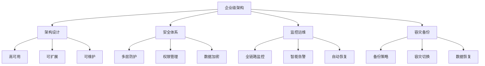

# 企业级解决方案



## 📋 知识结构（金字塔模型）

### 🏗️ 基础层：认知（What）
**企业级架构核心要素**

| 要素 | 要求 | 解决方案 | 监控指标 |
|------|------|----------|----------|
| **高可用** | 99.9%+ | 冗余部署 | 可用率 |
| **安全性** | 多层防护 | WAF+防火墙 | 安全事件 |
| **性能** | 低延迟 | 缓存+优化 | 响应时间 |
| **可扩展** | 弹性伸缩 | 负载均衡 | CPU/内存 |

### 🔍 理解层：机制（Why&How）

**企业架构模式：**

| 模式 | 特点 | 适用场景 | 复杂度 |
|------|------|----------|--------|
| **SOA** | 服务导向 | 传统企业 | 中等 |
| **ESB** | 企业总线 | 大企业集成 | 高 |
| **微服务** | 现代化 | 科技公司 | 高 |

### 🚀 应用层：实践（Apply）

**企业级监控系统：**

```javascript
// ✅ 全链路监控
class EnterpriseMonitoring {
  constructor() {
    this.tracing = new TracingService();
    this.metrics = new MetricsCollector();
    this.logger = new StructuredLogger();
  }
  
  // 业务监控
  monitorBusiness(nodeName, operation) {
    return async (req, res, next) => {
      const traceId = req.headers['x-trace-id'] || crypto.randomUUID();
      const spanId = crypto.randomUUID();
      
      const span = this.tracing.startSpan(nodeName, {
        traceId,
        spanId,
        operation,
        req: {
          method: req.method,
          url: req.url,
          userAgent: req.headers['user-agent']
        }
      });
      
      req.userTrace = { traceId, spanId, span };
      
      res.on('finish', () => {
        span.finish({
          status: res.statusCode,
          duration: Date.now() - req.startTime
        });
        
        // 记录业务指标
        this.metrics.recordBusinessMetric(nodeName, {
          operation,
          status: res.statusCode,
          duration: Date.now() - req.startTime,
          userId: req.user?.id
        });
      });
      
      next();
    };
  }
  
  // 性能告警
  setPerformanceAlert(service, threshold) {
    this.metrics.on('metric', (data) => {
      if (data.service === service && data.value > threshold) {
        this.sendAlert({
          type: 'performance',
          service,
          value: data.value,
          threshold,
          timestamp: new Date()
        });
      }
    });
  }
}

// ✅ 多层安全防护
class SecurityManager {
  constructor() {
    this.waf = new WebApplicationFirewall();
    this.firewall = new NetworkFirewall();
    this.encryption = new DataEncryption();
  }
  
  // 请求安全检查
  validateRequest(req, res, next) {
    // WAF检查
    if (this.waf.isBlocked(req)) {
      return res.status(403).json({ error: 'Request blocked' });
    }
    
    // 频率限制
    if (this.waf.isRateLimited(req)) {
      return res.status(429).json({ error: 'Too many requests' });
    }
    
    // IP白名单检查
    if (!this.firewall.isAllowed(req.ip)) {
      return res.status(403).json({ error: 'IP not allowed' });
    }
    
    next();
  }
  
  // 数据加密
  encryptSensitiveData(data) {
    const sensitiveFields = ['password', 'ssn', 'creditCard'];
    const encrypted = { ...data };
    
    sensitiveFields.forEach(field => {
      if (data[field]) {
        encrypted[field] = this.encryption.encrypt(data[field]);
      }
    });
    
    return encrypted;
  }
}
```

## 🧠 费曼学习法：能用简单的话解释

**企业级核心思想：**
1. **高可用** = 银行24小时营业，永远不关门
2. **安全体系** = 多层门禁，身份验证
3. **监控告警** = 保安监控室，随时发现问题

## 🎯 刻意练习要点

**必须掌握的技能：**
- [ ] 设计企业级架构
- [ ] 实施安全防护
- [ ] 建立监控体系
- [ ] 制定容灾策略

---

*🔗 相关链接：[[024-微服务架构模式]] | [[022-部署与运维策略]] | [[033-电商后端API]]*
