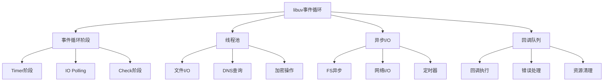

# libuv事件循环



## 📋 知识结构（金字塔模型）

### 🏗️ 基础层：认知（What）
**libuv架构组件**

| 组件 | 作用 | 实现 | 特点 |
|------|------|------|------|
| **事件循环** | 事件调度 | 单线程 | 高并发 |
| **线程池** | CPU/IO任务 | 多线程 | 利用率高 |
| **Handle** | 资源管理 | C结构 | 生命周期管理 |

### 🔍 理解层：机制（Why&How)

**事件循环执行顺序：**

1. Timer阶段：执行setTimeout/setInterval
2. IO Polling：执行I/O回调
3. Check阶段：执行setImmediate
4. Close Callbacks：执行关闭回调

### 🚀 应用层：实践（Apply)

**C++插件开发：**

```cpp
// ✅ Native插件实现
#include <node.h>
#include <uv.h>

void LongTask(const v8::FunctionCallbackInfo<v8::Value>& info) {
  v8::Isolate* isolate = info.GetIsolate();
  
  // 创建async handle
  uv_work_t* work = new uv_work_t;
  work->data = nullptr;
  
  // 调度到线程池
  uv_node_work(work, AsyncTask, AfterTask);
  
  info.GetReturnValue().Set(v8::Undefined(isolate));
}

void AsyncTask(uv_work_t* req) {
  // CPU密集型任务
  for (int i = 0; i < 1000000; i++) {
    // 计算任务
  }
}

void AfterTask(uv_work_t* req, int status) {
  v8::Isolate* isolate = v8::Isolate::GetCurrent();
  v8::HandleScope scope(isolate);
  
  // 回调JavaScript
  auto callback = v8::Function::New(isolate, [](void* data) {
    // 处理结果
  });
  
  callback->Call(isolate->GetCurrentContext(), 
                  v8::Undefined(isolate), 0, nullptr);
}
```

## 🧠 费曼学习法：能用简单的话解释

**libuv核心思想：**
1. **事件循环** = 餐厅服务员，循环查看每个桌子的需求
2. **线程池** = 后厨团队，处理复杂任务
3. **回调队列** = 点菜单，按顺序处理

## 🎯 刻意练习要点

**必须掌握的技能：**
- [ ] 理解事件循环机制
- [ ] 编写Native插件
- [ ] 性能调优
- [ ] 异步编程优化

---

*🔗 相关链接：[[004-事件循环机制]] | [[029-Stream源码剖析]] | [[031-V8引擎深度定制]]*
