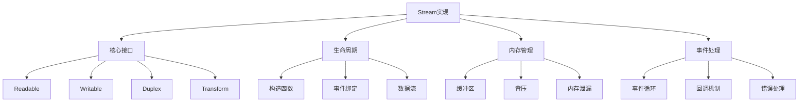

# Stream源码剖析



## 📋 知识结构（金字塔模型）

### 🏗️ 基础层：认知（What）
**Stream类型对比**

| Stream类型 | 特点 | 方法 | 事件 |
|------------|------|------|------|
| **Readable** | 可读 | read(), pipe() | 'data', 'end' |
| **Writable** | 可写 | write(), end() | 'drain', 'finish' |
| **Duplex** | 双向 | 继承两者 | 两者事件集合 |
| **Transform** | 转换 | _transform() | 'data', 'close' |

### 🔍 理解层：机制（Why&How)

**Stream工作流程：**

1. 创建Stream实例
2. 绑定事件监听器
3. 开始数据流动
4. 处理背压机制
5. 完成并清理

### 🚀 应用层：实践（Apply)

**自定义Stream实现：**

```javascript
// ✅ 基础Transform Stream
class CustomTransform extends stream.Transform {
  constructor(options = {}) {
    super(options);
    this.totalBytes = 0;
  }
  
  _transform(chunk, encoding, callback) {
    // 数据转换逻辑
    const transformed = this.transformChunk(chunk);
    
    // 统计字节数
    this.totalBytes += chunk.length;
    
    // 推送转换后的数据
    this.push(transformed);
    callback();
  }
  
  _flush(callback) {
    // 刷新时的清理工作
    console.log(`Total bytes processed: ${this.totalBytes}`);
    callback();
  }
  
  transformChunk(chunk) {
    // 具体转换实现
    return chunk;
  }
}

// ✅ 高级Stream组合
class StreamPipeline {
  constructor(inputStream) {
    this.source = inputStream;
    this.pipeline = [];
  }
  
  addTransform(transformStream) {
    this.pipeline.push(transformStream);
    return this;
  }
  
  pipeTo(destination) {
    let stream = this.source;
    
    // 链式连接所有Transform
    for (const transform of this.pipeline) {
      stream = stream.pipe(transform);
    }
    
    // 连接到目标
    return stream.pipe(destination);
  }
}

// ✅ 错误恢复Stream
class ResilientStream extends stream.Readable {
  constructor(sourceStream, options = {}) {
    super(options);
    this.source = sourceStream;
    this.maxRetries = options.maxRetries || 3;
    this.retryCount = 0;
    
    this.bindEvents();
  }
  
  bindEvents() {
    const handleError = (error) => {
      if (this.retryCount < this.maxRetries) {
        this.retryCount++;
        console.log(`Retry attempt ${this.retryCount}`);
        
        setTimeout(() => {
          this.source.resume();
          this.bindEvents();
        }, 1000 * this.retryCount);
      } else {
        this.emit('error', error);
      }
    };
    
    this.source.on('error', handleError);
    this.source.on('data', (chunk) => {
      this.retryCount = 0; // 重置重试计数
      this.push(chunk);
    });
    
    this.source.on('end', () => {
      this.push(null);
    });
  }
}
```

## 🧠 费曼学习法：能用简单的话解释

**Stream核心思想：**
1. **数据流** = 水管里的水流，可以控制流量
2. **背压** = 水龙头阀门，控制水流速度
3. **管道** = 接多个水管的系统

## 🎯 刻意练习要点

**必须掌握的技能：**
- [ ] 理解Stream工作原理
- [ ] 实现自定义Stream
- [ ] 处理背压问题
- [ ] 优化Stream性能

---

*🔗 相关链接：[[007-文件系统操作]] | [[028-libuv事件循环]] | [[030-Buffer内存管理]]*
