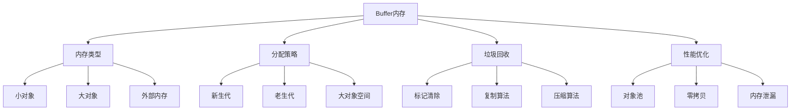

# Buffer内存管理



## 📋 知识结构（金字塔模型）

### 🏗️ 基础层：认知（What）
**Node.js内存管理**

| 内存类型 | 大小范围 | 垃圾回收 | 优化策略 |
|----------|----------|----------|----------|
| **小对象** | <8KB | 新生代 | 快速分配 |
| **大对象** | >8KB | 老生代 | 延迟回收 |
| **Buffer** | 独立空间 | 手动管理 | 对象池 |

### 🔍 理解层：机制（Why&How)

**垃圾回收算法：**

1. **新生代GC**：复制算法，回收快
2. **老生代GC**：标记-清除-压缩
3. **全堆GC**：所有代的垃圾回收

### 🚀 应用层：实践（Apply）

**Buffer优化实践：**

```javascript
// ✅ Buffer池化管理
class BufferPool {
  constructor(options = {}) {
    this.minSize = options.minSize || 1024;
    this.maxSize = options.maxSize || 65536;
    this.pools = new Map();
  }
  
  create(size) {
    const poolSize = this.getPoolSize(size);
    
    if (!this.pools.has(poolSize)) {
      this.pools.set(poolSize, []);
    }
    
    const pool = this.pools.get(poolSize);
    
    if (pool.length > 0) {
      return pool.pop();
    }
    
    return Buffer.allocUnsafe(poolSize);
  }
  
  recycle(buffer) {
    if (!Buffer.isBuffer(buffer)) return;
    
    const size = buffer.length;
    if (size < this.minSize || size > this.maxSize) {
      return; // 超出范围，让GC处理
    }
    
    const poolSize = this.getPoolSize(size);
    buffer.fill(0); // 清空数据
    
    if (!this.pools.has(poolSize)) {
      this.pools.set(poolSize, []);
    }
    
    const pool = this.pools.get(poolSize);
    if (pool.length < 10) { // 限制池大小
      pool.push(buffer);
    }
  }
  
  getPoolSize(size) {
    // 向上取整到2的幂次
    return Math.pow(2, Math.ceil(Math.log2(size)));
  }
}

// ✅ 零拷贝优化
class ZeroCopyOptimizer {
  constructor() {
    this.fileHandles = new Map();
  }
  
  // 文件预读
  async preloadFile(filePath, size = 64 * 1024) {
    const fs = require('fs').promises;
    const fd = await fs.open(filePath, 'r');
    
    const buffer = Buffer.allocUnslow(size);
    await fd.read(buffer, 0, size, 0);
    
    this.fileHandles.set(filePath, {
      fd,
      buffer,
      size: await fs.stat(filePath).then(stat => stat.size),
      position: size
    });
    
    return buffer;
  }
  
  // 零拷贝读取
  async readFile(filePath, offset = 0, length) {
    const handle = this.fileHandles.get(filePath);
    
    if (!handle) {
      return this.preloadFile(filePath);
    }
    
    if (offset < handle.size) {
      const data = handle.buffer.slice(offset, offset + (length || handle.size - offset));
      return data;
    }
    
    // 需要重新读取
    const fs = require('fs').promises;
    const buffer = Buffer.allocUnsafe(length || 64 * 1024);
    await handle.fd.read(buffer, 0, length, offset);
    
    return buffer.slice(0, length);
  }
}

// ✅ 内存泄漏检测
class MemoryLeakDetector {
  constructor() {
    this.baseline = process.memoryUsage();
    this.snapshots = [];
    this.interval = null;
  }
  
  start(intervalMs = 30000) {
    this.interval = setInterval(() => {
      this.takeSnapshot();
    }, intervalMs);
    
    console.log('Memory leak detection started');
  }
  
  stop() {
    if (this.interval) {
      clearInterval(this.interval);
      this.interval = null;
    }
    
    this.analyze();
  }
  
  takeSnapshot() {
    const usage = process.memoryUsage();
    
    this.snapshots.push({
      timestamp: Date.now(),
      rss: usage.rss,
      heapTotal: usage.heapTotal,
      heapUsed: usage.heapUsed,
      external: usage.external
    });
    
    // 只保留最近100个快照
    if (this.snapshots.length > 100) {
      this.snapshots.shift();
    }
  }
  
  analyze() {
    if (this.snapshots.length < 2) return;
    
    const recent = this.snapshots.slice(-10);
    const avgGrowthRate = this.calculateGrowthRate(recent);
    
    if (avgGrowthRate > 1024 * 1024) { // 1MB增长
      console.warn('Potential memory leak detected:', {
        averageGrowthRate: `${(avgGrowthRate / 1024 / 1024).toFixed(2)} MB`,
        totalSnapshots: this.snapshots.length
      });
    }
  }
  
  calculateGrowthRate(snapshots) {
    let totalGrowth = 0;
    for (let i = 1; i < snapshots.length; i++) {
      totalGrowth += snapshots[i].heapUsed - snapshots[i-1].heapUsed;
    }
    
    return snapshots.length > 1 ? totalGrowth / (snapshots.length - 1) : 0;
  }
}
```

## 🧠 费曼学习法：能用简单的话解释

**内存管理核心思想：**
1. **垃圾回收** = 清理房间，扔掉不需要的东西
2. **内存池** = 物品回收站，重复利用物品
3. **零拷贝** = 直接传递物品，不复制

## 🎯 刻意练习要点

**必须掌握的技能：**
- [ ] 理解内存管理机制
- [ ] 实现内存优化策略
- [ ] 检测内存泄漏
- [ ] 优化Buffer操作

---

*🔗 相关链接：[[003-V8引擎原理解析]] | [[029-Stream源码剖析]] | [[028-libuv事件循环]]*
