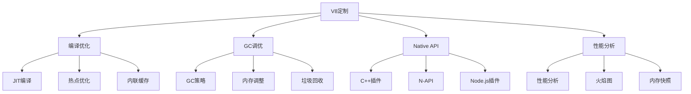

# V8引擎深度定制



## 📋 知识结构（金字塔模型）

### 🏗️ 基础层：认知（What）
**V8引擎组成**

| 组件 | 功能 | 优化目标 | 工具 |
|------|------|----------|------|
| **Parser** | 解析JavaScript | 解析速度 | --parser |
| **Ignition** | 字节码解释 | 启动速度 | --ignition |
| **TurboFan** | 优化编译 | 执行性能 | --turbo-fan |
| **GC** | 垃圾回收 | 内存效率 | --gc-interval |

### 🔍 理解层：机制（Why&How)

**V8启动命令行选项：**

```bash
node --max-old-space-size=4096          # 设置老生代空间4GB
node --max-new-space-size=128           # 设置新生代空间128MB
node --optimize-for-size                # 优化内存而非速度
node --gc-interval=100                  # 每100次分配触发GC
node --trace-gc                         # 跟踪垃圾回收
node --trace-opt                        # 跟踪编译优化
```

### 🚀 应用层：实践（Apply）

**性能分析工具：**

```javascript
// ✅ V8性能分析
class V8Profiler {
  constructor() {
    this.profiles = [];
    this.startTime = Date.now();
  }
  
  // CPU Profiling
  startProfiling() {
    const v8profiler = require('@v8/profiler');
    const profiler = v8profiler.createSamplingProfiler();
    profiler.startSampling('node-prof', 1000);
    
    return profiler;
  }
  
  stopProfiling(profiler) {
    profiler.stopSampling();
    
    const profile = profiler.getNodeNameFromStackTrace();
    console.log('CPU Profile summary:', {
      nodesCount: Object.keys(profile).length,
      duration: Date.now() - this.startTime
    });
    
    return profile;
  }
  
  // Heap Analysis
  analyzeHeap() {
    const v8 = require('v8');
    const heapUsage = process.memoryUsage();
    
    return {
      heapTotal: heapUsage.heapTotal,
      heapUsed: heapUsage.heapUsed,
      heapExternal: heapUsage.external,
      heapUtilization: `${((heapUsage.heapUsed / heapUsage.heapTotal) * 100).toFixed(2)}%`
    };
  }
  
  // GC Statistics
  getGCStats() {
    const v8stat = require('v8-statistics');
    
    return {
      totalGCCount: v8stat.getTotalGCCount(),
      totalGCDuration: v8stat.getTotalGCDuration(),
      averageGCDuration: v8stat.getAverageGCDuration(),
      heapSpaceUsages: v8stat.getHeapSpaceUsages()
    };
  }
}

// ✅ C++插件开发
// addon.cc
#include <node.h>

void Add(const v8::FunctionCallbackInfo<v8::Value>& info) {
  v8::Isolate* isolate = info.GetIsolate();
  
  if (info.Length() < 2) {
    isolate->ThrowException(v8::Exception::Error(v8::String::NewFromUtf8(isolate, "Wrong number of arguments")));
    return;
  }
  
  if (!info[0]->IsNumber() || !info[1]->IsNumber()) {
    isolate->ThrowException(v8::Exception::TypeError(v8::String::NewFromUtf8(isolate, "Wrong arguments")));
    return;
  }
  
  double value = info[0]->NumberValue() + info[1]->NumberValue();
  
  v8::Local<v8::Number> num = v8::Number::New(isolate, value);
  info.GetReturnValue().Set(num);
}

void Initialize(v8::Local<v8::Object> exports) {
  NODE_SET_METHOD(exports, "add", Add);
}

NODE_MODULE(NODE_GYP_MODULE_NAME, Initialize)
```

## 🧠 费曼学习法：能用简单的话解释

**V8引擎核心思想：**
1. **JIT编译** = 先翻译成方言便于理解，再优化成机器码
2. **GC调优** = 整理房间的频率和时间策略
3. **性能分析** = 体温计和血压计，了解身体状态

## 🎯 刻意练习要点

**必须掌握的技能：**
- [ ] 优化V8启动参数
- [ ] 分析内存和性能
- [ ] 开发C++插件
- [ ] 监控引擎行为

---

*🔗 相关链接：[[003-V8引擎原理解析]] | [[028-libuv事件循环]] | [[023-性能优化深入]]*
