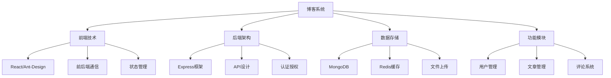

# 全栈博客系统



## 📋 知识结构（金字塔模型）

### 🏗️ 基础层：认知（What）
**系统架构设计**

| 层 | 技术栈 | 职责 | 工具 |
|---|--------|------|------|
| **前端** | React + Ant-Design | 用户界面 | Webpack |
| **后端** | Node.js + Express | API服务 | PM2 |
| **数据库** | MongoDB + Redis | 数据存储 | Mongoose |
| **部署** | Docker + Nginx | 生产环境 | GitHub Actions |

### 🔍 理解层：机制（Why&How)

**核心模块设计：**

```javascript
// ✅ 项目目录结构
const projectStructure = {
  frontend: {
    src: {
      components: 'UI组件',
      pages: '页面组件', 
      services: 'API服务',
      utils: '工具函数',
      store: '状态管理'
    }
  },
  backend: {
    src: {
      controllers: '控制器层',
      services: '业务逻辑',
      models: '数据模型',
      middleware: '中间件',
      routes: '路由定义'
    }
  }
};
```

### 🚀 应用层：实践（Apply）

**核心功能实现：**

```javascript
// ✅ 用户认证服务
class AuthenticationService {
  async register(userData) {
    const { email, password, username } = userData;
    
    // 验证邮箱唯一性
    const existingUser = await User.findOne({ email });
    if (existingUser) {
      throw new Error('Email already exists');
    }
    
    // 密码加密
    const hashedPassword = await bcrypt.hash(password, 12);
    
    // 创建用户
    const user = await User.create({
      email,
      username,
      password: hashedPassword,
      createdAt: new Date()
    });
    
    // 生成JWT
    const token = jwt.sign(
      { userId: user._id, email: user.email },
      process.env.JWT_SECRET,
      { expiresIn: '7d' }
    );
    
    return { user: this.formatUser(user), token };
  }
  
  async login(email, password) {
    const user = await User.findOne({ email }).select('+password');
    
    if (!user || !await bcrypt.compare(password, user.password)) {
      throw new Error('Invalid credentials');
    }
    
    const token = jwt.sign(
      { userId: user._id, email: user.email },
      process.env.JWT_SECRET,
      { expiresIn: '7d' }
    );
    
    return { user: this.formatUser(user), token };
  }
}

// ✅ 博客文章服务
class ArticleService {
  async createArticle(authorId, articleData) {
    const article = await Article.create({
      ...articleData,
      author: authorId,
      status: 'published',
      publishedAt: new Date(),
      readCount: 0
    });
    
    // 更新用户文章计数
    await User.findByIdAndUpdate(authorId, {
      $inc: { articleCount: 1 }
    });
    
    return article;
  }
  
  async getArticles(filters = {}) {
    const {
      page = 1,
      limit = 10,
      category,
      tag,
      author,
      keyword
    } = filters;
    
    const query = {};
    
    if (category) query.category = category;
    if (tag) query.tags = { $in: [tag] };
    if (author) query.author = author;
    if (keyword) {
      query.$or = [
        { title: { $regex: keyword, $options: 'i' } },
        { content: { $regex: keyword, $options: 'i' } }
      ];
    }
    
    const articles = await Article.find(query)
      .populate('author', 'username avatar')
      .sort({ publishedAt: -1 })
      .skip((page - 1) * limit)
      .limit(limit);
    
    const total = await Article.countDocuments(query);
    
    return {
      articles,
      pagination: {
        page,
        limit,
        total,
        pages: Math.ceil(total / limit)
      }
    };
  }
}

// ✅ 评论系统
class CommentService {
  async addComment(articleId, userId, commentData) {
    const comment = await Comment.create({
      ...commentData,
      article: articleId,
      author: userId,
      createdAt: new Date(),
      likes: 0
    });
    
    // 更新文章评论计数
    await Article.findByIdAndUpdate(articleId, {
      $inc: { commentCount: 1 }
    });
    
    return comment.populate('author', 'username avatar');
  }
  
  async getComments(articleId, page = 1, limit = 20) {
    const comments = await Comment.find({ article: articleId })
      .populate('author', 'username avatar')
      .sort({ createdAt: -1 })
      .skip((page - 1) * limit)
      .limit(limit);
    
    return comments;
  }
}
```

## 🧠 费曼学习法：能用简单的话解释

**全栈开发核心思想：**
1. **前端** = 门脸装修，用户看到什么
2. **后端** = 厨房设备，处理和存储数据
3. **数据库** = 仓库储存，保存所有货物

## 🎯 刻意练习要点

**必须掌握的技能：**
- [ ] 设计前后端架构
- [ ] 实现用户认证系统
- [ ] 开发CRUD功能
- [ ] 集成第三方服务

---

*🔗 相关链接：[[015-Express核心机制]] | [[017-数据库集成方案]] | [[018-身份验证与授权]]*
