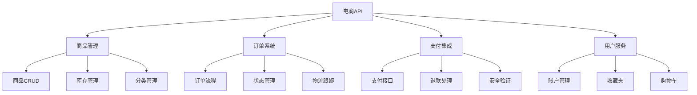

# 电商后端API



## 📋 知识结构（金字塔模型）

### 🏗️ 基础层：认知（What）
**电商API核心模块**

| 模块 | 功能 | 复杂度 | 依赖 |
|------|------|--------|------|
| **商品管理** | CRUD操作 | 中等 | MongoDB |
| **订单系统** | 流程控制 | 高 | Redis |
| **支付集成** | 第三方API | 很高 | Payment SDK |
| **库存管理** | 并发控制 | 高 | Database |

### 🚀 应用层：实践（Apply）

```javascript
// ✅ 商品服务
class ProductService {
  async createProduct(productData) {
    const product = await Product.create({
      ...productData,
      sku: await this.generateSku(),
      status: 'active',
      createdAt: new Date()
    });
    
    // 更新分类商品计数
    await Category.findByIdAndUpdate(productData.category, {
      $inc: { productCount: 1 }
    });
    
    return product;
  }
  
  async updateInventory(productId, quantity, operation = 'subtract') {
    const product = await Product.findById(productId);
    
    if (operation === 'subtract' && product.inventory < quantity) {
      throw new Error('Insufficient inventory');
    }
    
    const newInventory = operation === 'add' 
      ? product.inventory + quantity
      : product.inventory - quantity;
    
    return await Product.findByIdAndUpdate(productId, {
      inventory: newInventory
    }, { new: true });
  }
}
```

## 🧠 费曼学习法：能用简单的话解释

**电商核心思想：**
1. **商品管理** = 超市商品陈列
2. **订单系统** = 收银结账流程
3. **库存管理** = 仓库进货出货

## 🎯 刻意练习要点

**必须掌握的技能：**
- [ ] 设计电商业务流程
- [ ] 实现库存扣减
- [ ] 集成支付系统
- [ ] 处理高并发

---

*🔗 相关链接：[[017-数据库集成方案]] | [[024-微服务架构模式]] | [[027-企业级解决方案]]*
