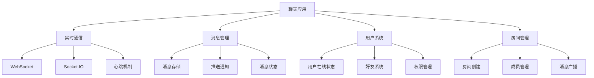

# 实时聊天应用



## 📋 知识结构（金字塔模型）

### 🏗️ 基础层：认知（What）
**聊天应用核心特性**

| 功能 | 技术要求 | 实现方式 | 存储 |
|------|----------|----------|------|
| **实时消息** | WebSocket | Socket.IO | MongoDB |
| **消息历史** | 持久化 | 数据库存储 | Redis |
| **在线状态** | 心跳检测 | SetInterval | 内存 |

### 🚀 应用层：实践（Apply）

```javascript
// ✅ 聊天服务
class ChatService {
  constructor(io) {
    this.io = io;
    this.onlineUsers = new Map();
    this.userRooms = new Map();
  }
  
  handleConnection(socket) {
    socket.on('join', (data) => {
      this.joinRoom(socket, data);
    });
    
    socket.on('message', (data) => {
      this.handleMessage(socket, data);
    });
    
    socket.on('disconnect', () => {
      this.handleDisconnection(socket);
    });
  }
  
  async joinRoom(socket, { userId, roomId }) {
    socket.join(roomId);
    
    // 更新在线状态
    this.onlineUsers.set(userId, {
      socketId: socket.id,
      roomId: roomId,
      lastSeen: new Date()
    });
    
    // 通知房间其他成员
    socket.to(roomId).emit('userJoined', {
      userId,
      timestamp: new Date()
    });
  }
  
  async handleMessage(socket, messageData) {
    const { roomId, content, messageType = 'text' } = messageData;
    
    const message = {
      id: crypto.randomUUID(),
      roomId,
      content,
      messageType,
      senderId: socket.userId,
      timestamp: new Date(),
      status: 'sent'
    };
    
    // 广播消息到房间
    this.io.to(roomId).emit('newMessage', message);
    
    // 保存到数据库
    await this.saveMessage(message);
  }
}
```

## 🧠 费曼学习法：能用简单的话解释

**聊天核心思想：**
1. **实时通信** = 打电话一样瞬间传递
2. **房间机制** = 会议室，不同房间隔离
3. **消息存储** = 通话记录，保存聊天历史

## 🎯 刻意练习要点

**必须掌握的技能：**
- [ ] 实现WebSocket通信
- [ ] 设计消息系统
- [ ] 管理用户状态
- [ ] 优化并发性能

---

*🔗 相关链接：[[025-实时通信技术]] | [[032-全栈博客系统]] | [[005-模块系统详解]]*
