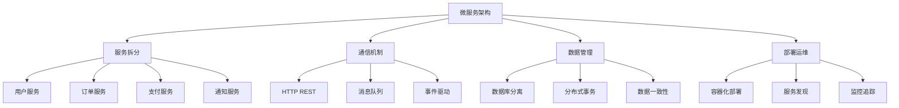

# 微服务项目实战



## 📋 知识结构（金字塔模型）

### 🏗️ 基础层：认知（What）
**微服务拆分策略**

| 服务 | 职责 | 数据库 | 通信方式 |
|------|------|--------|----------|
| **用户服务** | 用户管理 | MySQL | HTTP |
| **订单服务** | 订单处理 | MongoDB | HTTP+MQ |
| **支付服务** | 支付处理 | Redis | HTTP |
| **通知服务** | 消息推送 | Redis | MQ |

### 🚀 应用层：实践（Apply）

```javascript
// ✅ 服务间通信客户端
class ServiceClient {
  constructor(serviceName, registry) {
    this.serviceName = serviceName;
    this.registry = registry;
  }
  
  async call(targetService, endpoint, data) {
    const service = await this.registry.discover(targetService);
    
    const response = await fetch(`http://${service.host}:${service.port}${endpoint}`, {
      method: 'POST',
      headers: {
        'Content-Type': 'application/json',
        'X-Service': this.serviceName
      },
      body: JSON.stringify(data)
    });
    
    if (!response.ok) {
      throw new Error(`Service ${targetService} call failed`);
    }
    
    return await response.json();
  }
}

// ✅ 事件驱动通信
class EventBus {
  constructor(redis) {
    this.redis = redis;
    this.subscribers = new Map();
  }
  
  async publish(eventType, data) {
    const event = {
      id: crypto.randomUUID(),
      type: eventType,
      data,
      timestamp: new Date()
    };
    
    await this.redis.publish(`events:${eventType}`, JSON.stringify(event));
  }
  
  subscribe(eventType, handler) {
    this.redis.subscribe(`events:${eventType}`);
    
    this.redis.on('message', (channel, message) => {
      if (channel === `events:${eventType}`) {
        const event = JSON.parse(message);
        handler(event);
      }
    });
  }
}
```

## 🧠 费曼学习法：能用简单的话解释

**微服务核心思想：**
1. **服务拆分** = 把大公司分成多个专业部门
2. **服务通信** = 部门间相互协作
3. **独立部署** = 各部门独立招聘

## 🎯 刻意练习要点

**必须掌握的技能：**
- [ ] 服务拆分设计
- [ ] 实现服务间通信
- [ ] 处理分布式事务
- [ ] 管理服务生命周期

---

*🔗 相关链接：[[024-微服务架构模式]] | [[026-云原生应用开发]] | [[027-企业级解决方案]]*
