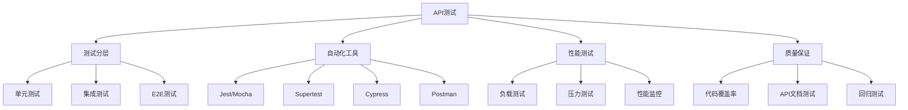

# API自动化测试



## 📋 知识结构（金字塔模型）

### 🏗️ 基础层：认知（What）
**测试策略和工具**

| 测试类型 | 工具 | 范围 | 频率 |
|----------|------|------|------|
| **单元测试** | Jest | 函数级别 | 每次提交 |
| **集成测试** | Supertest | 接口级别 | CI/CD |
| **E2E测试** | Cypress | 用户场景 | 每日 |

### 🚀 应用层：实践（Apply）

```javascript
// ✅ API测试套件
describe('API测试套件', () => {
  let authToken;
  
  beforeAll(async () => {
    // 设置测试环境
    const response = await request(app)
      .post('/api/auth/login')
      .send({ email: 'test@test.com', password: 'password' });
    
    authToken = response.body.token;
  });
  
  describe('用户管理API', () => {
    test('创建用户', async () => {
      const userData = {
        email: 'newuser@test.com',
        username: 'newuser',
        password: 'password123'
      };
      
      const response = await request(app)
        .post('/api/users')
        .set('Authorization', `Bearer ${authToken}`)
        .send(userData)
        .expect(201);
      
      expect(response.body.data.email).toBe(userData.email);
    });
    
    test('获取用户列表', async () => {
      const response = await request(app)
        .get('/api/users')
        .set('Authorization', `Bearer ${authToken}`)
        .expect(200);
      
      expect(response.body.data).toBeInstanceOf(Array);
      expect(response.body.meta.pagination).toBeDefined();
    });
  });
});

// ✅ 性能测试
async function performancetest() {
  const startTime = Date.now();
  const concurrentRequests = 100;
  
  const promises = Array(concurrentRequests).fill().map(() => 
    request(app)
      .get('/api/data')
      .set('Authorization', `Bearer ${authToken}`)
  );
  
  const responses = await Promise.all(promises);
  const duration = Date.now() - startTime;
  
  console.log(`Performance Test Results:
    Concurrent Requests: ${concurrentRequests}
    Duration: ${duration}ms
    Average Response Time: ${duration / concurrentRequests}ms
    Success Rate: ${responses.filter(r => r.status === 200).length / responses.length * 100}%`);
}
```

## 🧠 费曼学习法：能用简单的话解释

**自动化测试核心思想：**
1. **单元测试** = 检查每个零件质量
2. **集成测试** = 检查组装后功能
3. **性能测试** = 压力测试承受能力

## 🎯 刻意练习要点

**必须掌握的技能：**
- [ ] 编写API测试用例
- [ ] 设置CI/CD流水线
- [ ] 进行性能测试
- [ ] 生成测试报告

---

*🔗 相关链接：[[021-测试与质量保证]] | [[032-全栈博客系统]] | [[033-电商后端API]]*
