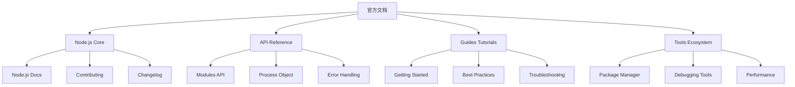

# Official Documentation Links

## 📋 官方文档资源分类

### 🏗️ Node.js 核心文档

| 类别 | 官网链接 | 描述 | 重要程度 |
|------|----------|------|----------|
| **Node.js官网** | [nodejs.org](https://nodejs.org/) | 主要入口 | ★★★★★ |
| **API文档** | [nodejs.dev](https://nodejs.dev/) | 官方API文档 | ★★★★★ |
| **npm文档** | [npmjs.com](https://www.npmjs.com/) | 包管理器 | ★★★★☆ |

### 🔍 Framework文档

| 框架 | 文档地址 | 特点 | 适用场景 |
|------|----------|------|----------|
| **Express** | [expressjs.com](https://expressjs.com/) | 最流行的Web框架 | Web应用 |
| **Koa** | [koajs.com](https://koajs.com/) | 现代简洁框架 | API服务 |
| **NestJS** | [nestjs.com](https://nestjs.com/) | 企业级TypeScript | 大型项目 |

### 🚀 学习资源链接

| 资源类型 | 链接 | 难度 | 适合人群 |
|----------|------|------|----------|
| **Getting Started** | [nodejs.dev/en/learn/](https://nodejs.dev/en/learn/) | 初级 | 新学者 |
| **Node.js Guides** | [nodejs.org/docs/guides](https://nodejs.org/docs/guides/) | 中级 | 有基础者 |
| **Contributors Guide** | [github.com/nodejs/node](https://github.com/nodejs/node) | 高级 | 开源贡献者 |

## 🧠 使用技巧

**文档查看建议：**
1. **版本兼容性** - 确认Node.js版本与API的一致性
2. **官方优先** - 优先查看官方文档，再查找社区资源  
3. **示例代码** - 重点看代码示例，理解用法

## 🎯 快速入口

- **新手入门** → [[001-Node.js概述]] 
- **API查询** → [[009-内置模块总览]]
- **实战练习** → [[032-全栈博客系统]]

---

*🔗 相关链接：[[042-Troubleshooting-Solutions]] | [[040-Industry-Practices]] | [[041-Tech-Toolbox]]*
