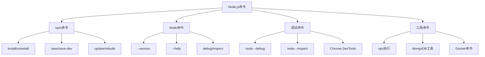

# 命令速查手册



## 📋 常用命令汇总

### 🏗️ npm命令大全

| 命令 | 作用 | 示例 | 说明 |
|------|------|------|------|
| **npm init** | 初始化项目 | `npm init -y` | 快速生成package.json |
| **npm install** | 安装依赖 | `npm i express` | 安装包 |
| **npm run** | 运行脚本 | `npm run dev` | 执行package.json中的脚本 |

### 🔍 Node.js命令

| 功能 | 命令 | 作用 | 示例 |
|------|------|------|------|
| **版本查看** | `node --version` | 查看Node版本 | `node -v` |
| **调试模式** | `node --inspect` | 开启调试 | `node --inspect app.js` |
| **ESLint** | `eslint` | 代码检查 | `eslint *.js` |

### 🚀 常用脚本命令

```bash
# 开发服务器
npm run dev
npm run start:dev

# 生产环境
npm run build
npm run start:prod

# 测试相关
npm test
npm run test:watch
npm run coverage
```

---

*🔗 相关链接：[[011-包管理器深入]] | [[012-开发工具链]] | [[041-Tech-Toolbox]]*
