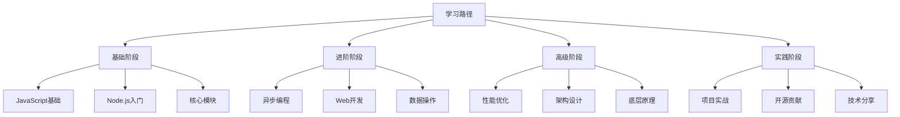

# Learning Path Guide

## 📋 学习路径规划

### 🏗️ 第一阶段：基础认知（1-2月）

| 学习内容 | 目标文件 | 技能要求 | 时间投入 |
|----------|----------|----------|----------|
| **Node.js概述** | [[001-Node.js概述]] | 理解Node.js特性 | 1周 |
| **运行环境对比** | [[002-JavaScript运行环境对比]] | 对比浏览器与Node | 1周 |
| **事件循环** | [[004-事件循环机制]] | 掌握异步原理 | 2周 |

**学习目标：** 理解Node.js基本概念和运行机制

### 🔍 第二阶段：核心理解（2-3月）

| 学习内容 | 目标文件 | 实践项目 | 技能目标 |
|----------|----------|----------|----------|
| **异步编程** | [[006-异步编程范式]] | 编写异步代码 | 熟练callback/Promise/async |
| **文件系统** | [[007-文件系统操作]] | 文件操作工具 | 掌握fs模块API |
| **网络编程** | [[008-网络编程基础]] | HTTP客户端 | 理解网络通信 |

**学习目标：** 精通Node.js核心概念和编程范式

### 🚀 第三阶段：框架应用（2-3月）

| 学习内容 | 目标文件 | 实战项目 | 产出要求 |
|----------|----------|----------|----------|
| **Express框架** | [[015-Express核心机制]] | Web应用开发 | 独立开发API |
| **数据库集成** | [[017-数据库集成方案]] | 后端系统 | CRUD操作 |
| **身份验证** | [[018-身份验证与授权]] | 安全系统 | 实现JWT认证 |

**学习目标：** 能够独立开发完整的Web应用

### 🎯 第四阶段：系统实战（3-4月）

| 学习内容 | 目标文件 | 综合项目 | 能力要求 |
|----------|----------|----------|----------|
| **全栈博客系统** | [[032-全栈博客系统]] | 前端+后端 | 掌握全栈开发 |
| **微服务架构** | [[035-微服务项目实战]] | 分布式系统 | 理解架构设计 |
| **云原生部署** | [[026-云原生应用开发]] | 容器化部署 | DevOps能力 |

**学习目标：** 具备企业级项目开发能力

## 🧠 学习注意事项

**阶段要求：**
1. **循序渐进** - 每个阶段要扎实掌握再进入下一阶段
2. **动手实践** - 理论结合实践，多写代码
3. **项目驱动** - 通过具体项目巩固知识

**学习时间安排：**
- **工作日**：每天1-2小时理论学习
- **周末**：每周末4-6小时项目实践
- **总周期**：6-12个月达到高级水平

## 🎯 检测标准

**每个阶段完成标准：**
- **能够讲解** - 用简单话解释核心概念（费曼学习法）
- **能够实践** - 独立完成对应难度项目
- **能够拓展** - 主动学习相关新技术
- **能够分享** - 向他人传授知识

---

*🔗 相关链接：[[046-Learning-Tips]] | [[045-Practice-Strategies]] | [[041-Tech-Toolbox]]*
