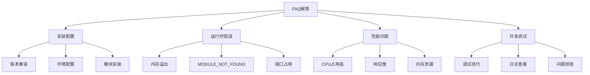

# 常见问题解答

## 📋 问题分类解答

### 🏗️ 安装配置问题

| 问题 | 原因 | 解决方案 |
|------|------|----------|
| **npm install失败** | 网络或权限问题 | 使用cnpm或配置代理 |
| **模块找不到** | 路径错误 | 检查require路径 |
| **版本不兼容** | Node版本过低 | 升级Node.js版本 |

### 🔍 运行时错误

| 错误类型 | 常见原因 | 解决方法 |
|----------|----------|----------|
| **Cannot find module** | 模块路径错误 | 检查文件路径和安装 |
| **EADDRINUSE** | 端口被占用 | 更换端口或杀死进程 |
| **Memory leak** | 内存泄漏 | 检查全局变量和闭包 |

### 🚀 性能调优

| 性能问题 | 优化方向 | 解决方案 |
|----------|----------|----------|
| **启动慢** | 优化模块加载 | 懒加载和代码分割 |
| **内存占用高** | 内存泄漏排查 | heapdump分析 |
| **CPU占用高** | 事件循环阻塞 | Worker Threads |

## 🧠 调试技巧

**问题排查步骤：**
1. **查看错误日志** - 仔细阅读错误信息
2. **检查代码逻辑** - 验证业务逻辑正确性
3. **使用调试工具** - Chrome DevTools或node --inspect
4. **分步调试** - console.log逐步定位问题

---

*🔗 相关链接：[[042-Troubleshooting-Solutions]] | [[010-错误处理机制]] | [[043-Skill-Knowledge-Map]]*
