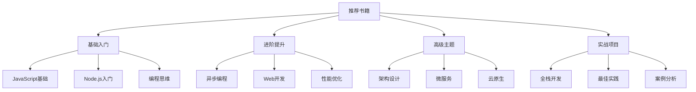

# Recommended Books

## 📋 推荐书目分类

### 🏗️ 基础入门类

| 书名 | 作者 | 推荐指数 | 适合阶段 | 核心价值 |
|------|------|----------|----------|----------|
| **JavaScript高级程序设计** | Nicholas C.Zakas | ★★★★★ | 基础阶段 | JavaScript权威指南 |
| **Node.js实战** | Mike Cantelon等 | ★★★★☆ | 初学阶段 | 实用性强 |
| **深入浅出Node.js** | 朴灵 | ★★★★★ | 进阶阶段 | 原理深入 |

### 🔍 进阶提升类

| 书名 | 作者 | 推荐指数 | 适用场景 | 学习要点 |
|------|------|----------|----------|----------|
| **Node.js设计模式** | Mario Casciaro | ★★★★☆ | 架构设计 | 设计模式应用 |
| **Express.js实战** | Ethan Brown | ★★★★☆ | Web开发 | Express框架精通 |
| **Node.js微服务** | David Gonzalez | ★★★★☆ | 微服务 | 分布式系统 |

### 🚀 高级主题类

| 书名 | 作者 | 推荐指数 | 技能要求 | 核心获益 |
|------|------|----------|----------|----------|
| **高性能Node.js** | Pedro Teixeira | ★★★★☆ | 有经验开发者 | 性能优化全面 |
| **Docker微服务部署** | David Gonzalez | ★★★★☆ | DevOps | 容器化部署 |
| **Node.js Web开发** | 狼叔 | ★★★★☆ | 全栈开发 | 工程实践 |

### 📚 技术生态

| 类型 | 推荐资源 | 获取方式 | 更新频率 |
|------|----------|----------|----------|
| **官方文档** | nodejs.org/docs | 免费在线 | 持续更新 |
| **技术博客** | 掘金/知乎Node.js | 免费在线 | 实时更新 |
| **视频教程** | 慕课网/极客时间 | 付费在线 | 定期更新 |

## 🧠 学习建议

**读书方法：**
1. **先实践后理论** - 先动手编码，再用书巩固
2. **多版本对比** - 同一主题看多本书不同观点  
3. **笔记整理** - 重要概念要做笔记和实践记录

**选书原则：**
- **权威性** - 选择知名作者和出版社
- **时效性** - 注意技术更新，选择较新版本
- **实用性** - 偏重理论与实践结合的书籍

## 🎯 阅读路径

**建议阅读顺序：**
1. **JavaScript基础** → 建立语言基础
2. **Node.js实战** → 快速上手实践
3. **深入浅出Node.js** → 深入理解原理
4. **性能优化/架构设计** → 进阶专业技能

---

*🔗 相关链接：[[037-Official-Documentation-Links]] | [[038-Learning-Path-Guide]] | [[042-Troubleshooting-Solutions]]*
