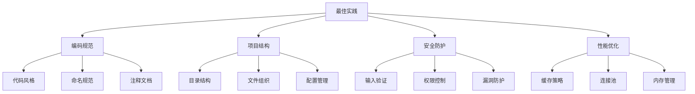

# 最佳实践清单



## 📋 开发规范清单

### 🏗️ 代码质量检查

| 检查项 | 工具 | 要求 | 检查方式 |
|--------|------|------|----------|
| **代码风格** | ESLint | Airbnb规范 | 每次提交 |
| **代码格式化** | Prettier | 统一格式 | CI/CD |
| **代码重复** | SonarQube | <3%重复率 | 定期检查 |

### 🔍 项目结构规范

```
project/
├── src/           # 源代码
├── tests/         # 测试代码
├── docs/          # 文档
├── scripts/       # 脚本文件
├── config/        # 配置文件
└── docker/        # 容器配置
```

### 🚀 安全最佳实践

| 安全措施 | 实施方法 | 检查频率 |
|----------|----------|----------|
| **输入验证** | validator库 | 每次请求 |
| **SQL注入防护** | 参数化查询 | 开发阶段 |
| **XSS防护** | 输出转义 | 每次渲染 |

## 🧠 开发原则

**核心开发原则：**
1. **DRY原则** - Don't Repeat Yourself
2. **KISS原则** - Keep It Simple, Stupid  
3. **SOLID原则** - 面向对象设计原则
4. **安全优先** - Security First

## 🎯 质量保证流程

**开发流程：**
1. **需求分析** → **架构设计** → **编码实现**
2. **单元测试** → **集成测试** → **代码审查**
3. **功能测试** → **性能测试** → **部署上线**

---

*🔗 相关链接：[[020-项目架构最佳实践]] | [[040-Industry-Practices]] | [[042-Troubleshooting-Solutions]]*
