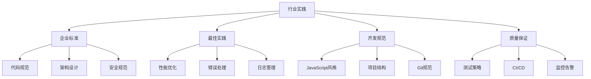

# Industry Practices



## 📋 企业级开发标准

### 🏗️ Node.js代码规范

| 规范类型 | 工具 | 配置要求 | 检查频率 |
|----------|------|----------|----------|
| **ESLint** | JavaScript Linter | Airbnb配置 | 每次提交 |
| **Prettier** | 代码格式化 | 统一风格 | CI/CD |
| **Husky** | Git Hooks | Pre-commit检查 | 提交前检查 |

### 🔍 项目结构规范

```
project/
├── src/
│   ├── controllers/    # 控制器
│   ├── services/       # 业务逻辑
│   ├── models/         # 数据模型
│   ├── middleware/     # 中间件
│   ├── routes/         # 路由
│   ├── utils/          # 工具函数
│   └── config/         # 配置文件
├── tests/              # 测试代码
├── docs/               # 文档
├── scripts/            # 脚本
└── docker/            # Docker配置
```

### 🚀 性能监控最佳实践

| 监控指标 | 工具 | 阈值 | 响应动作 |
|----------|------|------|----------|
| **CPU使用率** | PM2/Monitor | >80% | 扩缩容 |
| **内存使用** | PM2 | >90% | 内存泄漏检查 |
| **响应时间** | APM工具 | >1000ms | 性能调优 |
| **错误率** | 日志系统 | >5% | 错误分析 |

## 🧠 实战经验总结

**开发最佳实践：**
1. **错误处理** - 所有异步操作都要有错误处理
2. **日志规范** - 结构化日志，便于分析和监控
3. **配置管理** - 环境变量vs配置文件的最佳平衡
4. **安全防护** - 输入验证、权限控制、漏洞防护

## 🎯 质量保证流程

**CI/CD Pipeline:**
1. **代码提交** → 触发lint检查
2. **代码审查** → Peer Review
3. **自动化测试** → Unit/Integration测试
4. **构建部署** → Docker容器化部署
5. **监控告警** → 生产环境监控

---

*🔗 相关链接：[[020-项目架构最佳实践]] | [[021-测试与质量保证]] | [[022-部署与运维策略]]*
