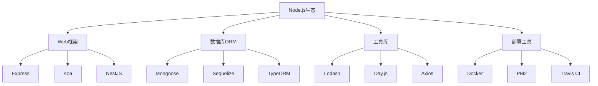

# 第三方库生态

## 📋 流行库分类

### 🏗️ Web开发框架

| 框架 | 特点 | 适用场景 | 学习难度 |
|------|------|----------|----------|
| **Express** | 轻量灵活 | 传统Web应用 | ⭐⭐ |
| **Koa** | 现代设计 | 中间件应用 | ⭐⭐⭐ |
| **Fastify** | 高性能 | API服务 | ⭐⭐⭐ |

### 🔍 数据库ORM

| ORM工具 | 数据库 | 特点 | 推荐度 |
|---------|--------|------|--------|
| **Mongoose** | MongoDB | 文档映射 | ⭐⭐⭐⭐ |
| **Sequelize** | SQL | 功能丰富 | ⭐⭐⭐⭐ |
| **Prisma** | 多数据库 | 现代设计 | ⭐⭐⭐⭐⭐ |

### 🚀 实用工具库

| 工具库 | 功能 | 使用频率 | 备注 |
|--------|------|----------|------|
| **Lodash** | 工具函数 | ★★★★☆ | 函数式编程 |
| **Axios** | HTTP客户端 | ★★★★★ | API调用 |
| **Joi** | 数据验证 | ★★★★★ | 输入验证 |

## 🧠 库选择建议

**选择原则：**
1. **社区活跃度** - GitHub Stars和活跃维护
2. **文档质量** - 完善的官方文档
3. **生态完整** - 丰富的插件和扩展
4. **学习成本** - 团队接受能力

## 🎯 依赖管理

**版本控制策略：**
- **锁定版本** - package-lock.json
- **定期更新** - npm audit fix
- **依赖分析** - npm ls查看依赖树
- **安全扫描** - npm audit安全检查

---

*🔗 相关链接：[[011-包管理器深入]] | [[015-Express核心机制]] | [[041-Tech-Toolbox]]*
