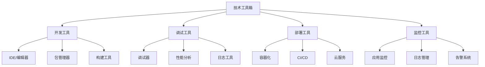

# Tech Toolbox



## 📋 开发工具清单

### 🏗️ 核心开发工具

| 工具类别 | 推荐工具 | 用途 | 替代选择 |
|----------|----------|------|----------|
| **IDE** | VS Code | 编辑器 | WebStorm/Sublime |
| **包管理** | npm/yarn | 依赖管理 | pnpm |
| **调试器** | Node.js Debug | 代码调试 | Chrome DevTools |

### 🔍 性能诊断工具

| 工具类型 | 工具名称 | 特点 | 使用场景 |
|----------|----------|------|----------|
| **Profiler** | clinic.js | 多维度分析 | 性能瓶颈分析 |
| **Memory** | heapdump | 内存快照 | 内存泄漏排查 |
| **CPU** | 0x | 火焰图 | CPU性能分析 |

### 🚀 部署运维工具

| 部署方式 | 推荐工具 | 特点 | 适用规模 |
|----------|----------|------|----------|
| **进程管理** | PM2 | 零停机重启 | 中小企业 |
| **容器化** | Docker | 环境一致性 | 所有规模 |
| **编排** | Kubernetes | 集群管理 | 大型项目 |

## 🧠 工具选择建议

**选择原则：**
1. **项目需求** - 根据项目规模选择合适工具
2. **团队技能** - 考虑团队技术栈和学习成本
3. **生态兼容** - 工具间的集成和兼容性
4. **持续学习** - 关注工具更新和最佳实践

## 🎯 工具配置模板

**基础开发环境配置：**
```json
{
  "package.json": "依赖管理",
  ".eslintrc.js": "代码规范",
  ".gitignore": "Git忽略文件",
  "docker-compose.yml": "开发环境",
  "jest.config.js": "测试配置"
}
```

---

*🔗 相关链接：[[012-开发工具链]] | [[022-部署与运维策略]] | [[023-性能优化深入]]*
