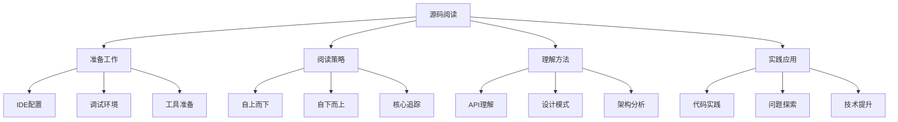

# 源码阅读技巧



## 📋 源码阅读方法论

### 🏗️ 准备工作

| 准备项目 | 工具推荐 | 重要性 | 说明 |
|----------|----------|--------|------|
| **IDE配置** | VS Code + Git | ⭐⭐⭐⭐ | 代码跳转和版本对比 |
| **调试环境** | Node.js Debug | ⭐⭐⭐⭐⭐ | 运行时理解 |
| **版本历史** | GitHub | ⭐⭐⭐ | 理解演进过程 |

### 🔍 阅读策略

**三步阅读法：**
1. **概览整体** - 理解项目结构和核心模块
2. **选择性深入** - 重点关注核心功能和API
3. **追踪流程** - 跟踪重要函数调用链路

### 🚀 理解框架

```javascript
// ✅ Node.js核心模块阅读思路
// 1. 找到入口文件 (index.js)
// 2. 理解模块导出 (module.exports)
// 3. 追踪核心函数 (关键API实现)
// 4. 分析内部机制 (算法和数据结构)

// 示例：fs模块阅读
const fs = require('fs');

// 重点关注的API：
// - readFile/readFileSync 实现
// - Stream 的继承关系
// - 错误处理机制
```

## 🧠 常见误区

**避免的陷阱：**
1. **逐行阅读** - 不要从头到尾看每一行代码
2. **过早深入** - 先理解整体再深入细节
3. **缺乏实践** - 边看边写，理论结合实践

## 🎯 进阶技巧

**深度学习方法：**
- **绘制UML图** - 理解类和模块关系
- **单步调试** - 使用调试器跟踪执行
- **修改测试** - 修改源码验证理解
- **重构练习** - 重写核心功能加深理解

---

*🔗 相关链接：[[028-libuv事件循环]] | [[029-Stream源码剖析]] | [[031-V8引擎深度定制]]*
