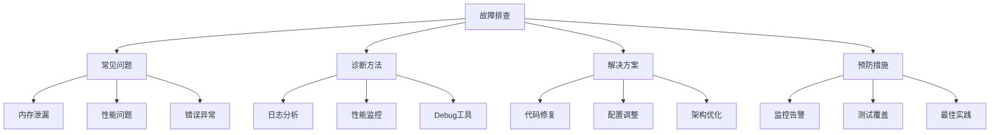

# Troubleshooting Solutions

## 📋 常见问题解决方案

### 🏗️ 内存问题

| 问题类型 | 症状表现 | 诊断方法 | 解决方案 |
|----------|----------|----------|----------|
| **内存泄漏** | 内存持续增长 | heapdump快照 | 检查全局变量/闭包 |
| **内存溢出** | heap out of memory | 监控内存使用 | 增加heap配置 |
| **GC频率高** | 频繁垃圾回收 | GC日志分析 | 优化对象创建 |

### 🔍 性能问题

| 性能瓶颈 | 影响 | 排查工具 | 优化手段 |
|----------|------|----------|----------|
| **CPU占用高** | 响应慢 | perf/0x | 算法优化/Worker |
| **I/O阻塞** | 并发低 | APM工具 | 异步优化 |
| **事件循环延迟** | 卡顿 | clinic.js | 耗时操作优化 |

### 🚀 错误异常处理

| 错误类型 | 原因分析 | 预防措施 | 处理方法 |
|----------|----------|----------|----------|
| **UnhandledPromiseRejection** | 未捕获异步错误 | 全局错误处理 | Promise错误捕获 |
| **Cannot find module** | 模块路径错误 | 路径检查 | 检查文件路径 |
| **Port already in use** | 端口占用 | 端口检查 | kill进程/换端口 |

## 🧠 诊断流程

**故障排查步骤：**
1. **现象收集** - 记录问题表现和复现步骤
2. **日志分析** - 查看错误日志和系统日志
3. **环境检查** - 确认运行环境配置
4. **逐步排查** - 从简单到复杂逐一排查
5. **解决方案** - 应用修复并进行测试

## 🎯 预防最佳实践

**问题预防措施：**
- **性能监控** - 建立完善的监控体系
- **压力测试** - 定期进行性能测试
- **代码审查** - 及时发现潜在问题
- **错误处理** - 完善的异常处理机制

---

*🔗 相关链接：[[010-错误处理机制]] | [[023-性能优化深入]] | [[045-Practice-Strategies]]*
