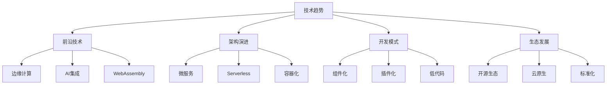

# 技术发展趋势

## 📋 技术发展方向

### 🏗️ 2024-2025技术热点

#### **架构层面**
| 技术方向 | 发展趋势 | 对Node.js影响 | 重要性 |
|----------|----------|----------------|--------|
| **微服务架构** | 持续成熟 | 框架支持完善 | ⭐⭐⭐⭐⭐ |
| **云原生** | Serverless普及 | 生态适配优化 | ⭐⭐⭐⭐⭐ |
| **边缘计算** | CDN+计算 | 轻量化方向 | ⭐⭐⭐⭐ |

#### **开发工具层面**
| 工具类型 | 演进趋势 | Node.js适配 | 学习价值 |
|----------|----------|-------------|----------|
| **容器化** | Kubernetes主导 | Native支持 | ⭐⭐⭐⭐⭐ |
| **CI/CD** | GitOps标准化 | 自动化完善 | ⭐⭐⭐⭐ |
| **监控** | 全链路可观测 | APM成熟 | ⭐⭐⭐⭐⭐ |

### 🔍 JavaScript生态演进

**语言发展趋势：**
- **ES2024+** - 持续语法增强
- **TypeScript统治** - 类型安全成为标准
- **Deno/Bun** - Node.js替代方案涌现
- **WebAssembly** - 高性能计算集成

### 🚀 学习建议

**技能发展重点：**
1. **云原生能力** - Docker、K8s、Serverless
2. **微服务架构** - 分布式系统设计
3. **安全防护** - 现代安全实践
4. **性能优化** - 大规模系统优化

## 🧠 前沿学习方向

**重点关注领域：**
- **Edge Computing** - 边缘节点计算
- **AI Integration** - 人工智能集成
- **GraphQL** - 现代API设计模式
- **WebAssembly** - 高性能Web应用

---

*🔗 相关链接：[[024-微服务架构模式]] | [[044-Technology-Tree]] | [[040-Third-Party-Ecosystem]]*
