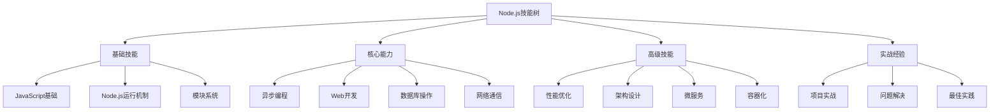

# Skill Knowledge Map

## 📋 技能评估体系

### 🏗️ 基础层技能（初学者）

| 技能点 | 掌握程度 | 测评方式 | 学习路径 |
|--------|----------|----------|----------|
| **JavaScript语法** | 熟练使用 | 代码练习 | [[001-Node.js概述]] |
| **事件循环理解** | 概念清晰 | 逻辑测试 | [[004-事件循环机制]] |
| **模块系统** | 正确使用 | 实际应用 | [[005-模块系统详解]] |

### 🔍 核心层技能（中级）

| 技能类别 | 掌握要求 | 评估标准 | 提升方法 |
|----------|----------|----------|----------|
| **异步编程** | Promise/async精通 | 能独立写异步代码 | [[006-异步编程范式]] |
| **API开发** | RESTful服务 | 完整的CRUD应用 | [[015-Express核心机制]] |
| **数据库集成** | ORM/数据库操作 | 复杂查询处理 | [[017-数据库集成方案]] |

### 🚀 高级层技能（高级）

| 技能领域 | 能力要求 | 产出标准 | 学习重点 |
|----------|----------|----------|----------|
| **架构设计** | 系统设计能力 | 大型项目架构 | [[024-微服务架构模式]] |
| **性能调优** | 性能分析和优化 | 系统性能提升 | [[023-性能优化深入]] |
| **运维部署** | DevOps能力 | 生产环境管理 | [[022-部署与运维策略]] |

## 🧠 技能进阶路径

**学习阶段规划：**
1. **基础建立**（1-3月）- 掌握Node.js核心概念
2. **能力巩固**（3-6月）- 独立开发Web应用
3. **技能拓展**（6-12月）- 具备架构设计能力
4. **专业精进**（1年以上） - 成为技术专家

## 🎯 持续学习建议

**技能维护：**
- **定期练习** - 保持编码手感
- **项目实战** - 通过项目巩固技能
- **技术分享** - 教授他人是最好的学习
- **社区参与** - 参与开源项目和社区

---

*🔗 相关链接：[[038-Learning-Path-Guide]] | [[044-Technology-Tree]] | [[046-Learning-Tips]]*
