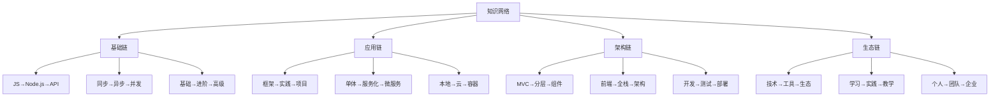

# 知识点关联网络



## 📋 核心知识链

### 🏗️ 基础技能链条

| 知识模块 | 前置知识 | 后续延伸 | 重要性 |
|----------|----------|----------|--------|
| **JavaScript** | HTML/CSS基础 | Node.js运行 | ⭐★★★★ |
| **事件循环** | JS基础 | 异步编程 | ⭐★★★★ |
| **模块系统** | Node.js概念 | 包管理 | ⭐⭐⭐⭐ |

### 🔍 技术能力链条

**技能成长路径：**
```
编程基础 → Node.js入门 → 全栈开发
    ↓           ↓           ↓
Web框架 → 数据库集成 → 系统架构
    ↓           ↓           ↓  
API设计 → 微服务 → 云原生
```

### 🚀 项目实战链条

| 项目类型 | 技术栈 | 技能要求 | 学习价值 |
|----------|--------|----------|----------|
| **Todo应用** | React+Express | 基础开发 | ⭐⭐⭐ |
| **博客系统** | 前端+后端+数据库 | 全栈思维 | ⭐⭐⭐⭐ |
| **电商API** | REST+MongoDB | 业务开发 | ⭐⭐⭐⭐ |
| **微服务项目** | Docker+K8s | 架构设计 | ⭐⭐⭐⭐⭐ |

## 🧠 关联学习方法

**知识连接策略：**
1. **主题式学习** - 围绕核心概念深入学习
2. **项目驱动** - 通过项目串联知识点
3. **对比分析** - 同类技术横向对比
4. **迭代深化** - 重复学习不断深入

---

*🔗 相关链接：[[047-Knowledge-Connected]] | [[043-Skill-Knowledge-Map]] | [[038-Learning-Path-Guide]]*
