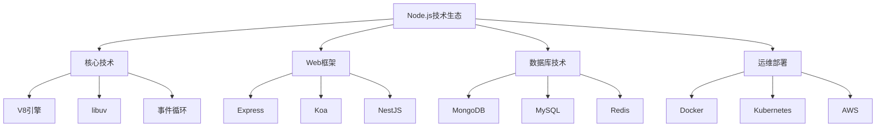

# Technology Tree



## 📋 技术栈分层架构

### 🏗️ 底层基础技术

| 技术类别 | 核心技术 | 学习优先级 | 依赖关系 |
|----------|----------|------------|----------|
| **运行时** | V8/Libuv | 高 | JavaScript基础→Node.js |
| **基础库** | fs/http/path | 中等 | Node.js→内置模块 |
| **异步处理** | Event Loop/Promise | 高 | JavaScript→异步编程 |

### 🔍 应用层技术

| 应用领域 | 技术选择 | 学习曲线 | 市场需求 |
|----------|----------|----------|----------|
| **Web开发** | Express/Koa/Fastify | 中等 | 高 |
| **API开发** | REST/GraphQL | 中高 | 很高 |
| **实时通信** | Socket.IO/WebSocket | 中高 | 中等 |

### 🚀 企业级技术

| 企业场景 | 技术方案 | 复杂度 | 重要性 |
|----------|----------|--------|--------|
| **微服务** | Docker+Kubernetes | 高 | 很高 |
| **性能** | Redis缓存/负载均衡 | 中高 | 高 |
| **安全** | JWT/OAuth/CORS | 高 | 很高 |

## 🧠 技术关联学习

**技术学习树状结构：**
```
JavaScript基础
├── Node.js入门
│   ├── Web开发 (Express)
│   ├── 数据库 (MongoDB/MySQL)
│   └── 异步编程 (Promise/async)
└── Web开发 → 全栈开发
    ├── 前端技术 (React/Vue)
    ├── 后端技术 (API/数据库)
    └── 部署运维 (Docker/CI/CD)
```

## 🎯 技术选择指南

**技术决策框架：**
1. **项目需求** - 根据具体需求选择技术栈
2. **团队能力** - 考虑团队技术背景
3. **生态成熟度** - 选择社区活跃的技术
4. **长期维护** - 考虑技术生命周期

---

*🔗 相关链接：[[043-Skill-Knowledge-Map]] | [[037-Official-Documentation-Links]] | [[041-Tech-Toolbox]]*
