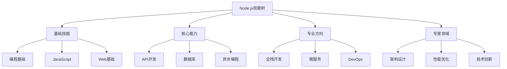

# 技能树与进阶路径

## 📋 技能层级体系

### 🏗️ 基础层 (0-1年)

| 技能类别 | 核心内容 | 能力要求 | 项目目标 |
|----------|----------|----------|----------|
| **JavaScript** | 语法、函数、对象 | 熟练使用 | Todo应用 |
| **Node.js基础** | 运行机制、核心模块 | 理解原理 | 简单API |
| **包管理** | npm使用、依赖管理 | 基本操作 | 项目构建 |

### 🔍 进阶层 (1-2年)

| 技能类别 | 核心内容 | 能力要求 | 项目目标 |
|----------|----------|----------|----------|
| **Web框架** | Express应用开发 | 熟练开发 | 博客系统 |
| **数据库** | MongoDB/SQL使用 | CURD精通 | 数据驱动应用 |
| **异步编程** | Promise/async用法 | 模式理解 | 高并发处理 |

### 🚀 高级层 (2-3年)

| 技能类别 | 核心内容 | 能力要求 | 项目目标 |
|----------|----------|----------|----------|
| **架构设计** | 系统设计能力 | 企业级架构 | 大型项目 |
| **性能优化** | 性能分析和调优 | 系统优化 | 高性能应用 |
| **微服务** | 分布式系统 | 架构理解 | 微服务项目 |

## 🧠 进阶策略

**技能发展建议：**
1. **纵向深入** - 在领域内不断精进
2. **横向拓展** - 学习相关技能互补
3. **项目实践** - 通过项目验证技能
4. **知识分享** - 教会他人是最好的学习

## 🎯 职业发展路径

**发展建议：**
- **初级开发** → 专注基础技能和项目实践
- **中级开发** → 掌握全栈开发和系统设计
- **高级开发** → 具备架构能力和团队领导
- **技术专家** → 技术创新和知识传承

---

*🔗 相关链接：[[043-Skill-Knowledge-Map]] | [[038-Learning-Path-Guide]] | [[048-学习路线总览]]*
