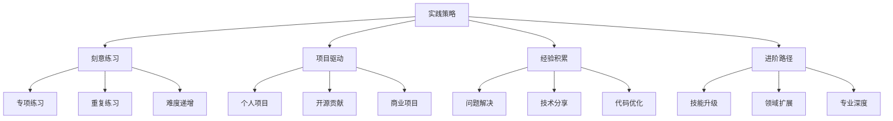

# Practice Strategies

## 📋 刻意练习方法论

### 🏗️ 练习层级规划

| 练习阶段 | 内容重点 | 时间周期 | 评估标准 |
|----------|----------|----------|----------|
| **基础练习** | 语法/API使用 | 每日1小时 | 代码正确性 |
| **应用练习** | 项目功能实现 | 每周10小时 | 功能完整性 |
| **优化练习** | 性能/重构 | 项目完成 | 代码质量 |

### 🔍 项目驱动学习

**项目复杂度递增：**
1. **Todo应用** → 学习CRUD操作
2. **博客系统** → 掌握Web开发全流程  
3. **电商API** → 处理复杂业务逻辑
4. **微服务项目** → 分布式系统设计

### 🚀 经验积累策略

| 积累类型 | 实践方法 | 时间投入 | 预期收益 |
|----------|----------|----------|----------|
| **编码经验** | 每日编码练习 | 2-4小时 | 5年专家 |
| **问题解决** | Bug调试/优化 | 随遇随练 | 洞察能力 |
| **架构设计** | 大项目参与 | 持续参与 | 系统思维 |

## 🧠 学习效果最大化

**高效练习原则：**
1. **目标明确** - 每次练习要有具体目标
2. **及时反馈** - 快速获得练习结果反馈
3. **适度挑战** - 难度稍微超出现有能力
4. **持续改进** - 基于反馈调整学习方法

## 🎯 进阶发展路径

**职业发展建议：**
- **初级**（0-2年）- 掌握基础技能，能够独立完成简单项目
- **中级**（2-5年）- 具备全栈开发能力，能够设计中等复杂度系统
- **高级**（5年以上）- 具备架构设计能力，能够领导技术和团队

---

*🔗 相关链接：[[032-全栈博客系统]] | [[043-Skill-Knowledge-Map]] | [[046-Learning-Tips]]*
