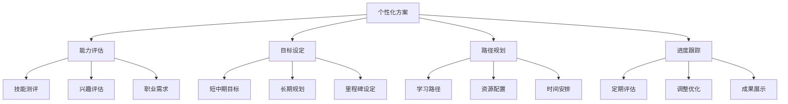

# 个性化学习计划

## 📋 个性化定制模板

### 🏗️ 能力基础评估

| 评估维度 | 自评表格 | 建议改进 | 重点关注 |
|----------|----------|----------|----------|
| **编程基础** | ★★★☆☆ | JavaScript强化 | 语法熟练度 |
| **Web开发** | ★★☆☆☆ | HTML/CSS学习 | 前端基础 |
| **逻辑思维** | ★★★★☆ | 算法练习 | 解题能力 |

### 🔍 学习目标设定

**短期目标 (1-3个月)：**
- 掌握Node.js基础概念和核心模块
- 完成3个小项目实现
- 建立个人学习笔记体系

**中期目标 (3-12个月)：**
- 具备全栈开发能力
- 完成博客系统项目
- 具备基础架构设计思维

**长期目标 (1-2年)：**
- 成为Node.js技术专家
- 具备大型项目开发经验
- 能够指导他人学习成长

### 🚀 时间规划建议

| 学习阶段 | 每日投入 | 周末投入 | 总时间 | 适合人群 |
|----------|----------|----------|--------|----------|
| **业余学习** | 1-2小时 | 4-6小时 | 周12小时 | 在职业余者 |
| **全日制学习** | 6-8小时 | 休息 | 周30小时 | 全职学习 |
| **强化提升** | 3-4小时 | 8-10小时 | 周20小时 | 进阶提升 |

## 🧠 个性化策略

**定制化建议：**
1. **根据日程** - 安排固定的学习时间
2. **根据基础** - 选择合适的学习起点  
3. **根据目标** - 制定针对性的学习计划
4. **根据兴趣** - 优先学习感兴趣的领域

## 🎯 成功关键因素

**个人成功建议：**
- **坚持执行** - 计划再好也需要执行
- **及时调整** - 根据实际情况灵活调整
- **寻求反馈** - 定期评估学习效果
- **保持动力** - 设定激励机制保持学习热情

---

*🔗 相关链接：[[048-学习路线总览]] | [[049-学习进度管理]] | [[046-Learning-Tips]]*
