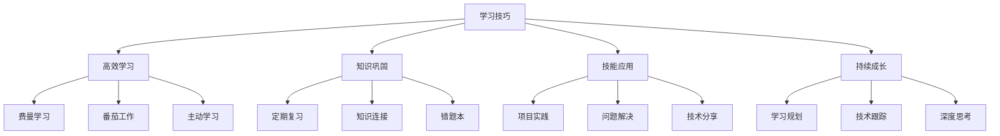

# Learning Tips

## 📋 高效学习方法

### 🏗️ 费曼学习法（核心）

| 学习阶段 | 操作方法 | 时间安排 | 检验标准 |
|----------|----------|----------|----------|
| **概念学习** | 理解概念定义 | 30分钟 | 能说出概念含义 |
| **简化表达** | 用简单话解释 | 10分钟 | 小学生能听懂 |
| **查漏补缺** | 补充知识点 | 20分钟 | 解释流畅完整 |
| **教学输出** | 向他人讲解 | 10分钟 | 他人能够理解 |

### 🔍 番茄工作法时间管理

**时间分配建议：**
- **番茄时间**：25分钟专注学习 + 5分钟休息
- **长休息**：4个番茄后休息15-30分钟
- **学习时间**：每天2-4个番茄时间（1-2小时）

### 🚀 主动学习策略

| 学习方式 | 参与程度 | 效果 | 适用场景 |
|----------|----------|------|----------|
| **被动阅读** | 低 | 20% | 快速浏览 |
| **主动编码** | 高 | 80% | 技术技能 |
| **项目实践** | 最高 | 90% | 综合应用 |

## 🧠 知识巩固技巧

**记忆强化方法：**
1. **关键词标记** - 重要概念高亮标注
2. **知识联系** - 新建知识与旧知识连接
3. **定期回顾** - 时隔复习巩固记忆
4. **实际应用** - 在项目中运用所学知识

## 🎯 持续成长原则

**学习成长守则：**
- **保持好奇心** - 主动探索新技术
- **寻求反馈** - 从他人那里获得改进建议
- **分享知识** - 教授他人是最好的学习
- **深度思考** - 不满足于表面理解

---

*🔗 相关链接：[[019-API设计与文档]] | [[042-Troubleshooting-Solutions]] | [[043-Skill-Knowledge-Map]]*
