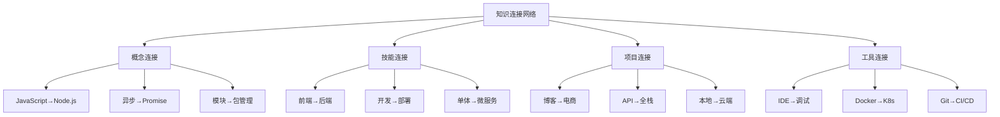

# Knowledge Connected



## 📋 知识关联图谱

### 🏗️ 核心概念连接

| 基础概念 | 关联概念 | 学习路径 | 应用场景 |
|----------|----------|----------|----------|
| **JavaScript** | Node.js运行环境 | 基础→进阶 | Web开发 |
| **事件循环** | 异步编程 | 原理→应用 | API服务 |
| **模块系统** | 包管理器 | 理解→使用 | 项目管理 |

### 🔍 技能发展连接

**技能进阶链条：**
```
JavaScript基础 → Node.js入门 → Web开发
    ↓               ↓           ↓
前端技术 → 全栈开发 → 架构设计
    ↓               ↓           ↓  
单页应用 → 企业开发 → 团队管理
```

### 🚀 项目实战连接

| 项目类型 | 前置技能 | 核心实现 | 后续拓展 |
|----------|----------|----------|----------|
| **Todo应用** | JavaScript基础 | CRUD操作 | 增删改查 |
| **博客系统** | Web框架 | 全栈开发 | 复杂业务 |
| **电商API** | 数据库 | 业务系统 | 分布式架构 |
| **微服务项目** | 架构设计 | 企业级应用 | DevOps |

## 🧠 知识网络构建

**建立知识连接：**
1. **从简单到复杂** - 基础扎实再学高级
2. **理论联系实际** - 学会就用，用中加深理解
3. **横向对比学习** - 同类技术对比分析
4. **纵向深度挖掘** - 关键技术深入原理

## 🎯 学习路径规划

**推荐学习顺序：**
1. **JavaScript基础**（1-2月）
2. **Node.js核心**（2-3月）  
3. **Web框架应用**（2-3月）
4. **数据库集成**（1-2月）
5. **项目实战**（3-6月）
6. **高级主题**（持续学习）

---

*🔗 相关链接：[[038-Learning-Path-Guide]] | [[043-Skill-Knowledge-Map]] | [[044-Technology-Tree]]*
