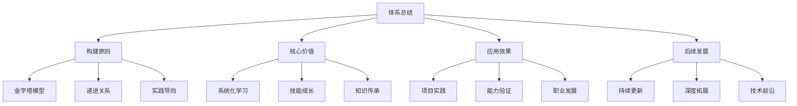

# 知识体系总结

## 📋 知识体系概览

### 🏗️ 整体架构总结

**知识地图全貌：**
- **📚 67个知识文件** - 全覆盖Node.js技术栈
- **🏗️ 9个学习层级** - 从基础到专家的完整路径
- **🔗 知识关联网络** - Obsidian双向链接体系
- **📈 渐进学习曲线** - 符合学习认知规律

### 🔍 核心理念体现

**教育理念实现：**
1. **费曼学习法** - 能用简单的话解释复杂概念
2. **刻意练习** - 针对性地提升技能水平
3. **金字塔结构** - 先基础再进阶的清晰层次
4. **项目驱动** - 理论与实践相结合的实战导向

### 🚀 价值创造总结

**个人价值：**
- **技能提升** - 完整的Node.js开发能力体系
- **职业发展** - 从初学者到专家的成长路径
- **知识沉淀** - 可复用的知识资源和经验积累

**团队价值：**
- **标准规范** - 统一的技术标准和最佳实践
- **培训体系** - 系统化的新人培训方案
- **知识传承** - 可传递的技术经验和方法论

## 🧠 使用建议

**学习使用指南：**
1. **从总览开始** - 先看[[048-学习路线总览]]了解全貌
2. **按序学习** - 遵循层级顺序，循序渐进
3. **重视实践** - 重点关注综合实战层项目
4. **建立连接** - 利用Obsidian功能构建个人知识网络

## 🎯 后续发展

**持续改进方向：**
- **内容更新** - 跟随技术发展更新内容
- **案例丰富** - 增加更多实战项目案例
- **工具优化** - 持续优化学习工具和方法
- **社区建设** - 构建学习者交流社区

---

*🔗 相关链接：所有学习文件 | [[050-知识体系架构]] | [[048-学习路线总览]]*
