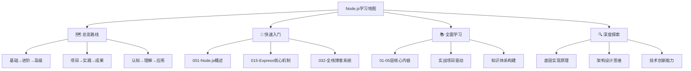

# Node.js学习路线图

## 🚀 快速开始指南

### 📋 学习路径选择

#### 🎯 **新手路线** (0基础，3-6个月)
| 阶段 | 关键文件 | 学习重点 | 产出目标 |
|------|----------|----------|----------|
| **1-2月** | [[001-Node.js概述]] → [[005-模块系统详解]] | 基础概念理解 | 完成Todo应用 |
| **3-4月** | [[006-异步编程范式]] → [[015-Express核心机制]] | 核心技能掌握 | 开发简单API |
| **5-6月** | [[032-全栈博客系统]]完整项目 | 全栈开发能力 | 博客系统上线 |

#### 🔥 **进阶路线** (有基础，6-12个月)
| 阶段 | 关键文件 | 学习重点 | 产出目标 |
|------|----------|----------|----------|
| **1-3月** | [[016-Web应用架构设计]] → [[020-项目架构最佳实践]] | 架构设计 | 企业级API |
| **4-6月** | [[024-微服务架构模式]] → [[035-微服务项目实战]] | 分布式系统 | 微服务项目 |
| **7-12月** | [[023-性能优化深入]] → [[026-云原生应用开发]] | 高级技能 | 生产级应用 |

#### ⚡ **专家路线** (高经验，12个月以上)
| 阶段 | 关键文件 | 学习重点 | 产出目标 |
|------|----------|----------|----------|
| **深入原理** | [[028-libuv事件循环]] → [[031-V8引擎深度定制]] | 底层理解 | 性能调优专家 |
| **技术引领** | [[044-Technology-Tree]] → [[042-技术发展趋势]] | 技术视野 | 架构师能力 |
| **知识传承** | [[046-Learning-Tips]] → [[047-知识体系总结]] | 教学方法 | 技术导师 |

## 🧠 学习方法建议

### 📈 **费曼学习法**
1. **选择概念** - 从路线图选择学习主题
2. **简化解释** - 用简单话概括核心思想  
3. **识别差距** - 找出理解不清晰的地方
4. **重新学习** - 补充知识点，完善理解

### 🎯 **刻意练习**
- **明确目标** - 设定具体可衡量的学习目标
- **专注练习** - 集中精力练习关键技能
- **及时反馈** - 通过项目验证学习效果
- **持续改进** - 根据反馈调整学习策略

## 📊 学习进度追踪

| 学习阶段 | 进度指标 | 验收标准 | 完成标志 |
|----------|----------|----------|----------|
| **基础认知** | 知识点掌握度 | 80%理论正确率 | 概念讲解清晰 |
| **核心理解** | 技能熟练度 | 独立完成练习 | API开发能力 |
| **框架应用** | 项目完成度 | 功能完整性 | Web应用上线 |
| **综合实战** | 综合能力 | 企业级应用 | 大型项目经验 |

---

**💡 建议：从[[001-Node.js概述]]开始您的Node.js学习之旅！**

*🔗 相关链接：[[048-学习路线总览]] | [[050-知识体系架构]] | [[049-学习进度管理]]*
