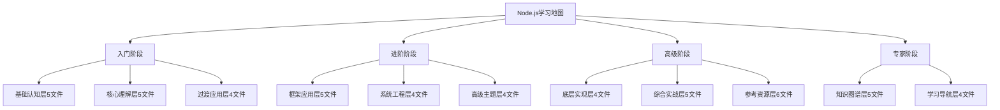

# 学习路线总览

## 📋 完整学习路径 (67个文件)

### 🏗️ 入门阶段（8-12个月）

**目标：能够独立开发中小型Web应用**

| 层级 | 文件数量 | 核心内容 | 完成标志 |
|------|----------|----------|----------|
| **01-基础认知** | 5个文件 | Node.js概念理解 | 理解事件循环原理 |
| **02-核心理解** | 5个文件 | 核心模块掌握 | 熟练异步编程 |
| **02.5-过渡应用** | 4个文件 | 工具链使用 | 搭建开发环境 |

### 🔍 进阶阶段（12-18个月）

**目标：具备全栈开发能力，能够设计中等复杂度系统**

| 层级 | 文件数量 | 核心内容 | 完成标志 |
|------|----------|----------|----------|
| **03-框架应用** | 5个文件 | Web框架精通 | 独立开发API服务 |
| **04-系统工程** | 4个文件 | 工程实践 | 完整的项目部署 |
| **05-高级主题** | 4个文件 | 架构设计 | 微服务架构理解 |

### 🚀 高级阶段（18个月以上）

**目标：成为技术专家，具备架构设计和团队领导能力**

| 层级 | 文件数量 | 核心内容 | 完成标志 |
|------|----------|----------|----------|
| **05.5-底层实现** | 4个文件 | 底层原理 | V8引擎定制 |
| **06-综合实战** | 5个文件 | 复杂项目 | 企业级应用开发 |
| **07-参考资源** | 6个文件 | 最佳实践 | 自主技术选型 |

### 🎯 专家阶段（持续学习）

**目标：成为领域专家，具备技术创新和知识传承能力**

| 层级 | 文件数量 | 核心内容 | 完成标志 |
|------|----------|----------|----------|
| **08-知识图谱** | 5个文件 | 知识体系 | 建立个人知识库 |
| **09-学习导航** | 4个文件 | 学习指导 | 指导他人学习 |

## 🧠 学习策略建议

**学习节奏：**
- **每日学习**：1-2小时理论 + 1小时实践
- **周末强化**：4-6小时项目实战
- **月度回顾**：总结学习成果，规划下阶段目标

## 🎯 成功指标

**各阶段能力认证：**
1. **入门成功** → 完成博客系统开发
2. **进阶成功** → 完成电商后端API
3. **高级成功** → 完成微服务架构项目
4. **专家成功** → 能够指导团队技术发展

---

*🔗 相关链接：[[050-知识体系架构]] | [[049-学习进度管理]] | [[051-学习成效评估]]*
