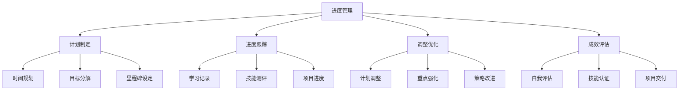

# 学习进度管理

## 📋 学习计划模板

### 🏗️ 月度学习计划

| 月份 | 重点技能 | 实践项目 | 验收标准 | 时间安排 |
|------|----------|----------|----------|----------|
| **第1-2月** | JavaScript强化 | Todo应用 | 功能完整 | 每日2小时 |
| **第3-4月** | Node.js基础 | 文件工具 | API开发 | 每日3小时 |
| **第5-6月** | Web框架 | 博客系统 | 全栈应用 | 每日4小时 |

### 🔍 进度跟踪表格

| 学习内容 | 开始日期 | 计划完成 | 实际完成 | 完成度 | 备注 |
|----------|----------|----------|----------|--------|------|
| **JavaScript基础** | 2024-01-01 | 2024-01-31 | 2024-02-05 | 85% | 延迟5天 |
| **Node.js入门** | 2024-02-01 | 2024-02-28 | - | 0% | 进行中 |

### 🚀 技能评估标准

**分层次评估：**
- **⭐ 了解** - 听过概念，能简单说明
- **⭐⭐ 理解** - 理解原理，能应用基础功能  
- **⭐⭐⭐ 掌握** - 熟练使用，能解决常见问题
- **⭐⭐⭐⭐ 精通** - 深度理解，能优化和改进
- **⭐⭐⭐⭐⭐ 专家** - 能够创新和指导他人

## 🧠 进度管理工具

**推荐工具：**
- **时间管理** - Pomodoro Technique（番茄工作法）
- **进度记录** - GitHub Projects + Issue
- **技能评估** - 自我测评 + 项目验收
- **学习笔记** - Obsidian + Markdown

## 🎯 调整优化策略

**进度调整原则：**
1. **灵活性** - 根据实际情况调整计划
2. **重点突出** - 优先完成核心技能
3. **循序渐进** - 基础扎实再学高级
4. **持续改进** - 定期反思学习方法

## 📈 成效追踪

**学习成果记录：**
- **代码量统计** - GitHub提交记录
- **项目完成度** - 功能实现情况
- **技能提升** - 定期自我评估
- **知识体系** - Obsidian知识图谱

---

*🔗 相关链接：[[048-学习路线总览]] | [[046-Learning-Tips]] | [[051-学习成效评估]]*
