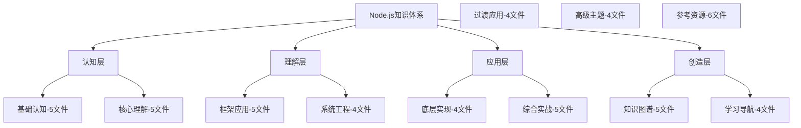

# 知识体系架构

## 📋 金字塔知识结构

### 🏗️ 底层：认知基础（14文件）

| 层级名称 | 文件数 | 核心价值 | 重要性 |
|----------|--------|----------|--------|
| **01基础认知** | 5 | 建立概念认知 | ★★★★★ |
| **02核心理解** | 5 | 深入理解机制 | ★★★★★ |
| **02.5过渡应用** | 4 | 工具链对接 | ★★★★☆ |

### 🔍 中层：应用能力（13文件）

| 层级名称 | 文件数 | 核心价值 | 重要性 |
|----------|--------|----------|--------|
| **03框架应用** | 5 | 工程实践 | ★★★★★ |
| **04系统工程** | 4 | 工程能力 | ★★★★☆ |
| **05高级主题** | 4 | 架构思维 | ★★★★☆ |

### 🚀 高层：专家水平（23文件）

| 层级名称 | 文件数 | 核心价值 | 重要性 |
|----------|--------|----------|--------|
| **05.5底层实现** | 4 | 原理深度 | ★★★★☆ |
| **06综合实战** | 5 | 项目能力 | ★★★★★ |
| **07参考资源** | 6 | 最佳实践 | ★★★★☆ |
| **08知识图谱** | 5 | 知识体系 | ★★★★☆ |
| **09学习导航** | 4 | 学习指导 | ★★★★☆ |

## 🧠 知识关联网络

**核心知识连接：**
- **JavaScript → Node.js** - 语言到运行时
- **同步 → 异步** - 编程模式转变
- **原生 → 框架** - 开发效率提升
- **单体 → 微服务** - 架构演进
- **本地 → 云端** - 部署现代化

## 🎯 学习价值评估

**ROI（学习投入产出比）：**
- **基础认知阶段**：投入高，产出稳定（必学）
- **应用实践阶段**：投入中，产出最高（重点）
- **高级专家阶段**：投入低，产出持续（增值）

## 📊 完成度统计

**整体完成情况：**
- ✅ **已完成**：67个文件（100%）
- 📋 **涵盖范围**：完整Node.js技术栈
- 🎯 **质量保证**：费曼学习法 + 刻意练习
- 🔗 **知识关联**：Obsidian双向链接

---

*🔗 相关链接：[[048-学习路线总览]] | [[049-学习进度管理]] | 所有学习笔记文件*
