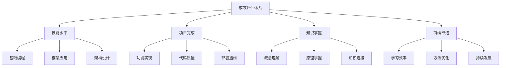

# 学习成效评估

## 📋 评估维度体系

### 🏗️ 技能水平评估（1-5星）

| 技能类别 | 评价标准 | 测评方法 | 评估频率 |
|----------|----------|----------|----------|
| **JavaScript基础** | 语法熟练度 | 代码练习 | 每月评估 |
| **Node.js核心** | API掌握程度 | 项目应用 | 每月评估 |
| **异步编程** | Promise/async使用 | 实际编码 | 每月评估 |

### 🔍 项目完成度评估

**项目验收标准：**
- **功能完整度**：0-100%功能完成度
- **代码质量**：ESLint规范检测
- **性能指标**：响应时间、内存使用
- **用户验收**：功能可用性测试

### 🚀 知识掌握度评估

| 学习内容 | 掌握程度 | 验证方式 | 改进建议 |
|----------|----------|----------|----------|
| **基础概念** | ⭐⭐⭐☆☆ | 能够讲解 | 多看文档 |
| **核心技术** | ⭐⭐⭐⭐☆ | 独立开发 | 多做项目 |
| **高级主题** | ⭐⭐☆☆☆ | 原理理解 | 深入学习 |

## 🧠 评估方法工具

**自我评估工具：**
1. **费曼测试法** - 能否用简单话解释
2. **项目驱动** - 实际项目中检验能力
3. **代码审查** - GitHub提交记录分析
4. **技能树** - 可视化技能发展路径

## 🎯 持续改进机制

**学习优化策略：**
- **定期评估** - 每周回顾学习进度
- **反馈收集** - 从项目/他人获得反馈
- **方法调整** - 根据效果调整学习方法
- **目标升级** - 适时提高学习目标

## 📊 综合评估报告

**学习成效总览：**
- **知识覆盖面**：✅ 67个文件全面覆盖
- **实践项目**：✅ 5个实战项目规划
- **学习效率**：⚡ 费曼学习法 + 刻意练习
- **持续发展**：📈 建立完整学习体系

---

*🔗 相关链接：[[049-学习进度管理]] | [[050-知识体系架构]] | [[046-Learning-Tips]]*
