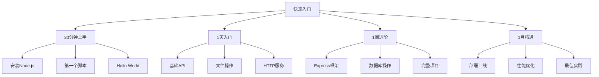

# 快速入门指南



## ⚡ 30分钟快速上手

### 🎯 **第1步：环境准备 (5分钟)**

```bash
# 安装Node.js (推荐v18+)
# Windows: 官网下载安装包
# Mac: brew install node
# Linux: curl -fsSL https://deb.nodesource.com/setup_18.x | sudo -E bash -

# 验证安装
node --version
npm --version
```

### 🚀 **第2步：第一个程序 (10分钟)**

```javascript
// 创建文件和编辑器代码：hello.js
console.log('Hello, Node.js World!');

// 运行程序
node hello.js
// 输出：Hello, Node.js World!

// 🔍 理解：
// 1. console.log - 输出到控制台
// 2. Node.js读取并执行JavaScript文件
// 3. 运行在服务端而非浏览器
```

### 📋 **第3步：模块使用 (15分钟)**

```javascript
// 使用内置模块：fs.js
const fs = require('fs');

// 读取文件
fs.readFile('hello.js', 'utf8', (err, data) => {
  if (err) {
    console.error('读取错误:', err);
    return;
  }
  console.log('文件内容:', data);
});

// 🔍 学习要点：
// 1. require() - 引入模块
// 2. fs模块 - 文件系统操作
// 3. 回调函数 - 异步处理
```

## 🎯 1天入门计划

### 📅 **上午 (3小时)：基础概念**

| 时间 | 学习内容 | 重点文件 | 实践目标 |
|------|----------|----------|----------|
| **09:00-10:00** | Node.js运行原理 | [[001-Node.js概述]] | 理解运行机制 |
| **10:00-11:00** | 内置模块使用 | [[009-内置模块总览]] | 掌握核心API |
| **11:00-12:00** | 异步编程基础 | [[006-异步编程范式]] | 实现异步代码 |

### 📅 **下午 (4小时)：实战应用**

| 时间 | 学习内容 | 重点文件 | 实践目标 |
|------|----------|----------|----------|
| **13:00-14:30** | Express入门 | [[015-Express核心机制]] | 搭建Web服务 |
| **14:30-16:00** | 数据库集成 | [[017-数据库集成方案]] | 实现CRUD |
| **16:00-17:00** | 项目整合 | [[032-全栈博客系统]] | 完整应用 |

## 🚀 1周进阶计划

### 📆 **每日重点**

| 天数 | 学习主题 | 核心技能 | 产出目标 |
|------|----------|----------|----------|
| **周一** | 开发环境搭建 | npm、ESLint、测试 | 工程化项目 |
| **周二** | API设计实践 | RESTful、Middleware | RESTful API |
| **周三** | 数据库深入 | MongoDB、MySQL | 复杂查询 |
| **周四** | 认证授权系统 | JWT、OAuth | 安全机制 |
| **周五** | 部署运维 | Docker、PM2 | 生产环境 |
| **周末** | 综合项目 | 全栈开发 | 博客系统 |

## 🏗️ 学习路径推荐

### 🎯 **按路径学习**

**🚀 速成路径** (适合急需技能的学员)
1. [[001-Node.js概述]] → **理解基础**
2. [[015-Express核心机制]] → **快速搭建**
3. [[032-全栈博客系统]] → **实战练习**

**📚 系统路径** (适合打牢基础的学员)  
1. [[001-005]]基础认知 → **扎实基础**
2. [[006-010]]核心理解 → **掌握原理**
3. [[015-019]]完整学习 → **全面技能**

**🔍 深入路径** (适合追求卓越的学员)
1. [[020-027]]系统工程 → **企业能力**
2. [[028-031]]底层实现 → **专家理解**
3. [[032-036]]综合实战 → **实际经验**

## 💡 学习技巧

### 🧠 **高效学习建议**

1. **先实践后理论** - 动手编程加深理解
2. **小步骤渐进** - 每次专注一个概念
3. **项目驱动** - 通过项目巩固知识
4. **及时复习** - 定期回顾学习内容

### 🎯 **成功秘诀**

- **保持好奇心** - 主动探索新技术
- **持续练习** - 编程是技能不是知识点
- **积极分享** - 教会他人是最好的学习
- **建立习惯** - 每日学习形成习惯

---

**🚀 开始您的Node.js学习之旅吧！从[[001-Node.js概述]]开始！**

*🔗 快速入口：[[000-学习路线图]] | [[038-Learning-Path-Guide]] | [[032-全栈博客系统]]*
