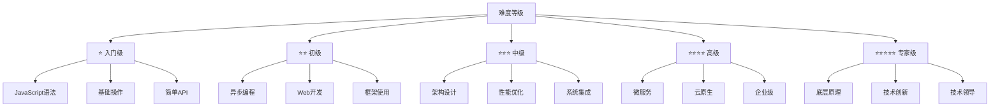

# 知识难度量表

## 📊 难度分级标准

### ⭐ **入门级难度 (Easy)**

| 难度描述 | 技术要求 | 学习时间 | 典型内容 |
|----------|----------|----------|----------|
| **基础概念** | JavaScript基础 | 1-2周 | Node.js概述、模块系统 |
| **简单操作** | 基础编程能力 | 2-4周 | 文件操作、HTTP请求 |
| **API使用** | 文档阅读能力 | 1-2周 | 内置模块API |

**代表文件：**
- [[001-Node.js概述]] ⭐⭐⭐⭐⭐
- [[002-JavaScript运行环境对比]] ⭐⭐⭐⭐⭐
- [[005-模块系统详解]] ⭐⭐⭐⭐⭐

### ⭐⭐ **初级难度 (Medium-Easy)**

| 难度描述 | 技术要求 | 学习时间 | 典型内容 |
|----------|----------|----------|----------|
| **异步编程** | Promise理解 | 3-4周 | 回调、Promise、async/await |
| **Web开发** | HTML/CSS基础 | 4-6周 | Express框架、路由 |
| **后端思维** | 服务端开发 | 3-4周 | API设计、数据操作 |

**代表文件：**
- [[006-异步编程范式]] ⭐⭐⭐⭐☆
- [[007-文件系统操作]] ⭐⭐⭐⭐☆
- [[015-Express核心机制]] ⭐⭐⭐⭐☆

### ⭐⭐⭐ **中级难度 (Medium)**

| 难度描述 | 技术要求 | 学习时间 | 典型内容 |
|----------|----------|----------|----------|
| **架构设计** | 系统设计思维 | 6-8周 | MVC模式、分层架构 |
| **性能优化** | 调试分析能力 | 4-6周 | 内存优化、并发优化 |
| **工程实践** | 项目经验 | 8-12周 | CI/CD、测试、部署 |

**代表文件：**
- [[016-Web应用架构设计]] ⭐⭐⭐☆☆
- [[020-项目架构最佳实践]] ⭐⭐⭐☆☆
- [[023-性能优化深入]] ⭐⭐⭐☆☆

### ⭐⭐⭐⭐ **高级难度 (Hard)**

| 难度描述 | 技术要求 | 学习时间 | 典型内容 |
|----------|----------|----------|----------|
| **微服务架构** | 分布式思维 | 3-6个月 | 服务拆分、通信、治理 |
| **云原生** | DevOps能力 | 6-12个月 | Docker、K8s、CI/CD |
| **企业级应用** | 大型项目经验 | 12-24个月 | 架构设计、团队管理 |

**代表文件：**
- [[024-微服务架构模式]] ⭐⭐⭐⭐☆
- [[026-云原生应用开发]] ⭐⭐⭐⭐☆
- [[027-企业级解决方案]] ⭐⭐⭐⭐☆

### ⭐⭐⭐⭐⭐ **专家级难度 (Expert)**

| 难度描述 | 技术要求 | 学习时间 | 典型内容 |
|----------|----------|----------|----------|
| **底层原理** | 系统编程背景 | 12-24个月 | libuv、V8引擎、事件循环 |
| **技术创新** | 深度技术理解 | 24个月+ | 源码分析、性能调优 |
| **技术领导** | 架构师能力 | 36个月+ | 技术决策、团队培养 |

**代表文件：**
- [[028-libuv事件循环]] ⭐⭐⭐⭐⭐
- [[031-V8引擎深度定制]] ⭐⭐⭐⭐⭐
- [[035-微服务项目实战]] ⭐⭐⭐⭐⭐

## 🎯 学习建议

### 📈 **难度进阶策略**

1. **扎实基础** - 入门级必须100%掌握才能进阶
2. **循序渐进** - 按难度等级逐步提升，不可跳跃
3. **项目验证** - 每个难度级别用项目验证掌握程度
4. **持续练习** - 高级技能需要大量实践积累

### ⏰ **学习时间规划**

**基于难度的时间投入：**
- **入门级** - 每日1-2小时，持续1-2个月
- **初级** - 每日2-3小时，持续2-3个月  
- **中级** - 每日3-4小时，持续3-4个月
- **高级** - 每日4-6小时，持续6-12个月
- **专家级** - 持续学习+项目经验，12个月以上

## 💡 **个性化建议**

**根据个人情况选择：**
- **编程小白** → 专注入门级和初级内容
- **有基础者** → 直接从中级开始，回补基础
- **经验丰富** → 重点学习高级和专家级
- **职业导向** → 根据工作需求选择对应难度层级

---

*🔗 相关链接：[[038-Learning-Path-Guide]] | [[045-个性化学习计划]] | [[049-学习进度管理]]*
