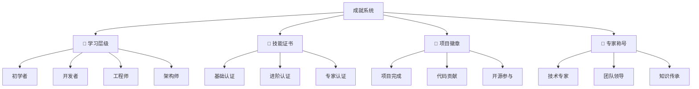

# 学习成就系统

## 🏆 成就等级系统

### 🥉 **初学者等级 (Newbie)**

| 成就名称 | 获得条件 | 验证方式 | 奖励内容 |
|----------|----------|----------|----------|
| **First Node** | 运行第一个Node.js程序 | 代码截图 | 🎓 Node.js新兵徽章 |
| **Module Master** | 掌握5个核心模块 | 小测验 | 📚 模块专家徽章 |
| **Hello Express** | 搭建第一个Web服务 | 演示视频 | 🌐 Web入门徽章 |

**解锁条件：**
- ✅ 完成[[001-Node.js概述]]学习
- ✅ 独立完成10个基础练习
- ✅ 通过基础知识测试（80%+）

### 🥈 **开发者等级 (Developer)**

| 成就名称 | 获得条件 | 验证方式 | 奖励内容 |
|----------|----------|----------|----------|
| **Async Ninja** | 熟练使用Promise/async/await | 代码项目 | ⚡ 异步编程专家 |
| **API Architect** | 设计RESTful API | API文档 | 🔧 API设计大师 |
| **Database Diver** | 掌握MongoDB+MySQL | 数据库项目 | 🗄️ 数据专家徽章 |

**解锁条件：**
- ✅ 完成所有01-03层文件学习
- ✅ 完成2个中等复杂度项目
- ✅ 代码质量检查通过

### 🥇 **工程师等级 (Engineer)**

| 成就名称 | 获得条件 | 验证方式 | 奖励内容 |
|----------|----------|----------|----------|
| **Full Stack Hero** | 独立开发全栈应用 | 完整项目展示 | 🚀 全栈工程师徽章 |
| **Performance Optimizer** | 性能调优技能 | 优化报告 | ⚡ 性能专家徽章 |
| **DevOps Specialist** | Docker+K8s部署 | 部署文档 | 🐳 DevOps徽章 |

**解锁条件：**
- ✅ 完成04-05层深入学习
- ✅ 完成大型复杂项目
- ✅ 具备企业级开发经验

### 💎 **架构师等级 (Architect)**

| 成就名称 | 获得条件 | 验证方式 | 奖励内容 |
|----------|----------|----------|----------|
| **Microservices Master** | 微服务架构设计 | 架构图+文档 | 🏗️ 微服务架构师 |
| **System Designer** | 大型系统设计 | 设计文档 | 🎨 系统架构师 |
| **Tech Evangelist** | 技术分享+指导他人 | 演讲材料 | 📢 技术布道师 |

**解锁条件：**
- ✅ 完成所有学习内容
- ✅ 具备独立架构设计能力
- ✅ 能够指导团队技术发展

## 📜 技能认证体系

### 🎓 **官方认证路径**

| 认证等级 | 考试范围 | 项目要求 | 证书价值 |
|----------|----------|----------|----------|
| **Node.js Foundation** | 核心API | 基础项目 | ⭐⭐⭐ |
| **Express.js Expert** | 框架深入 | Web应用 | ⭐⭐⭐⭐ |
| **Full Stack Developer** | 前后端 | 完整系统 | ⭐⭐⭐⭐⭐ |
| **System Architect** | 架构设计 | 企业级项目 | ⭐⭐⭐⭐⭐ |

### 🏅 **自定义认证**

**技能徽章系统：**
- **🟢 基础徽章** - 概念理解和API使用
- **🔵 进阶徽章** - 框架应用和项目开发  
- **🟣 高级徽章** - 架构设计和性能优化
- **🔴 专家徽章** - 底层原理和创新应用

## 🎯 项目里程碑

### 📈 **项目成长路径**

| 项目阶段 | 验收标准 | 成就奖励 | 能力提升 |
|----------|----------|----------|----------|
| **Todo应用** | 基础CRUD | 🎯 基础开发者徽章 | Node.js基础 |
| **博客系统** | 全栈功能 | 🌟 全栈初学者徽章 | Web开发能力 |
| **API服务** | REST设计 | 🔧 API设计徽章 | 后端架构 |
| **微服务项目** | 分布式系统 | 🏗️ 架构师徽章 | 企业级技能 |

## 🌟 **荣誉殿堂**

### 🏆 **终身成就**

- **🎓 知识传承者** - 帮助10+人学习Node.js
- **🚀 技术创新者** - 开源项目获得100+ Stars
- **👑 Node.js大师** - 成为社区认可的技术专家
- **📚 文档贡献者** - 贡献官方或重要项目文档

### 💫 **特殊荣誉**

- **🔥 持续学习者** - 连续学习6个月不间断
- **⚡ 高效实践者** - 1个月内完成3个项目
- **🎯 精准掌握者** - 技能测试95%+正确率
- **🌟 技术分享者** - 线下/线上技术分享5次+

## 🎮 **激励机制**

**学习动力系统：**
1. **进度可视化** - 完成度进度条展示
2. **即时反馈** - 完成一项立即获得成就提醒
3. **社交分享** - 成就徽章可分享到社交媒体
4. **内部竞赛** - 排行榜鼓励学习竞争

---

*🔗 相关链接：[[049-学习进度管理]] | [[051-学习成效评估]] | [[046-Learning-Tips]]*
