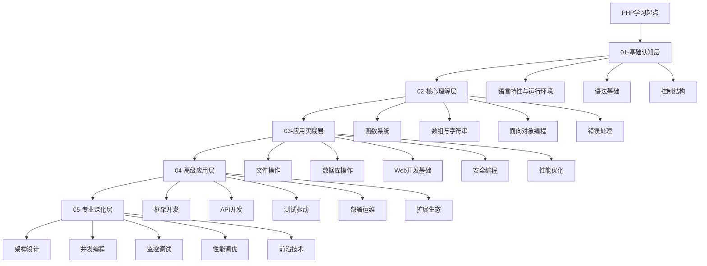

# PHP学习路径图

## 🎯 学习目标
- 掌握PHP核心语法和特性
- 具备Web开发实战能力
- 理解现代PHP开发最佳实践
- 能够设计和实现企业级应用

## 📊 学习路径概览

## 🚀 学习阶段规划

### 第一阶段：基础认知 (2-3周)
**目标**: 建立PHP基础认知框架
- [[01-基础认知层/语言特性与运行环境/01-PHP语言特性|PHP语言特性]]
- [[01-基础认知层/语法基础/01-变量与常量|变量与常量]]
- [[01-基础认知层/控制结构/01-条件语句|条件语句]]

**学习方式**: 理论学习 + 基础练习
**检验标准**: 能够编写简单的PHP脚本

### 第二阶段：核心理解 (3-4周)
**目标**: 深入理解PHP核心概念
- [[02-核心理解层/函数系统/01-函数基础|函数基础]]
- [[02-核心理解层/面向对象编程/01-类与对象基础|类与对象基础]]
- [[02-核心理解层/数组与字符串/01-数组基础|数组基础]]

**学习方式**: 概念理解 + 代码实践
**检验标准**: 能够使用OOP思想解决问题

### 第三阶段：应用实践 (4-5周)
**目标**: 掌握实际开发技能
- [[03-应用实践层/数据库操作/01-MySQL基础|MySQL基础]]
- [[03-应用实践层/Web开发基础/01-HTTP协议基础|HTTP协议基础]]
- [[03-应用实践层/安全编程/01-SQL注入防护|安全编程]]

**学习方式**: 项目实战 + 问题解决
**检验标准**: 能够开发完整的Web应用

### 第四阶段：高级应用 (3-4周)
**目标**: 掌握现代开发工具和框架
- [[04-高级应用层/框架开发/01-Laravel框架|Laravel框架]]
- [[04-高级应用层/API开发/01-RESTful API设计|RESTful API设计]]
- [[04-高级应用层/测试驱动/01-单元测试|单元测试]]

**学习方式**: 框架学习 + 最佳实践
**检验标准**: 能够使用框架开发企业级应用

### 第五阶段：专业深化 (持续学习)
**目标**: 成为PHP专家
- [[05-专业深化层/架构设计/01-MVC架构模式|架构设计]]
- [[05-专业深化层/性能调优/01-代码性能优化|性能调优]]
- [[05-专业深化层/前沿技术/01-PHP 8+新特性|前沿技术]]

**学习方式**: 深度研究 + 技术分享
**检验标准**: 能够设计复杂系统架构

## 📈 学习进度追踪

### 学习里程碑
- [ ] 完成基础语法学习
- [ ] 掌握OOP编程
- [ ] 完成第一个Web项目
- [ ] 学会使用主流框架
- [ ] 掌握性能优化技巧
- [ ] 完成企业级项目

### 技能评估矩阵

| 技能领域 | 初级 | 中级 | 高级 | 专家 |
|---------|------|------|------|------|
| 语法基础 | ⭐ | ⭐⭐ | ⭐⭐⭐ | ⭐⭐⭐⭐ |
| OOP编程 | ⭐ | ⭐⭐ | ⭐⭐⭐ | ⭐⭐⭐⭐ |
| Web开发 | ⭐ | ⭐⭐ | ⭐⭐⭐ | ⭐⭐⭐⭐ |
| 框架应用 | ⭐ | ⭐⭐ | ⭐⭐⭐ | ⭐⭐⭐⭐ |
| 架构设计 | ⭐ | ⭐⭐ | ⭐⭐⭐ | ⭐⭐⭐⭐ |

## 🎯 学习建议

### 费曼学习法应用
1. **选择概念**: 选择要学习的PHP概念
2. **教授他人**: 用简单语言解释概念
3. **回顾反思**: 发现知识盲点
4. **简化表达**: 用更简单的语言重新表达

### 刻意练习策略
1. **明确目标**: 设定具体的学习目标
2. **专注练习**: 集中注意力在薄弱环节
3. **及时反馈**: 通过测试和项目获得反馈
4. **持续改进**: 根据反馈调整学习策略

### 学习资源推荐
- **官方文档**: [PHP.net](https://www.php.net/)
- **在线教程**: PHP官方教程
- **实践项目**: [[99-实践项目/基础项目/01-个人博客系统|个人博客系统]]
- **社区交流**: Stack Overflow, Reddit

## 🔗 相关链接
- [[02-知识体系总览|知识体系总览]]
- [[计算机/开发学习/语言/PHP/00-学习导航/03-学习进度追踪|学习进度追踪]]
- [[04-学习资源索引|学习资源索引]]
